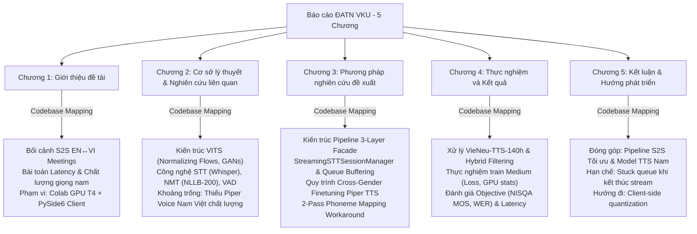

# HỆ THỐNG PHÂN TÍCH CODEBASE & HƯỚNG DẪN SOẠN THẢO BÁO CÁO ĐỒ ÁN TỐT NGHIỆP VKU (AGENTS.md)

Tài liệu này xác lập vai trò, chế độ hoạt động nghiêm ngặt và khung định hướng nghiên cứu dành cho AI Agent (Antigravity) trong quá trình đồng hành cùng tác giả hoàn thiện Báo cáo Đồ án Tốt nghiệp Kỹ sư AI tại Trường Đại học Công nghệ Thông tin và Truyền thông Việt - Hàn (VKU) năm 2026.

---

## 1. NGUYÊN TẮC HOẠT ĐỘNG CỦA AI AGENT (STRICT READ-ONLY MODE)

> [!IMPORTANT]
> **CHẾ ĐỘ HOẠT ĐỘNG: 100% READ-ONLY ĐỐI VỚI MÃ NGUỒN**
> - Tuyệt đối **KHÔNG** chỉnh sửa, thêm, bớt hoặc xóa bất kỳ dòng mã (code) nào trong các thư mục mã nguồn hiện tại của hai repository (`.\GradProject` và `.\piper_vi_vais1000_finetuning`).
> - **Quyền ghi file:** Chỉ được phép tạo mới hoặc cập nhật các file tài liệu định dạng Markdown (`.md`) nằm tại thư mục gốc (`D:\VKU\GraProject\For_report`) phục vụ cho việc nghiên cứu codebase, lập cấu trúc, lưu trữ số liệu thực nghiệm và soạn thảo nội dung báo cáo Đồ án Tốt nghiệp.
> - **Mục tiêu hoạt động:** Chuyển đổi hoàn toàn từ "Phát triển/Sửa lỗi phần mềm" sang "Nghiên cứu sâu sắc codebase, phân tích kiến trúc, hệ thống hóa tài liệu kỹ thuật để phục vụ viết báo cáo khoa học (Technical Writing)".

---

## 2. CẤU TRÚC HỆ THỐNG ĐỀ TÀI (PROJECT STRUCTURAL MAPPING)

Đồ án tốt nghiệp là một hệ thống **Dịch Giọng Nói Thời Gian Thực song hướng (Speech-to-Speech Translation - S2S)**, được cấu thành từ hai repository độc lập nhưng tích hợp chặt chẽ:

```
D:\VKU\GraProject\For_report\ (IDE Workspace Root)
├── AGENTS.md                                    # Tài liệu điều hướng và định ước nghiên cứu này
├── Hướng dẫn Báo cáo ĐATN Định hướng NCKH...    # Hướng dẫn chính thức của Nhà trường (VKU)
│
├── 1. GradProject/                              # HỆ THỐNG PIPELINE S2S THỜI GIAN THỰC
│   ├── server/                                  # FastAPI Server (Triển khai trên Google Colab T4 GPU)
│   │   ├── core_ai/                             # AI Engine Layer (STT -> MT -> TTS Facades)
│   │   │   ├── stt_engine/                      # FasterWhisper (EN) & PhoWhisper (VI - specialized)
│   │   │   ├── mt_engine/                       # NLLB-200 CTranslate2 (1 shared multilingual instance)
│   │   │   └── tts_engine/                      # PiperONNXEngine (4 voices: VI/EN Male/Female)
│   │   ├── api/websocket/                       # WebSocket Protocol, Dispatcher, Session State
│   │   │   └── streaming/                       # StreamingSTTSessionManager (VAD-segmented streaming)
│   │   └── docs/                                # Tài liệu kỹ thuật chi tiết của Server (INTERFACE_SPEC.md)
│   ├── client/                                  # PySide6 GUI Client (Truyền/nhận âm thanh thời gian thực)
│   └── shared_docs/                             # Giao thức WebSocket Contract giữa Client và Server
│
└── 2. piper_vi_vais1000_finetuning/             # NGHIÊN CỨU & FINE-TUNE MODEL PIPER TTS GIỌNG NAM VIỆT
    ├── colab/                                   # Quy trình quản lý môi trường ảo (venv snapshotting)
    ├── notebooks/                               # Các notebook thực nghiệm theo Phase (Phase 0 đến 8)
    ├── scripts/                                 # Kịch bản tiền xử lý, chuẩn hóa tiếng Việt, và QC audio
    ├── docs_for_report/                         # Nhật ký hành trình thực nghiệm chi tiết từng phase
    ├── reports/                                 # Số liệu thực nghiệm raw, biểu đồ phân bố và loss curves
    └── evaluation/                              # Kịch bản đánh giá subjective/objective (NISQA MOS)
```

---

## 3. KHUNG BÁO CÁO ĐỒ ÁN TỐT NGHIỆP VKU (5-CHAPTER THESIS FRAMEWORK)

Dựa trên tài liệu hướng dẫn chính thức của Phòng KHCN&HTQT - VKU dành cho Đồ án Tốt nghiệp định hướng Nghiên cứu Khoa học năm 2026, cấu trúc báo cáo 5 chương sẽ được ánh xạ trực tiếp từ codebase như sau:



### CHƯƠNG 1. GIỚI THIỆU ĐỀ TÀI (5 - 7 trang)
*   **1.1. Lý do chọn đề tài (Motivation):** Nhu cầu dịch cuộc họp trực tuyến thời gian thực song hướng Anh - Việt (EN ↔ VI). Những hạn chế về độ trễ (latency) và tính tự nhiên của giọng nói tổng hợp hiện nay.
*   **1.2. Phát biểu bài toán (Problem Statement):** 
    *   Bài toán dịch chuỗi âm thanh liên tục dạng streaming không làm mất ngữ cảnh.
    *   Bài toán đồng bộ hóa và giảm thiểu độ trễ tích lũy qua 3 tầng (STT → MT → TTS).
    *   Bài toán thiếu hụt mô hình TTS giọng nam tiếng Việt tự nhiên, dung lượng nhẹ phục vụ thời gian thực.
*   **1.3. Mục tiêu và Đóng góp của đề tài:**
    *   Xây dựng hệ thống Speech-to-Speech Translation thời gian thực tích hợp sâu.
    *   Nghiên cứu phương pháp chuyển đổi giới tính giọng nói (cross-gender fine-tuning) để tạo ra mô hình Piper TTS giọng nam Việt chất lượng từ tập dữ liệu hạn chế.
*   **1.4. Đối tượng và Phạm vi nghiên cứu:** 
    *   Kiến trúc Server-Client sử dụng kết nối song công WebSocket.
    *   Phạm vi công nghệ: PhoWhisper/FasterWhisper, NLLB-200 CTranslate2, Piper TTS, Silero VAD.
*   **1.5. Bố cục báo cáo (Thesis Structure):** Tóm tắt nội dung 5 chương.

---

### CHƯƠNG 2. TỔNG QUAN TÀI LIỆU VÀ CƠ SỞ LÝ THUYẾT (Tối đa 25 trang)
*   **2.1. Cơ sở lý thuyết nền tảng (Background):**
    *   **Nhận dạng tiếng nói (STT):** Cơ chế Attention và Transformer trong Whisper, mô hình PhoWhisper được tinh chỉnh cho tiếng Việt.
    *   **Dịch máy thần kinh (NMT):** Kiến trúc của NLLB-200 và kỹ thuật lượng tử hóa/tối ưu hóa CTranslate2.
    *   **Tổng hợp tiếng nói (TTS):** Phân tích sâu kiến trúc **VITS (Variational Inference with adversarial learning for end-to-end Text-to-Speech)**:
        *   *Posterior Encoder:* Học phân bố latent đại diện từ mel-spectrogram.
        *   *Prior Encoder (Text Encoder):* Ánh xạ ký tự/âm vị (phonemes) sang không gian latent.
        *   *Normalizing Flows:* Biến đổi phân bố đơn giản từ Text Encoder thành phân bố phức tạp của spectrogram.
        *   *HiFi-GAN Decoder & Discriminators (MPD, MSD):* Tổng hợp sóng âm trực tiếp từ latent space và đánh giá chất lượng qua đối nghịch.
    *   **Phân đoạn giọng nói (VAD):** Silero VAD và vai trò của nó trong việc cắt câu streaming.
*   **2.2. Các nghiên cứu liên quan & Khoảng trống nghiên cứu (Related Work & Research Gaps):**
    *   Đánh giá các giải pháp dịch giọng nói hiện tại (hầu hết là cascaded offline hoặc tính phí cao).
    *   Hiện trạng mô hình Piper tiếng Việt: Chỉ có duy nhất base `vi_VN-vais1000-medium` giọng nữ. Chưa có giọng nam Việt tối ưu.
    *   Chỉ ra khoảng trống nghiên cứu về tối ưu hóa độ trễ cho pipeline streaming bidirectional trên tài nguyên GPU hạn chế (Colab T4).

---

### CHƯƠNG 3. PHƯƠNG PHÁP NGHIÊN CỨU ĐỀ XUẤT (Tối đa 20 trang)
*   **3.1. Thiết kế Kiến trúc Hệ thống Tổng quát (System Architecture):**
    *   **Giao thức WebSocket Protocol:** Thiết kế khung dữ liệu nhị phân (audio chunk) và JSON (control frames). Cấu trúc `SessionState` và cơ chế định tuyến mode-dispatch.
    *   **Thiết kế Polymorphic Facade Pattern:** Sự đồng bộ 85% cấu trúc giữa 3 AI Engine (`STTEngine`, `MTEngine`, `TTSEngine`) thông qua contract chung (`load_async`, `infer_async`, `cleanup_session`, v.v.).
    *   **Cơ chế Preload & Warmup:** Loại bỏ độ trễ cold-start tại startup bằng cách pre-warm các model cần thiết (FasterWhisper, PhoWhisper, NLLB-200, 4 giọng Piper).
    *   **Kiến trúc Song song hóa (Parallelism):** Thiết kế `ExecutionLane` với thread pool executor kết hợp với khóa thao tác `operation_lock` trên từng model entry để tránh xung đột tài nguyên GPU.
*   **3.2. Thiết kế Pipeline Streaming STT-MT-TTS thời gian thực:**
    *   Cấu trúc luồng xử lý `StreamingSTTSessionManager`: Tích hợp Silero VAD cắt câu động dựa trên ngưỡng im lặng `SILENCE_THRESHOLD_FRAMES` (450ms).
    *   Kịch bản đệm dịch ngắn (Short-MT buffering) và cơ chế watchdog flush sau 3 giây để tối ưu hóa tính tự nhiên khi tổng hợp giọng dịch.
    *   *Phân tích hạn chế hệ thống:* Vấn đề kẹt hàng đợi (stuck outbound queue) khi luồng client dừng gửi dữ liệu và giải pháp khắc phục.
*   **3.3. Quy trình đề xuất Fine-tuning Piper TTS Giọng Nam Việt:**
    *   **Phương pháp Cross-Gender Fine-tuning:** Kế thừa kiến trúc phoneme embeddings của `vais1000-medium` để tập trung cập nhật Decoder và Discriminator học đặc trưng giọng nam.
    *   **Giải pháp 2-Pass Phoneme Mapping Workaround:** Khắc phục hạn chế của thư viện piper-train khi gặp ký tự/âm vị lạ (từ tiếng Anh pha trộn) mà không hỗ trợ cấu hình bản đồ âm vị trực tiếp.

---

### CHƯƠNG 4. THỰC NGHIỆM VÀ KẾT QUẢ (Tối đa 25 trang)
*   **4.1. Môi trường thực nghiệm (Experimental Environment):**
    *   Cấu hình phần cứng huấn luyện (Colab Pro T4 GPU 16GB VRAM) và thực thi local (WSL2 Ubuntu, Windows).
    *   Kỹ thuật Virtual Environment Snapshotting giúp khôi phục môi trường ảo Colab trong 30 giây.
*   **4.2. Quy trình xử lý dữ liệu thực nghiệm (Data Pipeline & Quality Control):**
    *   Khai thác tập dữ liệu `VieNeu-TTS-140h`, nhóm theo person ID thực tế và phân tích xếp hạng thời lượng.
    *   **Quy trình Kiểm soát Chất lượng (Audio QC):** Sử dụng PhoWhisper-large để nhận dạng ngược toàn bộ 1999 clips, phân tích Word Error Rate (WER) và tỷ lệ trùng khớp để phát hiện mismatch.
    *   **Bộ lọc Hybrid Per-Speaker:** Cơ chế giữ/loại bỏ nghiêm ngặt các clip dựa trên mức độ tin cậy của STT QC để lọc ra tập dữ liệu sạch 1500 clips (~2.5 giờ).
    *   Quy trình chuẩn hóa văn bản tiếng Việt sử dụng `vinorm` tích hợp custom rules.
*   **4.3. Quá trình Huấn luyện & Các chỉ số đánh giá (Evaluation Metrics):**
    *   Các tham số huấn luyện: learning rate 1e-4, batch size 16, validation-split 0.03, precision 32.
    *   Các chỉ số giám sát: Generator loss, Discriminator loss, Mel reconstruction loss, KL divergence.
    *   Phương pháp đánh giá chủ quan (Subjective MOS) và khách quan sử dụng mô hình học sâu **NISQA** (Neural Image/Speech Quality Assessment) MOS predictor.
*   **4.4. Phân tích & Thảo luận Kết quả (Results & Comparative Analysis):**
    *   *Phân tích đường cong huấn luyện:* Sự hội tụ Mel Loss qua 3000 epochs, đối sánh hiện tượng quá khớp (overfitting).
    *   *So sánh hiệu năng Lượng tử hóa ONNX FP32 và FP16:*
        *   Dung lượng model (giảm từ 63MB xuống 32MB).
        *   Độ trễ suy luận (Inference Latency) và Hệ số thời gian thực (Real-Time Factor - RTF).
        *   Mức tiêu thụ tài nguyên GPU/VRAM.
        *   Độ biến dạng âm phổ (Spectral distortion) và điểm số NISQA MOS đối sánh giữa model gốc và model lượng tử hóa.
    *   *Biểu đồ phổ âm (Spectrogram comparison):* Phân tích trực quan spectrogram của câu tổng hợp so với ground truth.

---

### CHƯƠNG 5. KẾT LUẬN VÀ HƯỚNG PHÁT TRIỂN (Tối đa 5 trang)
*   **5.1. Những đóng góp chính của Đồ án:**
    *   Hoàn thiện hệ thống pipeline dịch giọng nói thời gian thực hiệu năng cao, độ trễ tối ưu.
    *   Đóng góp mô hình Piper TTS giọng nam tiếng Việt chất lượng tốt, dung lượng cực nhẹ phục vụ cộng đồng nghiên cứu AI tại Việt Nam.
*   **5.2. Các hạn chế hiện tại:**
    *   Hạn chế về tài nguyên huấn luyện (phụ thuộc vào GPU Colab miễn phí/Pro giới hạn giờ).
    *   Vấn đề stuck outbound queue khi client dừng gửi audio mà không kích hoạt watchdog do cấu trúc push-driven queue.
*   **5.3. Định hướng phát triển tương lai:**
    *   Nghiên cứu tối ưu hóa lượng tử hóa mức INT8/INT4 trực tiếp trên CPU client.
    *   Thiết kế giao thức gửi gói tin giữ kết nối (ping/keep-alive) hoặc VAD-dummy chunk để giải phóng hàng đợi triệt để.
    *   Mở rộng hệ thống dịch đa ngôn ngữ song hướng (EN-VI-JA-KO).

---

## 4. CHIẾN LƯỢC TIẾN HÀNH & KẾ HOẠCH TƯƠNG TÁC KỲ TỚI

Để đảm bảo chất lượng khoa học cao nhất và tuân thủ tuyệt đối quy định Read-Only, quá trình làm việc giữa USER và Antigravity sẽ tuân theo lộ trình tuần tự:

1.  **Giai đoạn 1: Quét sâu hệ thống (Deep Core Research)**
    *   AI sẽ tiến hành đọc chi tiết các module mã nguồn cốt lõi trong `GradProject/server/core_ai/`, `GradProject/server/api/websocket/` và `piper_vi_vais1000_finetuning/docs_for_report/`.
    *   Trích xuất toàn bộ các sơ đồ luồng dữ liệu, cấu trúc lớp (class diagrams), thông số kỹ thuật thực tế và log lỗi trong lịch sử huấn luyện.
2.  **Giai đoạn 2: Tạo Bản nháp Chương (Drafting Chapter Artifacts)**
    *   Với mỗi chương trong cấu trúc 5 chương VKU, AI sẽ tạo một file bản thảo Markdown độc lập tại thư mục root (ví dụ: `CHAP3_Proposed_Methodology.md`, `CHAP4_Experiments_Results.md`).
    *   Nội dung bản thảo sẽ được viết bằng tiếng Việt chuẩn học thuật khoa học, có chèn cấu trúc bảng biểu, sơ đồ Mermaid trực quan hóa kiến trúc hệ thống và các khối mã minh họa giải thuật/workaround.
3.  **Giai đoạn 3: Rà soát & Tối ưu hóa học thuật (Review & Refinement)**
    *   Tác giả rà soát các bản thảo, phản hồi và AI tiến hành hiệu chỉnh từ từ từng chương mà không chạm vào bất kỳ file code nguồn nào.

---

## 5. QUY TẮC SOẠN THẢO BÁO CÁO VÀ ĐỒNG BỘ HÓA GIT (STRICT WRITING & VERSION CONTROL RULES)

> [!IMPORTANT]
> **QUY TẮC TUÂN THỦ KHUNG BÁO CÁO VÀ ĐỒNG BỘ HÓA PHIÊN BẢN**
> - **Nguyên tắc bám sát Outline:** Tất cả các nội dung viết báo cáo phải dựa theo các mục đã được xác lập trong [BAOCAO_OUTLINE.md](file:///c:/Users/DELL/Downloads/DATN/Report/GradProject_for_report/BAOCAO_OUTLINE.md).
> - **Thay đổi cấu trúc:** Nếu có bất kỳ thay đổi nào về thứ tự, thêm bớt đầu mục hoặc nội dung đầu mục so với dàn ý gốc, Agent **bắt buộc** phải dừng lại và thông báo chi tiết, xin ý kiến phản hồi từ tác giả (User). Chỉ thực hiện thay đổi khi được phê duyệt.
> - **Tập trung báo cáo tích lũy:** File báo cáo chính thức và tích lũy duy nhất là [Final_report.md](file:///c:/Users/DELL/Downloads/DATN/Report/GradProject_for_report/Final_report.md). Mọi nội dung chi tiết được biên soạn hoặc chỉnh sửa sẽ được cập nhật trực tiếp vào file này.
> - **Nguyên tắc đọc mã nguồn trước khi viết (Code-First Verification):** Trước khi viết bất kỳ phần, mục lớn hay mục nhỏ nào trong báo cáo có liên quan đến khía cạnh kỹ thuật, thuật toán hoặc kết quả thực nghiệm, Agent bắt buộc phải chủ động đọc tệp mã nguồn liên quan (view_file) hoặc tài liệu thực nghiệm thô để hiểu chính xác bản chất hoạt động của hệ thống, không tự ý đoán hoặc diễn đạt mông lung.
> - **Tự động lưu trữ Git:** Sau khi hoàn thành mỗi task viết báo cáo (như hoàn thiện một mục lớn hoặc một chương), Agent phải thực hiện chạy các lệnh Git: `git add .`, `git commit -m "[thông điệp chi tiết về nội dung đã hoàn thành]"` và `git push` để đẩy code lên repository từ xa. Tác giả cần cấu hình sẵn thông tin đăng nhập Git (credentials) để tránh treo luồng.

> [!TIP]
> **QUY TẮC VĂN PHONG HỌC THUẬT VÀ CHẤT LƯỢNG KHOA HỌC**
> - **Văn phong khoa học (Academic Tone):** Sử dụng ngôn ngữ viết học thuật chuẩn xác, mang tính khách quan và khoa học. Tránh sử dụng văn phong nói hoặc từ ngữ đánh giá cảm tính chủ quan (không viết *"rất tốt/khá nhanh"*, thay vào đó viết *"giảm độ trễ suy luận xuống 32% (từ 120ms xuống 81.6ms)"*).
> - **Dựa trên dữ liệu thực nghiệm (Evidence-Based Drafting):** Trích xuất chính xác các số liệu, bảng biểu, đồ thị từ kết quả thực nghiệm huấn luyện và kiểm thử hệ thống trong codebase. Không giả lập hoặc bịa đặt số liệu.
> - **Đồng bộ thuật ngữ chuyên ngành:** Thống nhất các khái niệm tiếng Anh/tiếng Việt xuyên suốt tài liệu (ví dụ: *VITS, PhoWhisper, NLLB-200, Silero VAD, Spectrogram, Latent Space, Normalizing Flows*).
> - **Định dạng Công thức và Sơ đồ:** Sử dụng ký pháp LaTeX chuẩn cho công thức toán học và định dạng khối mã/sơ đồ Mermaid hợp lệ để trực quan hóa kiến trúc hệ thống.

---

*Tài liệu này được lưu trữ để hướng dẫn tất cả các AI Agent tương tác với thư mục làm việc này. Chế độ hoạt động bảo toàn mã nguồn đã được thiết lập thành công.*
