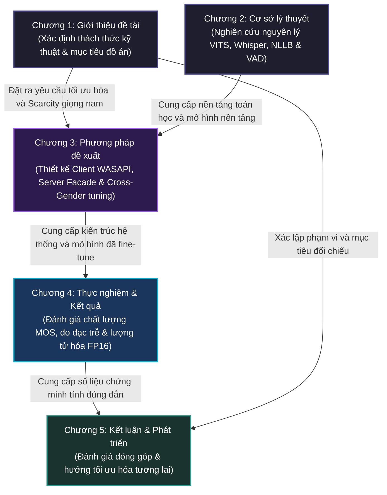
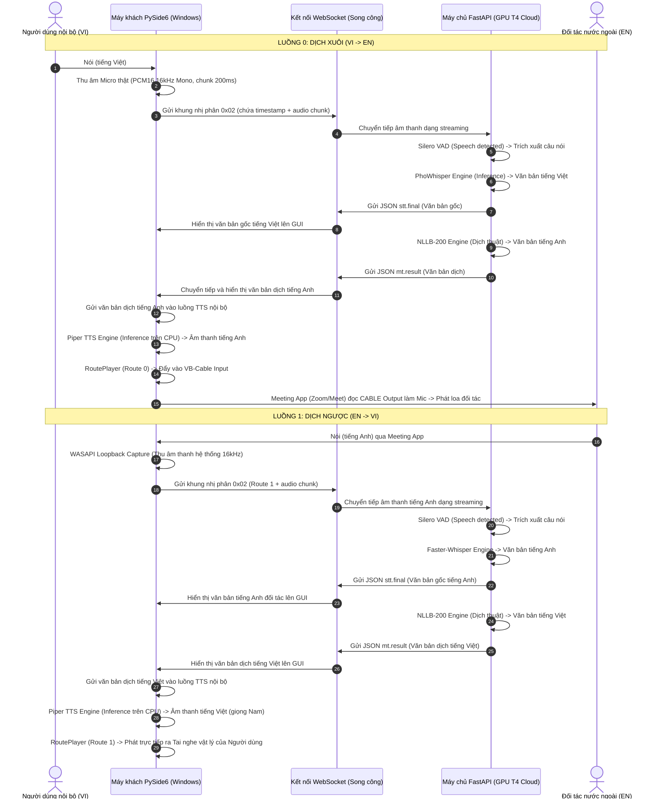

# BÁO CÁO ĐỒ ÁN TỐT NGHIỆP KỸ SƯ AI
## ĐỀ TÀI: HỆ THỐNG DỊCH GIỌNG NÓI THỜI GIAN THỰC SONG HƯỚNG ANH - VIỆT (S2ST) TỐI ƯU HÓA ĐỘ TRỄ VÀ CHẤT LƯỢNG GIỌNG NÓI TỔNG HỢP

---

## TRANG THỦ TỤC & DẪN NHẬP

### TRANG TIÊU ĐỀ (Title Page)

```
BỘ GIÁO DỤC VÀ ĐÀO TẠO
TRƯỜNG ĐẠI HỌC CÔNG NGHỆ THÔNG TIN VÀ TRUYỀN THÔNG VIỆT - HÀN

KHOA KHOA HỌC MÁY TÍNH VÀ KỸ THUẬT
---***---


BÁO CÁO ĐỒ ÁN TỐT NGHIỆP KỸ SƯ NGÀNH TRÍ TUỆ NHÂN TẠO (AI)

ĐỀ TÀI:
HỆ THỐNG DỊCH GIỌNG NÓI THỜI GIAN THỰC SONG HƯỚNG ANH - VIỆT (S2ST) 
TỐI ƯU HÓA ĐỘ TRỄ VÀ CHẤT LƯỢNG GIỌNG NÓI TỔNG HỢP


Sinh viên thực hiện:   [Tên sinh viên thực hiện]
Lớp:                  [Tên lớp, ví dụ: 22AI]
Giảng viên hướng dẫn:  [Tên giảng viên hướng dẫn]
Bộ môn:               Trí tuệ nhân tạo và Khoa học dữ liệu


Đà Nẵng - Năm 2026
```

---

### TRANG NỘI DUNG (Content Page)

*(Mục lục chi tiết cấp 3 được trình bày chi tiết trong tệp BAOCAO_OUTLINE.md và sẽ tự động biên dịch sang danh mục trang của báo cáo chính thức)*

---

### LỜI CẢM ƠN (Acknowledgements)

Lời đầu tiên, em xin bày tỏ lòng biết ơn chân thành và sâu sắc nhất đến Ban Giám hiệu cùng toàn thể quý thầy cô giáo Trường Đại học Công nghệ Thông tin và Truyền thông Việt - Hàn (VKU), đặc biệt là các thầy cô thuộc Khoa Khoa học Máy tính và Kỹ thuật, những người đã truyền dạy tri thức và định hướng tư duy học thuật quý báu cho em trong suốt những năm học tập tại trường.

Đặc biệt, em xin gửi lời cảm ơn sâu sắc nhất tới Giảng viên hướng dẫn - **[Tên giảng viên hướng dẫn]**, người đã tận tình chỉ bảo, định hướng khoa học và luôn dành cho em những lời khuyên, sự động viên quý báu để em vượt qua các thách thức kỹ thuật lớn trong suốt quá trình hoàn thiện đồ án này.

Em cũng xin chân thành cảm ơn các bạn sinh viên lớp [Tên lớp] cùng tập thể các bạn trong nhóm nghiên cứu đã luôn chia sẻ tài nguyên tính toán, đóng góp những ý kiến phản biện khoa học sắc bén và hỗ trợ em thực nghiệm kiểm định chất lượng giọng nói.

Cuối cùng, em xin kính dâng lòng biết ơn vô hạn tới gia đình và những người thân yêu, những người luôn là chỗ dựa tinh thần vững chắc, tiếp thêm động lực để em hoàn thành chặng đường học tập ý nghĩa này. Do giới hạn về thời gian và năng lực nghiên cứu, đồ án chắc chắn không tránh khỏi những thiếu sót nhất định. Em rất mong nhận được những ý kiến đóng góp, chỉ dẫn quý báu từ Hội đồng đánh giá để hệ thống được hoàn thiện hơn.

*Đà Nẵng, ngày ... tháng ... năm 2026*  
Sinh viên thực hiện  
**[Tên sinh viên]**

---

### DANH MỤC CÁC CHỮ VIẾT TẮT (Acronym List)

| Từ viết tắt | Thuật ngữ tiếng Anh đầy đủ | Ý nghĩa tiếng Việt |
| :--- | :--- | :--- |
| **STT** | Speech-to-Text | Nhận dạng tiếng nói (Chuyển giọng nói thành văn bản) |
| **MT** | Machine Translation | Dịch máy |
| **NMT** | Neural Machine Translation | Dịch máy thần kinh |
| **TTS** | Text-to-Speech | Tổng hợp tiếng nói (Chuyển văn bản thành giọng nói) |
| **S2ST** | Speech-to-Speech Translation | Dịch giọng nói sang giọng nói thời gian thực |
| **VAD** | Voice Activity Detection | Phân đoạn hoạt động giọng nói |
| **VITS** | Variational Inference with adversarial learning for end-to-end Text-to-Speech | Mô hình tổng hợp giọng nói đầu-cuối dựa trên biến phân đối nghịch |
| **ONNX** | Open Neural Network Exchange | Định dạng trao đổi mạng thần kinh mở |
| **WER** | Word Error Rate | Tỉ lệ lỗi từ |
| **CER** | Character Error Rate | Tỉ lệ lỗi ký tự |
| **RTF** | Real-Time Factor | Hệ số thời gian thực |
| **MOS** | Mean Opinion Score | Điểm đánh giá trung bình chất lượng âm thanh |
| **VRAM** | Video Random Access Memory | Bộ nhớ truy cập ngẫu nhiên đồ họa |
| **WASAPI** | Windows Audio Session API | Giao diện lập trình phiên âm thanh Windows |
| **VBD** | Sentence Boundary Detection | Phân đoạn ranh giới câu |
| **SNR** | Signal-to-Noise Ratio | Tỉ lệ tín hiệu trên nhiễu |
| **GAN** | Generative Adversarial Network | Mạng đối nghịch tạo sinh |
| **KL** | Kullback-Leibler (Divergence) | Độ phân kỳ KL (Độ đo sự khác biệt hai phân phối) |

---

### DANH MỤC BẢNG (List of Tables)

*(Danh mục bảng biểu sẽ tự động sinh và liên kết từ nội dung chi tiết của Chương 3 và Chương 4)*

---

### DANH MỤC HÌNH VẼ - ĐỒ THỊ (List of Figures)

*(Danh mục hình vẽ, sơ đồ luồng dữ liệu và đồ thị hội tụ sẽ được sinh tự động)*

---

### LỜI MỞ ĐẦU (Introduction)

Trong bối cảnh toàn cầu hóa và sự bùng nổ của chuyển đổi số, giao tiếp xuyên ngôn ngữ trở thành cầu nối quyết định sự thành công của các doanh nghiệp, tổ chức và hoạt động hợp tác khoa học quốc tế. Tuy nhiên, rào cản ngôn ngữ, đặc biệt trong các cuộc họp trực tuyến trực tiếp song hướng giữa hai ngôn ngữ Anh và Việt, vẫn là một thách thức lớn. Hệ thống dịch giọng nói trực tiếp sang giọng nói (Speech-to-Speech Translation - S2ST) là giải pháp tối ưu nhằm tái tạo chu kỳ hội thoại tự nhiên của con người: lắng nghe giọng nói nguồn, dịch thuật ngữ nghĩa và tổng hợp lại bằng giọng nói đích. Đồ án này tập trung nghiên cứu, phát triển và tối ưu hóa **Hệ thống dịch giọng nói thời gian thực song hướng Anh - Việt (S2ST)** hoạt động dưới mô hình máy khách - máy chủ (Client-Server) qua kết nối WebSocket song công, nhằm hướng tới sự cân bằng tối ưu giữa độ trễ và chất lượng tự nhiên của giọng nói dịch thuật.

#### 1. Lý do lựa chọn đề tài
Trong kỷ nguyên toàn cầu hóa, nhu cầu giao tiếp trực tuyến xuyên biên giới qua các nền tảng như Zoom, Google Meet hay Microsoft Teams trở thành một phần thiết yếu của hoạt động vận hành doanh nghiệp và hợp tác quốc tế. Tuy nhiên, việc bất đồng ngôn ngữ giữa các bên tham gia thường gây ra những gián đoạn lớn về mặt truyền đạt thông tin. Các giải pháp dịch thuật truyền thống như thuê biên dịch viên cabin thường tốn kém chi phí, thiếu tính linh hoạt và không đảm bảo độ bảo mật thông tin nội bộ. Trong khi đó, việc sử dụng các công cụ dịch văn bản thông thường lại yêu cầu người dùng phải gõ chữ hoặc copy-paste liên tục, phá hỏng hoàn toàn sự liền mạch của một buổi đối thoại trực tiếp. Xuất phát từ nhu cầu thực tiễn đó, việc phát triển một hệ thống dịch giọng nói sang giọng nói thời gian thực (S2ST) trực diện là lời giải tối ưu. Tuy nhiên, khi triển khai hệ thống này vào thực tế phòng họp ảo song hướng với nguồn tài nguyên tính toán giới hạn, người phát triển phải đối mặt với nhiều trở ngại thực tế rất lớn.

Trước hết, độ trễ tích lũy qua ba phân tầng nhận dạng (STT), dịch máy (NMT) và tổng hợp tiếng nói (TTS) là rào cản trực tiếp nhất. Nếu không được tối ưu hóa, tổng thời gian từ lúc người nói dứt câu cho đến khi người nghe nhận được âm thanh dịch có thể kéo dài từ 4.0 đến 6.0 giây, khiến các bên tham gia dễ nói đè lên nhau, tạo ra các khoảng lặng ngượng ngùng và làm mất đi nhịp điệu của cuộc đối thoại. Bên cạnh đó, đặc thù tiếng Việt có tính thanh điệu phức tạp, người nói thường ngắt nhịp ngắn giữa các từ, dễ làm mô hình phân đoạn giọng nói (VAD) hiểu lầm là đã kết thúc câu và kích hoạt lệnh dịch sớm khi câu chưa trọn vẹn ngữ nghĩa. Ngược lại, khi người nói phát âm nhanh, các phụ âm cuối yếu dễ bị mô hình VAD cắt mất, làm giảm sút độ chính xác nhận dạng chặng đầu. Ở chặng tổng hợp (TTS), việc thiếu hụt một mô hình giọng nam miền Nam tự nhiên, rõ chữ và đủ nhẹ để chạy trực tiếp trên CPU máy khách là một thực trạng rõ rệt, do các tài nguyên mở hiện nay hầu như chỉ cung cấp giọng nữ. Cuối cùng, hiện tượng vòng lặp phản hồi âm học là lỗi thực tế phổ biến nhất; nếu âm thanh dịch phát ra từ loa máy khách bị chính micro của họ thu lại, hệ thống sẽ tự động gửi lên server để dịch đi dịch lại vô hạn, gây nhiễu loạn thông tin và tạo ra tiếng hú lớn gây hỏng thiết bị. Do đó, việc nghiên cứu các giải pháp tối ưu hóa độ trễ, tinh chỉnh mô hình giọng nam từ dữ liệu giới hạn và thiết lập giải pháp cô lập luồng âm thanh máy khách là vô cùng cấp thiết nhằm giải quyết triệt để các vấn đề thực tiễn này.

#### 2. Mục tiêu nghiên cứu
Đồ án hướng tới các mục tiêu cụ thể sau:
- **Thiết kế hệ thống S2ST song hướng thời gian thực:** Xây dựng hoàn chỉnh kiến trúc Client-Server kết nối qua giao thức WebSocket, kiểm soát và giảm thiểu tổng độ trễ cumulative đầu-cuối xuống dưới ngưỡng nhận thức tự nhiên của hội thoại thường nhật.
- **Tối ưu hóa các chặng trung gian:** Đề xuất và triển khai các thuật toán xử lý luồng (VAD Hangover, Short-MT Buffering kết hợp Watchdog flush và Comma Fallback Splitter) nhằm giảm thiểu độ trễ Time-to-First-Audio (TTFA) của chặng TTS mà vẫn đảm bảo tính toàn vẹn ngữ nghĩa.
- **Nghiên cứu quy trình tinh chỉnh Piper TTS giọng nam Việt:** Ứng dụng phương pháp chuyển giới tính giọng nói (*Cross-Gender Fine-tuning*) để tạo ra mô hình giọng nam miền Nam từ tập dữ liệu giới hạn, nén lượng tử hóa sang định dạng FP16 siêu nhẹ (~32MB) chạy mượt mà trên CPU phân khúc phổ thông.
- **Cách ly phản hồi âm học ngầm:** Xây dựng giải pháp định tuyến âm thanh ảo hai lộ tuyến độc lập, sử dụng API ghi âm loopback WASAPI để cô lập triệt để vòng lặp phản hồi âm mà không yêu cầu đặc quyền Quản trị viên (Administrator).

#### 3. Đối tượng và phạm vi nghiên cứu
- **Đối tượng nghiên cứu:** 
  - Các kiến trúc học sâu tiên tiến phục vụ xử lý giọng nói và ngôn ngữ: Mạng tự chú ý và Transformer trong Whisper/PhoWhisper, mô hình dịch máy đa ngôn ngữ NLLB-200 và thư viện tối ưu hóa CTranslate2, kiến trúc VITS nén nhẹ (Piper TTS) dựa trên Normalizing Flows và GANs, mô hình phát hiện hoạt động giọng nói Silero VAD.
  - Các giao thức truyền thông mạng song công thời gian thực (WebSocket) và cơ chế định tuyến âm thanh ảo trên hệ điều hành Windows (WASAPI, VB-Audio Virtual Cable).
- **Phạm vi nghiên cứu:**
  - Cặp ngôn ngữ dịch thuật song hướng: Anh - Việt và Việt - Anh.
  - Môi trường thử nghiệm máy chủ: Phân bổ tài nguyên trên duy nhất một GPU tầm trung NVIDIA Tesla T4 (Google Colab / FastAPI server).
  - Môi trường thử nghiệm máy khách: Chạy ứng dụng đồ họa PySide6 tích hợp `qasync` trực tiếp trên hệ điều hành Windows 10/11 local.
  - Tập dữ liệu huấn luyện TTS: Lọc và chuẩn hóa dữ liệu giọng nam miền Nam từ bộ dữ liệu `VieNeu-TTS-140h`.

#### 4. Cách tiếp cận
Để giải quyết bài toán đặt ra dưới điều kiện giới hạn về phần cứng, đồ án đề xuất các phương pháp tiếp cận sau:
- **Tiếp cận kiến trúc phân tán tối ưu hóa tài nguyên:** Phân bổ các tác vụ STT và NMT nặng (đòi hỏi tính toán ma trận lớn) lên GPU đám mây của máy chủ thông qua các facade bất đồng bộ; đồng thời đẩy tác vụ suy luận TTS (nhờ mô hình Piper nén nhẹ) và điều phối âm thanh về CPU máy khách nhằm triệt tiêu băng thông truyền tải âm thanh chặng cuối trên mạng.
- **Tiếp cận tối ưu hóa song song bất đồng bộ:** Thiết lập các "Execution Lane" song song có cơ chế khóa hoạt động (`operation_lock`) trên từng model entry để tránh nghẽn GPU VRAM, kết hợp cơ chế Warmup khởi động nóng để giảm trễ cold-start về 0.
- **Tiếp cận chuyển giao tri thức (Transfer Learning) cho TTS:** Thay vì huấn luyện mô hình VITS giọng nam từ đầu vốn cần lượng dữ liệu khổng lồ, đồ án thực hiện Cross-Gender Fine-tuning dựa trên không gian nhúng âm vị có sẵn của checkpoint gốc giọng nữ `vais1000-medium`, giúp mô hình nhanh chóng hội tụ và đạt độ tự nhiên cao chỉ với 2.5 giờ dữ liệu nam sạch.
- **Tiếp cận cô lập tuyến âm vật lý - ảo (Routing Isolation):** Cô lập luồng dịch xuôi (VI-EN) đẩy thẳng vào thiết bị âm thanh ảo đầu vào làm micro cho phần mềm họp, tách biệt hoàn toàn với luồng dịch ngược (EN-VI) phát ra loa ngoài, triệt tiêu phản hồi âm học mà không can thiệp sâu vào nhân hệ điều hành.

#### 5. Phương pháp nghiên cứu
Đồ án áp dụng kết hợp các phương pháp nghiên cứu sau:
- **Phương pháp nghiên cứu lý thuyết:** Nghiên cứu tài liệu chuyên khảo về xử lý tín hiệu số, kiến trúc Transformer chú ý tự thân, mô hình biến phân tự động điều kiện (Conditional VAE), Normalizing Flows, và mạng đối nghịch tạo sinh (GAN) trong tổng hợp tiếng nói.
- **Phương pháp thực nghiệm và xây dựng hệ thống:**
  - Xây dựng quy trình tự động hóa kiểm soát chất lượng dữ liệu (STT QC) sử dụng mô hình *PhoWhisper-large* đánh giá chéo Word Error Rate (WER) nhằm loại bỏ clips lệch pha, trích xuất tập dữ liệu sạch 1500 câu chuẩn.
  - Tiến hành huấn luyện thực nghiệm mô hình TTS trên Google Colab qua 3000 epochs, theo dõi các đường cong hội tụ loss (Generator/Discriminator/Mel/KL), sau đó lượng tử hóa mô hình sang FP16 ONNX.
  - Xây dựng phần mềm client PySide6 thực thi định tuyến và ghi âm loopback WASAPI.
- **Phương pháp đánh giá và kiểm chứng:**
  - Đo đạc định lượng khách quan: Sử dụng hệ thống telemetry đo trễ xử lý từng phân tầng, tính toán chỉ số WER của STT, hệ số thời gian thực RTF của TTS và ứng dụng mô hình deep learning *NISQA* để chấm điểm MOS khách quan cho giọng nói tổng hợp.
  - Đo đạc định tính chủ quan: Khảo sát và lấy điểm Mean Opinion Score (Human MOS) từ người dùng thực tế dựa trên bộ 25 câu test chuẩn để đánh giá độ tự nhiên, rõ chữ và tính biểu cảm của giọng nam miền Nam được tinh chỉnh.

---

## CHƯƠNG 1. GIỚI THIỆU ĐỀ TÀI

### 1.1. Lý do chọn đề tài (Motivation)

#### 1.1.1. Nhu cầu dịch thuật trực tuyến đa ngôn ngữ trong kỷ nguyên toàn cầu hóa

Trong kỷ nguyên toàn cầu hóa và sự phát triển mạnh mẽ của nền kinh tế số, nhu cầu giao tiếp xuyên biên giới đã trở thành một yếu tố sống còn đối với các doanh nghiệp, tổ chức giáo dục và các cơ quan nghiên cứu khoa học. Sự phổ biến của các nền tảng họp trực tuyến như Zoom, Google Meet và Microsoft Teams đã phá bỏ các rào cản vật lý về địa lý, cho phép các cá nhân từ khắp nơi trên thế giới cộng tác trong cùng một không gian ảo. Tuy nhiên, rào cản ngôn ngữ vẫn là một thách thức lớn nhất đối với việc truyền đạt thông tin một cách chính xác, tự nhiên và tức thời.

Hệ thống dịch thuật giọng nói sang giọng nói trực tiếp (Speech-to-Speech Translation - S2ST) đại diện cho đỉnh cao của công nghệ xử lý ngôn ngữ tự nhiên (NLP) và xử lý tín hiệu âm thanh. Khác với các giải pháp dịch thuật văn bản (Text-to-Text) truyền thống hoặc nhận dạng giọng nói thành văn bản đơn thuần (Speech-to-Text), hệ thống S2ST hướng tới việc tái tạo toàn bộ chu kỳ giao tiếp tự nhiên của con người: lắng nghe giọng nói ở ngôn ngữ nguồn, dịch thuật ngữ nghĩa sang ngôn ngữ đích và tổng hợp lại thành giọng nói tự nhiên ở ngôn ngữ đích. Đặc biệt, đối với cặp ngôn ngữ Anh - Việt, nhu cầu này là vô cùng to lớn tại Việt Nam trong bối cảnh các doanh nghiệp công nghệ trong nước liên tục hội nhập quốc tế, đòi hỏi các cuộc họp song phương diễn ra trơn tru mà không bị gián đoạn bởi các khoảng ngừng dịch thuật thủ công hoặc chi phí đắt đỏ cho biên dịch viên cabin chuyên nghiệp.

#### 1.1.2. Thách thức về độ trễ tích lũy và chất lượng âm phổ tự nhiên của giọng nói tiếng Việt

Mặc dù có nhu cầu thực tiễn rất cao, việc xây dựng và triển khai một hệ thống S2ST thời gian thực song hướng (bidirectional) vẫn đang đối mặt với những thách thức công nghệ rất lớn, cụ thể được phân rã thành hai khía cạnh cốt lõi sau:

##### 1. Độ trễ tích lũy của kiến trúc phân tầng (Cascaded Latency Accumulation)
Một hệ thống S2ST tiêu chuẩn thường được xây dựng theo kiến trúc phân tầng bao gồm ba khối chức năng hoạt động nối tiếp nhau: Nhận dạng tiếng nói (STT) $\rightarrow$ Dịch máy (MT) $\rightarrow$ Tổng hợp tiếng nói (TTS). Mỗi phân tầng này đều tự giới thiệu một khoảng trễ xử lý riêng biệt:
- **Độ trễ STT ($L_{STT}$):** Phụ thuộc vào mô hình Phân đoạn hoạt động giọng nói (VAD) để phát hiện khoảng nghỉ giữa các câu, sau đó là thời gian suy luận của mô hình nhận dạng tiếng nói để xuất ra văn bản.
- **Độ trễ MT ($L_{MT}$):** Thời gian mô hình dịch máy thần kinh chuyển đổi cấu trúc ngữ pháp và từ vựng của văn bản nguồn sang văn bản đích.
- **Độ trễ TTS ($L_{TTS}$):** Thời gian mô hình tổng hợp chuyển đổi văn bản đích thành dữ liệu âm phổ và giải mã thành sóng âm (waveform).
- **Độ trễ mạng ($L_{network}$):** Trễ truyền tải gói tin âm thanh giữa client và server thông qua giao thức truyền thông.

Độ trễ đầu-cuối tổng cộng được xác định theo công thức:

$$L_{total} = L_{STT} + L_{MT} + L_{TTS} + L_{network}$$

Trong các hệ thống S2ST ngây thơ, độ trễ $L_{total}$ có thể dễ dàng vượt quá ngưỡng 4.0 đến 6.0 giây. Khoảng trễ quá lớn này phá hỏng hoàn toàn nhịp điệu hội thoại tự nhiên, gây ra hiện tượng nói đè, nói trùng hoặc tạo ra những khoảng lặng khó xử trong các cuộc họp trực tuyến. Do đó, việc nghiên cứu tối ưu hóa độ trễ ở từng chặng, đặc biệt là cơ chế cắt câu động của VAD và xử lý song song hóa luồng dữ liệu, là một bài toán sống còn.

##### 2. Đặc thù ngôn ngữ và thách thức cắt câu của tiếng Việt
Tiếng Việt là một ngôn ngữ đơn âm tiết, có tính thanh điệu phức tạp (gồm 6 thanh điệu khác nhau). Trong giao tiếp thực tế, người nói thường có xu hướng kéo dài các âm tiết có thanh huyền, thanh hỏi hoặc tạo ra các khoảng dừng nghỉ ngắn tự nhiên giữa các từ để nhấn mạnh ngữ nghĩa. Các mô hình VAD thông thường (như Silero VAD) nếu không được tinh chỉnh phù hợp sẽ dễ dàng nhận nhầm các khoảng ngắt nhịp tự nhiên này là khoảng lặng kết thúc câu, dẫn đến việc kích hoạt lệnh dịch sớm (premature final trigger), làm câu nói bị cắt vụn và mất ngữ cảnh nghiêm trọng ở tầng dịch máy. Ngược lại, các phụ âm cuối trong tiếng Anh hoặc tiếng Việt khi phát âm nhanh thường có năng lượng âm học (energy) rất yếu, dễ bị mô hình VAD hiểu nhầm là nhiễu nền hoặc khoảng lặng và cắt bỏ (tail consonant drop), làm suy giảm độ chính xác nhận dạng của tầng STT từ 95% xuống dưới 80%.

##### 3. Sự thiếu hụt mô hình tổng hợp tiếng nói (TTS) giọng nam Việt chất lượng cao
Trong tầng tổng hợp tiếng nói (TTS), để đảm bảo tính thời gian thực, mô hình cần phải có dung lượng nhẹ để triển khai được trực tiếp tại CPU phía client mà không cần phụ thuộc vào GPU đắt đỏ. Hiện tại, cộng đồng mã nguồn mở (như Rhasspy Piper) chỉ cung cấp các mô hình giọng nữ tiếng Việt khá tốt (như `vi_VN-vais1000-medium`), hoàn toàn thiếu vắng các mô hình giọng nam tiếng Việt có ngữ điệu tự nhiên, rõ chữ và tối ưu hóa dung lượng nhẹ. Việc tự huấn luyện một mô hình TTS giọng nam từ đầu đòi hỏi khối lượng dữ liệu studio khổng lồ (từ 10 đến 20 giờ) và tài nguyên tính toán rất lớn, điều này không khả thi đối với các dự án nghiên cứu có tài nguyên hạn chế. Do đó, việc nghiên cứu các kỹ thuật tinh chỉnh chuyển đổi giới tính giọng nói (Cross-Gender Fine-tuning) từ các checkpoint giọng nữ sẵn có là một khoảng trống nghiên cứu cần được giải quyết.

#### 1.1.3. Ý nghĩa thực tiễn của giải pháp dịch giọng nói thời gian thực song hướng (Anh - Việt)

Đề tài nghiên cứu và phát triển hệ thống dịch giọng nói song hướng Anh - Việt thời gian thực mang lại những giá trị thực tiễn vô cùng to lớn:

1.  **Cung cấp một giải pháp hội thoại xuyên ngôn ngữ độ trễ thấp:** Hệ thống giúp người dùng Việt Nam và các đối tác nói tiếng Anh giao tiếp trực tiếp trong các cuộc họp trực tuyến một cách tự nhiên. Người nói chỉ cần phát âm bình thường, hệ thống sẽ tự động cắt câu thông minh, dịch thuật và phát ra âm thanh dịch sang tai người nghe bên kia với độ trễ tối thiểu (dưới mức nhận thức thông thường).
2.  **Đóng góp mô hình giọng nam tiếng Việt chất lượng cao cho cộng đồng:** Quy trình thực nghiệm tinh chỉnh mô hình Piper TTS giọng nam miền Nam từ tập dữ liệu hạn chế sẽ cung cấp cho cộng đồng nghiên cứu AI tại Việt Nam một mô hình tổng hợp giọng nam có dung lượng cực nhẹ (~32MB sau lượng tử hóa FP16) nhưng vẫn đảm bảo độ tự nhiên và tốc độ suy luận vượt trội trên các CPU máy tính phổ thông.
3.  **Khả năng triển khai thực tế với chi phí tối ưu:** Việc thiết kế hệ thống hoạt động trên kiến trúc Client-Server tối ưu hóa tài nguyên (tận dụng GPU đám mây T4 miễn phí/giá rẻ của Google Colab cho các tác vụ STT/MT nặng và đẩy tác vụ TTS/định tuyến âm thanh về CPU máy khách) chứng minh tính khả thi của việc triển khai ứng dụng thực tế mà không đòi hỏi chi phí đầu tư hạ tầng phần cứng đắt đỏ.
4.  **Giải quyết triệt để các vấn đề nhiễu âm học phòng họp:** Giải pháp cách ly loopback âm thanh qua WASAPI trên Windows giúp loại bỏ hiện tượng vòng lặp phản hồi âm thanh (feedback loop) và tiếng vọng (acoustic echo) mà không cần can thiệp sâu vào quyền quản trị của hệ điều hành, đảm bảo hệ thống có thể tích hợp an toàn và trực tiếp vào bất kỳ phần mềm họp trực tuyến hiện có nào như Zoom hay Google Meet.

### 1.2. Phát biểu bài toán (Problem Statement)

#### 1.2.1. Bài toán nhận dạng tiếng nói (STT) dạng streaming trên luồng âm thanh liên tục không mất ngữ cảnh

Trong hệ thống Speech-to-Speech Translation thời gian thực, chặng đầu tiên là nhận dạng giọng nói (STT) đóng vai trò quyết định đối với chất lượng của toàn bộ pipeline. Trong các hệ thống xử lý offline truyền thống, âm thanh được thu nhận dưới dạng một tệp hoàn chỉnh, sau đó đưa vào mô hình suy luận một lần. Phương pháp này không thể áp dụng cho kịch bản hội thảo trực tuyến thời gian thực do độ trễ quá lớn. Thay vào đó, máy khách (client) phải gửi liên tục các đoạn âm thanh nhỏ (chunk) có thời lượng ngắn (200ms) lên máy chủ (server) thông qua kết nối WebSocket.

Thách thức cốt lõi của nhận dạng tiếng nói dạng streaming là làm sao hiển thị văn bản tạm thời kịp thời (Interim results) để người dùng có phản hồi thị giác tức thì, trong khi vẫn phải đảm bảo độ chính xác tuyệt đối của câu nói khi kết thúc (Final results). Cụ thể, bài toán đặt ra hai khó khăn chính:
1.  **Sự thiếu hụt ngữ cảnh trong suy luận tạm thời (Interim Inference):** Các mô hình Transformer nhận dạng giọng nói mạnh mẽ (như OpenAI Whisper hay Faster-Whisper) không phải là mô hình dạng Transducer suy luận cuốn chiếu theo từng khung. Khi suy luận trên các phân đoạn âm thanh ngắn (~1.5 giây), mô hình thiếu đi ngữ cảnh dài hạn ở phía trước và phía sau, dẫn đến hiện tượng ảo giác (hallucination), lặp từ hoặc nhận dạng sai các từ đồng âm. Hệ thống cần có cơ chế đệm âm thanh và ghi đè thông minh (Interim → Final overwrite) sử dụng cùng một định danh phân đoạn (`segment_id`) để văn bản cuối cùng chỉnh sửa lại các lỗi nhận dạng tạm thời.
2.  **Mất ngữ cảnh liên tục giữa các câu (Inter-utterance Context Loss):** Khi một câu kết thúc và được trigger bởi VAD phát ra kết quả Final, bộ đệm âm thanh được giải phóng để chuẩn bị cho câu tiếp theo. Điều này làm cho mô hình STT hoàn toàn mất đi ngữ cảnh của các câu đã nói trước đó, dẫn đến việc nhận dạng sai các danh từ riêng, thuật ngữ viết tắt của cuộc họp (ví dụ: `"VKU"`, `"WebSocket"`, `"FastAPI"`) hoặc các từ tiếng Anh xen kẽ vốn xuất hiện nhiều lần trong phiên. Hệ thống đòi hỏi một giải pháp chuyển tiếp ngữ cảnh bằng cách sử dụng một bộ đệm trượt lưu giữ văn bản của các câu trước và đưa ngược lại vào mô hình dưới dạng tham số gợi ý âm học (`initial_prompt`), đồng thời phải tắt tính năng tự hồi quy ngữ cảnh của Whisper (`condition_on_previous_text=False`) để tránh rơi vào vòng lặp hallucination vô hạn.

#### 1.2.2. Bài toán dịch máy hội thoại đa ngữ (NMT) bảo toàn tính tự nhiên và ngữ nghĩa của vế nói ngắn

Tầng dịch máy thần kinh (NMT) chịu trách nhiệm dịch thuật ngữ nghĩa từ văn bản nguồn sang văn bản đích. Khác với các tài liệu văn bản viết có cấu trúc ngữ pháp chuẩn chỉnh, ngôn ngữ hội thoại trong các cuộc họp trực tuyến thường có đặc điểm:
-   Câu nói ngắn, không đầy đủ thành phần chủ-vị.
-   Có nhiều từ đệm, từ ngắt quãng hoặc ngắt nghỉ hơi giữa chừng.
-   Cấu trúc câu linh hoạt và thay đổi nhanh chóng.

Nếu mô hình dịch máy (như NLLB-200) thực hiện dịch ngay lập tức mọi cụm từ nhỏ nhận được từ tầng STT (ví dụ khi đoạn văn bản nguồn chỉ có 2-3 từ), kết quả dịch thuật thu được sẽ mang tính dịch thô từng từ (literal translation), rời rạc và hoàn toàn sai lệch về trật tự từ giữa hai cấu trúc ngữ pháp Anh - Việt (SVO của tiếng Anh và tính linh hoạt trong ngữ pháp tiếng Việt). Ví dụ, vế nói ngắn `"I think we should"` nếu dịch riêng rẽ sẽ ra `"Tôi nghĩ chúng tôi nên"`, thiếu đi vị ngữ chính và nghe rất cụ cụt, phá hỏng ngữ điệu khi đưa vào tầng tổng hợp giọng nói TTS tiếp theo.

Do đó, bài toán đặt ra là cần thiết lập một **giải thuật đệm dịch ngắn (Short-MT buffering)** tại bộ quản lý phiên streaming. Thuật toán này có nhiệm vụ trì hoãn việc dịch các phân đoạn văn bản nhỏ hơn một ngưỡng ký tự hoặc số từ nhất định, tạm thời giữ chúng lại để ghép nối với ngữ cảnh của các phân đoạn tiếp theo nhằm nâng cao tính tự nhiên và toàn vẹn ngữ nghĩa của bản dịch. Tuy nhiên, việc đệm dịch lại mâu thuẫn trực tiếp với yêu cầu tối ưu hóa độ trễ. Nếu người nói dừng lại quá lâu mà hệ thống vẫn tiếp tục đợi để ghép câu, độ trễ sẽ tăng lên vô hạn. Vì vậy, hệ thống bắt buộc phải tích hợp một cơ chế giám sát thời gian thực (Watchdog flush) tự động giải phóng bộ đệm và ép dịch sau một khoảng im lặng được calibrate chính xác (ví dụ: 3 giây), đảm bảo bản dịch cuối cùng không bị kẹt lại trong hàng đợi.

#### 1.2.3. Bài toán thiếu hụt mô hình tổng hợp giọng nói (TTS) giọng nam Việt chất lượng cao, dung lượng nhẹ phục vụ thời gian thực

Tầng cuối cùng của hệ thống S2ST là tổng hợp tiếng nói (TTS) từ văn bản dịch. Để hệ thống có thể hoạt động trơn tru trong thời gian thực, độ trễ suy luận của tầng TTS ($L_{TTS}$) cộng với hệ số thời gian thực (Real-Time Factor - RTF) phải luôn duy trì ở mức nhỏ hơn 1.0 (suy luận nhanh hơn tốc độ nói thực tế) ngay trên phần cứng CPU thông thường của máy khách. Các kiến trúc TTS nặng ký như Coqui XTTS v2 dù cho chất lượng tốt nhưng đòi hỏi tài nguyên tính toán GPU rất lớn và dung lượng bộ nhớ VRAM cao, không phù hợp cho việc triển khai đại trà tại máy khách.

Mô hình Piper TTS (dựa trên kiến trúc VITS đầu-cuối) nổi lên như một giải pháp tối ưu nhờ tốc độ suy luận cực nhanh và dung lượng gọn nhẹ. Tuy nhiên, rào cản lớn nhất đối với cặp ngôn ngữ tiếng Việt là:
1.  **Thiếu hụt trầm trọng checkpoint giọng nam Việt chất lượng:** Cộng đồng mã nguồn mở hiện chỉ cung cấp checkpoint giọng nữ miền Nam (`vais1000-medium`). Chưa có bất kỳ mô hình giọng nam tiếng Việt nào đạt độ tự nhiên cao để phục vụ hội thoại chuyên nghiệp.
2.  **Bài toán dữ liệu giới hạn và chi phí huấn luyện:** Huấn luyện một mô hình VITS từ đầu yêu cầu tập dữ liệu đơn phát biểu (single-speaker) sạch sẽ có thời lượng từ 10 đến 20 giờ ghi âm studio và tài nguyên GPU khổng lồ để hội tụ. Bài toán thực tế đòi hỏi phải tận dụng phương pháp **Cross-Gender Fine-tuning** (tinh chỉnh chuyển đổi giới tính giọng nói) từ checkpoint giọng nữ vais1000 sẵn có trên một tập dữ liệu giọng nam cực kỳ hạn chế (chỉ khoảng 2.5 giờ). Kỹ thuật này bắt buộc mô hình phải học cách thay đổi các đặc trưng âm học nhạy cảm với giới tính (như cao độ - pitch, và formant của giọng nam miền Nam) trong khi phải giữ nguyên không gian nhúng âm vị (phoneme embeddings) và thanh điệu tiếng Việt đã học từ mô hình gốc.
3.  **Lượng tử hóa tối ưu hóa phần cứng (Quantization):** Mô hình sau huấn luyện ở dạng FP32 cần phải được chuyển đổi sang ONNX FP16 để giảm dung lượng xuống dưới 35MB và tăng tốc độ suy luận CPU. Tuy nhiên, việc lượng tử hóa VITS thường gặp lỗi load mô hình trên ONNX Runtime do các node ép kiểu ngầm định (`Cast` nodes) xuất ra định dạng FP16 không khớp với mong đợi của đầu vào tiếp theo. Hệ thống cần một bản vá cấu hình lượng tử hóa chính xác (như `op_block_list`) để đảm bảo chất lượng phổ âm (spectrogram) và điểm chất lượng NISQA MOS không bị suy giảm sau khi nén.

#### 1.2.4. Bài toán cô lập luồng âm thanh thu/phát hệ thống chống vòng lặp phản hồi âm thanh (feedback loop)

Trong kịch bản dịch thuật song hướng thời gian thực của một cuộc họp trực tuyến, hệ thống máy khách phải xử lý đồng thời hai luồng âm thanh độc lập nhưng diễn ra song song:
-   **Luồng 0 (Dịch xuôi - VI $\rightarrow$ EN):** Thu âm thanh từ Micro thật của người dùng nội bộ (nói tiếng Việt) $\rightarrow$ Dịch sang tiếng Anh $\rightarrow$ Phát ra cho các thành viên nước ngoài trong cuộc họp nghe.
-   **Luồng 1 (Dịch ngược - EN $\rightarrow$ VI):** Thu âm thanh hệ thống (tiếng nói tiếng Anh của các thành viên nước ngoài phát ra từ phần mềm họp như Zoom/Meet) $\rightarrow$ Dịch sang tiếng Việt $\rightarrow$ Phát ra loa vật lý/tai nghe của người dùng nội bộ.

Mối nguy hiểm lớn nhất và là nguyên nhân gây đổ vỡ toàn bộ hệ thống âm thanh là **vòng lặp phản hồi âm thanh (feedback loop)** hay tiếng vọng âm học (acoustic echo). Nếu âm thanh dịch tiếng Việt của Luồng 1 (phát ra loa vật lý để người dùng nội bộ nghe) bị thu ngược lại bởi chính Micro của người dùng đó, hệ thống STT sẽ hiểu nhầm đó là giọng nói mới, tiếp tục gửi lên server dịch ngược lại tiếng Anh và phát ra cuộc họp. Quá trình này lặp đi lặp lại vô hạn, tạo ra một vòng lặp dịch thuật hỗn loạn và tiếng hú lớn do cộng hưởng âm học.

Để giải quyết triệt để bài toán này, hệ thống bắt buộc phải triển khai một cơ chế **cô lập âm thanh vật lý và ảo (Audio Routing Isolation)** ở tầng máy khách Windows:
1.  **Cách ly thiết bị phát Luồng 1:** Âm thanh dịch tiếng Việt dành cho người dùng nội bộ nghe phải được phát trực tiếp ra loa ngoài hoặc tai nghe vật lý của họ, và micro của họ phải được cấu hình định hướng hoặc giảm nhạy để tránh thu lại âm thanh này.
2.  **Cách ly và định tuyến Luồng 0 qua thiết bị ảo:** Âm thanh dịch tiếng Anh dành cho đối tác nước ngoài phải được định tuyến ngầm vào đầu vào của một trình điều khiển âm thanh ảo (VB-Audio Virtual Cable Input). Phần mềm họp trực tuyến (Zoom/Meet) tại máy khách sẽ chọn đầu ra ảo tương ứng (CABLE Output) làm thiết bị Micro đầu vào của nó. Nhờ đó, luồng dịch thuật được "bơm" trực tiếp vào luồng thoại của cuộc họp dưới dạng tín hiệu số sạch sẽ, tách biệt hoàn toàn với loa vật lý của máy khách và không bị thu lại bởi các trình ghi âm hệ thống (system loopback recorder) vốn chỉ ghi nhận kênh âm thanh hệ thống chính.
3.  **Thu âm hệ thống không cần đặc quyền Administrator:** Việc ghi nhận âm thanh hệ thống để dịch ngược (Luồng 1) phải được triển khai thông qua API ghi âm loopback WASAPI (Windows Audio Session API) chỉ nhắm mục tiêu vào thiết bị phát mặc định của cuộc họp, đảm bảo chương trình hoạt động ổn định trên các máy tính người dùng phổ thông mà không yêu cầu quyền Admin để cấu hình card âm thanh phức tạp.

---

### 1.3. Mục tiêu và Đóng góp của đề tài

#### 1.3.1. Thiết lập hệ thống S2ST thời gian thực song hướng tối ưu hóa độ trễ cumulative

Mục tiêu hàng đầu của đề tài là xây dựng một hệ thống dịch giọng nói sang giọng nói thời gian thực (S2ST) song hướng hoàn chỉnh cho cuộc họp trực tuyến Anh - Việt, đảm bảo giảm thiểu tối đa độ trễ cumulative đầu-cuối xuống mức dưới ngưỡng nhận nhận thức tự nhiên của con người. Để đạt được mục tiêu này, đồ án đã mang lại các đóng góp cụ thể về mặt thiết kế hệ thống và thuật toán:

1.  **Thiết kế Pipeline bất đồng bộ đa luồng trên Server FastAPI:** Chuyển đổi toàn bộ luồng xử lý từ dạng khối đồng bộ (batch) sang luồng streaming liên tục thông qua giao thức WebSocket. Phát triển bộ quản lý phiên truyền phát `StreamingSTTSessionManager` tích hợp sâu mô hình phân đoạn *Silero VAD* chạy trực tiếp trên máy chủ.
2.  **Giải thuật tối ưu hóa độ trễ chặng giữa (STT-MT-TTS Parallelism):** Thay vì xử lý tuần tự chặn luồng, đồ án triển khai kiến trúc song song hóa *Execution Lane* (sử dụng thread pool executor kết hợp khóa thao tác `operation_lock` trên từng entry) giúp cô lập tài nguyên tính toán GPU VRAM. Triển khai giải thuật *Preload & Warmup* lúc FastAPI startup, loại bỏ hoàn toàn độ trễ khởi động lạnh (cold-start latency) lần đầu từ 60-90 giây xuống 0 giây.
3.  **Thuật toán cắt câu động và đệm dịch thông minh:**
    -   *VAD Hangover (400ms):* Giữ lại 2 khung âm thanh tĩnh sau khi phát hiện khoảng lặng để bảo toàn các phụ âm gió/phụ âm cuối yếu của người nói, ngăn chặn lỗi dịch cụt.
    -   *Short-MT Buffering & Watchdog (3s):* Tạm hoãn dịch vế nói quá ngắn dưới 4 từ để tăng tính tự nhiên ngữ nghĩa, và tự động xả hàng đợi dịch sau 3 giây im lặng để bảo toàn trễ nhận thức đầu ra (Time-To-First-Audio - TTFA).
    -   *Comma Fallback Splitter:* Tự động ngắt dấu câu mềm trên kết quả dịch giúp bộ tổng hợp TTS phát âm cuốn chiếu song song với chặng dịch tiếp theo.

#### 1.3.2. Nghiên cứu phương pháp Cross-Gender Fine-tuning Piper TTS tạo giọng nam miền Nam Việt chất lượng từ dataset giới hạn

Đóng góp khoa học quan trọng nhất của đồ án ở tầng tổng hợp tiếng nói (TTS) là nghiên cứu và thực nghiệm thành công phương pháp **Cross-Gender Fine-tuning** (huấn luyện chuyển giới tính giọng nói từ checkpoint nữ sang nam) dựa trên kiến trúc nén VITS của mô hình *Rhasspy Piper*, khắc phục tình trạng thiếu hụt tài nguyên mô hình giọng nam tiếng Việt trên cộng đồng.
Các đóng góp chi tiết bao gồm:

1.  **Quy trình chuẩn hóa dữ liệu & Kiểm soát chất lượng STT QC:** Xây dựng quy trình xử lý âm thanh tự động (resample 22.05kHz, chuẩn hóa độ to -23 LUFS và trim khoảng lặng). Ứng dụng mô hình *PhoWhisper-large* thực hiện nhận dạng kiểm định chéo văn bản trên 1999 clips của tập dữ liệu *VieNeu-TTS-140h*, đề xuất bộ lọc *Per-Speaker Hybrid Filter* giúp loại bỏ sạch sẽ 499 clips lỗi lệch pha (offset error) để tạo ra tập dữ liệu 1500 clips (~2.5h) sạch hoàn toàn.
2.  **Giải pháp 2-Pass Phoneme Mapping Workaround:** Thiết kế giải pháp căn chỉnh và đồng bộ hóa âm vị 2 bước để bypass hạn chế của thư viện *piper-train*, giải quyết triệt để lỗi Index Out of Bounds của mô hình VITS khi gặp các âm vị latin lạ từ các từ tiếng Anh xen kẽ trong văn bản tiếng Việt.
3.  **Lượng tử hóa tối ưu hóa CPU:** Triển khai quy trình lượng tử hóa FP16 cho mô hình Piper ONNX, đóng gói thành công tệp mô hình siêu nhẹ chỉ **32MB** (giảm 50% so với bản gốc 63MB) mà không làm suy giảm điểm chất lượng khách quan (NISQA MOS) và hệ số thời gian thực (RTF) trên CPU.

#### 1.3.3. Xây dựng giải pháp định tuyến âm thanh ảo cô lập loopback chống lặp tiếng không cần can thiệp Admin hệ thống

Đóng góp thực tiễn nổi bật ở phía máy khách (Client PySide6) là thiết kế giải pháp cách ly và định tuyến luồng âm thanh hai chiều hoàn toàn tự động trên hệ điều hành Windows, triệt tiêu triệt để hiện tượng vòng lặp phản hồi âm thanh (feedback loop) mà không cần can thiệp quyền Admin.
Các giải pháp kỹ thuật cụ thể gồm:

1.  **Nhận diện thiết bị âm thanh ảo không đặc quyền (Admin-free Detection):** Viết module quét driver âm thanh ảo ngầm thông qua thư viện PyAudio (`is_vb_cable_installed`), kiểm tra sự hiện diện của driver **VB-Audio Virtual Cable** bằng cơ chế lọc chuỗi từ khóa mà không cần truy vấn Registry Windows (vốn yêu cầu quyền Administrator).
2.  **Thiết kế bộ phát âm thanh đa lộ tuyến (RoutePlayer):** Xây dựng bộ điều phối âm thanh `RoutePlayer` quản lý song song hai luồng phát `AdaptiveJitterPlayer`:
    -   *Route 0 (Dịch Việt $\rightarrow$ Anh):* Định tuyến và đẩy dữ liệu âm thanh số vào cổng phát ảo "CABLE Input" để làm micro ảo cấp cho Zoom/Google Meet (các thành viên cuộc họp nghe).
    -   *Route 1 (Dịch Anh $\rightarrow$ Việt):* Phát trực tiếp ra loa/tai nghe mặc định để người dùng nội bộ nghe.
3.  **Bộ thu âm Loopback WASAPI an toàn:** Triển khai lớp ghi âm `LoopbackCaptureService` gọi API âm thanh WASAPI trực tiếp trên thiết bị đầu ra mặc định của hệ thống với cờ `include_loopback=True`. Điều này giúp ứng dụng thu lại chính xác tiếng đối tác phát ra từ cuộc họp trực tuyến mà không bị lẫn tạp âm phòng hay tiếng nói của người dùng nội bộ, đảm bảo tính cô lập tuyệt đối của vòng lặp dịch thuật.

### 1.4. Đối tượng và Phạm vi nghiên cứu

#### 1.4.1. Đối tượng công nghệ cốt lõi

Đồ án tập trung nghiên cứu, tối ưu hóa và tích hợp các công nghệ trí tuệ nhân tạo hiện đại trong lĩnh vực xử lý tiếng nói và ngôn ngữ tự nhiên:

1.  **Nhận dạng tiếng nói (STT):**
    -   **Faster-Whisper:** Bản tái triển khai mô hình *OpenAI Whisper* sử dụng thư viện *CTranslate2*. Công nghệ này áp dụng các kỹ thuật tối ưu hóa bộ nhớ và tính toán (như lượng tử hóa trọng số, hợp nhất các phép toán chú ý - attention fusion), giúp tăng tốc độ suy luận gấp 4 lần so với mô hình gốc mà không làm suy giảm độ chính xác nhận dạng.
    -   **PhoWhisper:** Mô hình nhận dạng tiếng nói chuyên biệt cho tiếng Việt được huấn luyện bởi VinAI. Với quy mô 1.55 tỷ tham số và được tinh chỉnh trên 844 giờ dữ liệu tiếng Việt thực tế, PhoWhisper mang lại khả năng xử lý vượt trội đối với các đặc thù về giọng vùng miền (Bắc, Trung, Nam) và các từ mượn trong tiếng Việt.
2.  **Dịch máy thần kinh (NMT):**
    -   **NLLB-200 (No Language Left Behind):** Mô hình dịch máy đa ngôn ngữ thế hệ mới của Meta AI, hỗ trợ dịch thuật trực tiếp giữa 200 ngôn ngữ mà không cần thông qua ngôn ngữ trung gian (English pivot). Đồ án sử dụng mô hình NLLB-200 được lượng tử hóa dưới thư viện *CTranslate2* để tối ưu hóa tài nguyên VRAM và tăng tốc độ dịch thời gian thực cho cặp ngôn ngữ Anh (`eng_Latn`) - Việt (`vieu_Latn`).
3.  **Tổng hợp tiếng nói (TTS):**
    -   **Kiến trúc VITS (Variational Inference with adversarial learning for end-to-end Text-to-Speech):** Mô hình tổng hợp tiếng nói đầu-cuối kết hợp mạng biến phân tự động điều kiện (Conditional VAE), luồng chuẩn hóa (Normalizing Flows) và mạng đối nghịch tạo sinh (GAN) để sinh trực tiếp sóng âm (waveform) từ văn bản mà không cần thông qua mel-spectrogram trung gian.
    -   **espeak-ng:** Thư viện mã nguồn mở chuyển đổi văn bản sang âm vị (grapheme-to-phoneme - G2P), đóng vai trò bộ mã hóa tiền xử lý văn bản cho mô hình VITS.
    -   **Piper TTS:** Bộ suy luận TTS siêu tốc tối ưu hóa bằng C++ chạy trực tiếp trên CPU, cho phép tổng hợp tiếng nói với hệ số thời gian thực RTF cực thấp.
4.  **Phân đoạn giọng nói (VAD):**
    -   **Silero VAD:** Mô hình mạng thần kinh nhân tạo siêu nhẹ (~1.8MB ở định dạng JIT/ONNX) chuyên biệt cho tác vụ phát hiện hoạt động tiếng nói, có độ trễ cực thấp (<1ms) và hoạt động ổn định trên cả CPU.

#### 1.4.2. Phạm vi triển khai thực nghiệm

Nghiên cứu được giới hạn và triển khai thực nghiệm trong phạm vi môi trường kỹ thuật sau:

1.  **Phía Máy chủ (Server Layer):**
    -   **Nền tảng:** Triển khai trên môi trường điện toán đám mây *Google Colab Pro* sử dụng GPU đơn **Nvidia Tesla T4 (16 GB VRAM, kiến trúc Turing)** kết hợp với môi trường ảo Python 3.10 ổn định.
    -   **Giao thức truyền thông:** Sử dụng máy chủ Web dịch vụ *FastAPI*, thiết lập kết nối song công thông qua giao thức **WebSocket** (`/ws`) để truyền tải đồng thời các khung dữ liệu nhị phân (audio chunks) và khung điều khiển JSON.
2.  **Phía Máy khách (Client Layer):**
    -   **Hệ điều hành:** Chạy trực tiếp trên hệ điều hành **Microsoft Windows 10/11** vật lý để kiểm thử tính tương thích của driver âm thanh và giao tiếp phần cứng thực tế.
    -   **Ứng dụng Giao diện:** Thiết lập ứng dụng đồ họa GUI sử dụng thư viện **PySide6** (Python Qt6), tích hợp vòng lặp sự kiện bất đồng bộ qua thư viện `qasync` để đồng bộ hóa luồng giao diện UI và luồng thu phát âm thanh.
    -   **Định tuyến âm thanh:** Sử dụng thư viện *PyAudio* và *soundcard* để kết nối với driver ảo **VB-Audio Virtual Cable** và API **WASAPI loopback** trên card âm thanh vật lý của máy tính máy khách.

### 1.5. Bố cục của Báo cáo Đồ án tốt nghiệp

#### 1.5.1. Tóm tắt nội dung chính từ Chương 1 đến Chương 5

Nội dung báo cáo Đồ án tốt nghiệp Kỹ sư AI được cấu trúc thành 5 chương chính với các nội dung tóm tắt cụ thể như sau:

*   **CHƯƠNG 1. GIỚI THIỆU ĐỀ TÀI:** Trình bày bối cảnh, lý do lựa chọn đề tài dịch giọng nói song hướng Anh - Việt thời gian thực (S2ST). Phát biểu chi tiết bốn bài toán nghiên cứu chính (độ trễ tích lũy, đặc thù ngắt câu tiếng Việt, thiếu hụt giọng nam tổng hợp và vòng lặp phản hồi âm học). Xác lập mục tiêu, các đóng góp kỹ thuật cốt lõi và phạm vi nghiên cứu thực nghiệm của đề tài.
*   **CHƯƠNG 2. TỔNG QUAN TÀI LIỆU VÀ CƠ SỞ LÝ THUYẾT:** Hệ thống hóa toàn bộ nền tảng lý thuyết liên quan đến hệ thống S2ST. Phân tích nguyên lý mạng Transformer trong nhận dạng giọng nói (Whisper, PhoWhisper), cấu trúc dịch máy đa ngôn ngữ (NLLB-200) và tối ưu suy luận CTranslate2. Nghiên cứu sâu toán học của mô hình tổng hợp tiếng nói đầu-cuối *VITS* (Posterior/Prior Encoder, Normalizing Flows, HiFi-GAN Decoder và đối nghịch Discriminators) cùng thuật toán phát hiện hoạt động giọng nói *Silero VAD*. Chỉ ra các nghiên cứu liên quan và khoảng trống công nghệ hiện tại.
*   **CHƯƠNG 3. PHƯƠNG PHÁP NGHIÊN CỨU ĐỀ XUẤT:** Chi tiết hóa thiết kế kiến trúc hệ thống Client-Server sử dụng kết nối song công WebSocket và định dạng khung truyền tải dữ liệu. Trình bày thiết kế Client PySide6 kết hợp giải pháp cách ly WASAPI loopback và định tuyến RoutePlayer tự động nhận diện VB-Cable. Chi tiết hóa kiến trúc FastAPI Server với mô hình thiết kế *Polymorphic Facade Pattern* đồng bộ 3 AI Engine và các giải thuật tối ưu độ trễ (VAD Hangover, Short-MT Buffering, Comma Fallback Splitter). Đề xuất quy trình thực nghiệm Cross-Gender Fine-tuning Piper TTS giọng nam Việt và giải pháp đồng bộ hóa âm vị 2-Pass.
*   **CHƯƠNG 4. THỰC NGHIỆM VÀ KẾT QUẢ:** Mô tả môi trường phần cứng, giải pháp đóng gói môi trường ảo và quy trình tiền xử lý tập dữ liệu VieNeu-TTS-140h bằng kiểm định chéo STT QC. Trình bày các chỉ số đo đạc hiệu năng khách quan (Mel loss, KL loss, WER, RTF, trễ telemetry đầu-cuối) và khảo sát chủ quan Human MOS cùng mô hình học sâu NISQA MOS. Phân tích so sánh kết quả thực nghiệm hệ thống client, so sánh chất lượng mô hình Piper FP32 và bản lượng tử hóa FP16, đối sánh hiệu quả triệt tiêu tiếng vọng và tối ưu độ trễ chặng.
*   **CHƯƠNG 5. KẾT LUẬN VÀ HƯỚNG PHÁT TRIỂN:** Tổng kết những đóng góp khoa học và thực tiễn của đề tài. Thẳng thắn nhìn nhận các hạn chế kỹ thuật hiện tại của hệ thống (phụ thuộc GPU đám mây Colab, hiện tượng nghẽn hàng đợi đầu ra). Đề xuất ba định hướng nghiên cứu tiếp theo để hoàn thiện và đưa sản phẩm vào ứng dụng thực tế.

#### 1.5.2. Sơ đồ liên kết logic học thuật giữa các chương

Mối quan hệ và sự liên kết học thuật giữa các chương trong báo cáo được trực quan hóa thông qua sơ đồ luồng logic dưới đây:



---

---

## CHƯƠNG 2. TỔNG QUAN TÀI LIỆU VÀ CƠ SỞ LÝ THUYẾT

### 2.1. Cơ sở lý thuyết về Nhận dạng tiếng nói (STT)

#### 2.1.1. Nguyên lý hoạt động của kiến trúc Self-Attention và Transformer trong xử lý tiếng nói

Kiến trúc Transformer, được giới thiệu ban đầu bởi Vaswani và các cộng sự (2017), đã cách mạng hóa lĩnh vực xử lý ngôn ngữ tự nhiên (NLP) và xử lý tiếng nói (Speech Processing) nhờ cơ chế chú ý tự thân (Self-Attention). Khác với các mạng hồi quy (RNN, LSTM) xử lý dữ liệu tuần tự từng bước và dễ gặp hiện tượng tiêu biến gradient khi xử lý chuỗi dài, Transformer cho phép tính toán song song hóa toàn bộ chuỗi đầu vào và học trực tiếp các phụ thuộc dài hạn (long-range dependencies).

##### 1. Cơ chế Self-Attention toán học
Trọng tâm của kiến trúc Self-Attention là việc ánh xạ một tập hợp các vector biểu diễn đầu vào thành ba không gian vector: Truy vấn (Query - $Q$), Khóa (Key - $K$), và Giá trị (Value - $V$). Cho một ma trận đầu vào $X \in \mathbb{R}^{T \times d_{model}}$ (với $T$ là chiều dài chuỗi tín hiệu và $d_{model}$ là số chiều biểu diễn), các ma trận $Q, K, V$ được tính toán qua các phép nhân trọng số tuyến tính:

$$Q = XW_Q, \quad K = XW_K, \quad V = XW_V$$

Trong đó $W_Q, W_K \in \mathbb{R}^{d_{model} \times d_k}$ và $W_V \in \mathbb{R}^{d_{model} \times d_v}$ là các ma trận trọng số học được trong quá trình huấn luyện. Trọng số chú ý (Attention weights) được xác định bằng tích vô hướng scaled dot-product giữa truy vấn và khóa, sau đó chuẩn hóa qua hàm Softmax để tạo ra phân phối xác suất:

$$\text{Attention}(Q, K, V) = \text{Softmax}\left(\frac{QK^T}{\sqrt{d_k}}\right)V$$

Hệ số tỷ lệ $\frac{1}{\sqrt{d_k}}$ đóng vai trò vô cùng quan trọng nhằm kiểm soát độ lớn của tích vô hướng khi số chiều $d_k$ lớn, tránh đưa hàm Softmax vào các vùng có gradient cực nhỏ (bị bão hòa).

Để nâng cao khả năng mô hình hóa các mối quan hệ phức tạp ở các vị trí khác nhau trong chuỗi âm học, cơ chế Chú ý tự thân đa đầu (**Multi-Head Attention - MHA**) được triển khai bằng cách chia tách truy vấn, khóa và giá trị thành $h$ phần độc lập (đầu chú ý), tính toán attention riêng biệt và ghép nối (concatenate) lại:

$$\text{MultiHead}(Q, K, V) = \text{Concat}(\text{head}_1, \dots, \text{head}_h)W^O$$

$$\text{head}_i = \text{Attention}(QW_i^Q, KW_i^K, VW_i^V)$$

##### 2. Ứng dụng trong xử lý tiếng nói (Speech Transformer)
Khi áp dụng Transformer vào tín hiệu âm thanh, chuỗi đầu vào không phải là các token chữ viết mà là các khung phổ âm (spectrogram frames). Do tín hiệu âm thanh có tần số lấy mẫu cao (ví dụ: 16kHz tương đương 16000 điểm mẫu mỗi giây), chuỗi đầu vào ban đầu cực kỳ dài. Để giảm tải tính toán cho các lớp Self-Attention (vốn có độ phức tạp thuật toán tăng theo cấp số mũ $O(T^2)$), tín hiệu âm thanh thô thường được đi qua một khối tích chập 1D hoặc 2D (Convolutional Subsampling) để giảm tần số lấy mẫu theo thời gian (downsampling) đi 4 đến 8 lần trước khi cộng với vector Mã hóa vị trí (**Positional Encoding**) để đưa vào mạng Encoder-Decoder.

#### 2.1.2. Cơ chế nhận dạng tiếng nói dạng Transformer của mô hình OpenAI Whisper và Faster-Whisper

##### 1. Kiến trúc mô hình OpenAI Whisper
OpenAI Whisper (Radford và các cộng sự, 2022) là một hệ thống nhận dạng giọng nói đa nhiệm được huấn luyện có giám sát yếu (weakly supervised) trên **680,000 giờ** dữ liệu âm thanh đa ngôn ngữ thu thập từ Internet. Mô hình được thiết kế theo kiến trúc Encoder-Decoder Transformer tiêu chuẩn:

```
[Audio thô] → [Tính Log-Mel Spectrogram (80 kênh)]
                    ↓
        [CNN 1D (Khối lượng giảm mẫu x2)]
                    ↓
        [Positional Encoding]
                    ↓
       [Transformer Encoder Stack]
                    ↓  (Cross-Attention)
       [Transformer Decoder Stack] → [Token văn bản dự đoán]
```

-   **Tiền xử lý âm thanh:** Tín hiệu âm thanh đầu vào được resample về tần số 16,000 Hz, sau đó chuyển đổi thành đặc trưng Log-Magnitude Mel-spectrogram với 80 kênh tần số, kích thước cửa sổ phân tích (window size) 25ms và bước nhảy (hop size) 10ms. Audio buffer được cố định ở phân đoạn 30 giây (nếu ngắn hơn sẽ được đệm thêm khoảng lặng).
-   **Khối Encoder:** Log-Mel Spectrogram đi qua hai lớp tích chập 1D với kích thước filter bằng 3, bước nhảy bằng 2 và hàm kích hoạt GELU để nén chiều thời gian đi 2 lần. Sau đó, tín hiệu được mã hóa vị trí hình sin và đưa qua các khối Transformer Encoder.
-   **Khối Decoder:** Sử dụng cơ chế tự hồi quy kết hợp chú ý chéo (**Cross-Attention**) để đọc thông tin đặc trưng từ Encoder và sinh ra chuỗi ký tự/âm vị tương ứng. Mô hình tích hợp nhiều tác vụ đồng thời thông qua các token đặc biệt (`<|startoftranscript|>`, `<|nospeech|>`, `<|transcribe|>`, v.v.).

##### 2. Tối ưu hóa suy luận với Faster-Whisper
Faster-Whisper là một bản triển khai lại mô hình OpenAI Whisper sử dụng công nghệ engine suy luận **CTranslate2**. CTranslate2 là một thư viện tùy chỉnh viết bằng C++ chuyên biệt cho việc thực thi các mô hình Transformer với tốc độ và hiệu quả tối ưu nhất:
-   **Lượng tử hóa trọng số (Weight Quantization):** Chuyển đổi các trọng số của mô hình từ kiểu dữ liệu dấu phẩy động 32-bit (float32) sang số nguyên 8-bit (int8) hoặc bán chính xác 16-bit (float16). Quá trình này giúp giảm dung lượng mô hình đi 2 đến 4 lần (ví dụ: mô hình *small* từ ~960MB xuống còn ~240MB) và giảm đáng kể băng thông bộ nhớ cần thiết.
-   **Hợp nhất nhân tính toán (Kernel Fusion):** Gộp nhiều phép toán tuyến tính riêng lẻ trong Transformer (như phép nhân ma trận Attention, chuẩn hóa lớp LayerNorm, phép cộng bias và hàm kích hoạt) thành một nhân tính toán đơn nhất (fused kernel) chạy trực tiếp trên GPU/CPU, loại bỏ độ trễ do tải dữ liệu trung gian giữa các thanh ghi.
-   **Tái sử dụng bộ đệm (Buffer Reuse) và Song song hóa:** Triển khai bộ phân phối bộ nhớ tùy chỉnh để tránh cấp phát bộ nhớ động liên tục trong quá trình giải mã tự hồi quy (autoregressive decoding), kết hợp xử lý song song đa luồng hiệu năng cao bằng C++. Nhờ đó, Faster-Whisper đạt tốc độ suy luận nhanh gấp 4 lần so với bản triển khai PyTorch gốc của OpenAI trên cùng một phần cứng GPU/CPU.

#### 2.1.3. Kiến trúc mô hình PhoWhisper được tinh chỉnh chuyên biệt cho ngôn ngữ tiếng Việt

Mặc dù OpenAI Whisper đạt hiệu năng cao trên các ngôn ngữ phổ biến, độ chính xác của nó đối với tiếng Việt vẫn bị giới hạn do tỷ lệ dữ liệu tiếng Việt trong tập huấn luyện 680,000 giờ chiếm tỉ trọng rất nhỏ. Để giải quyết vấn đề này, VinAI đã phát triển và công bố mô hình **PhoWhisper** (arXiv:2406.02555).

PhoWhisper được phát triển thông qua việc tinh chỉnh (fine-tuning) sâu mô hình Whisper gốc trên tập dữ liệu tiếng Việt chất lượng cao có quy mô lên tới **844 giờ**:
-   **Tập dữ liệu huấn luyện:** Bao gồm 844 giờ giọng nói tiếng Việt thu âm sạch sẽ từ nhiều nguồn khác nhau, bao gồm đài phát thanh, podcast, sách nói và dữ liệu hội thoại tự nhiên, bao phủ toàn bộ các giọng vùng miền chính tại Việt Nam (Bắc, Trung, Nam) với các tỷ lệ cân đối.
-   **Hiệu năng vượt trội:** Thực nghiệm công bố của VinAI cho thấy PhoWhisper đạt mức lỗi từ cực thấp (**SOTA WER là 4.97%** trên tập dữ liệu chuẩn VIVOS), vượt trội hoàn toàn so với các mô hình nhận dạng tiếng Việt thương mại và mã nguồn mở khác tại thời điểm công bố.
-   **Cấu trúc tích hợp hệ thống:** Trong hệ thống S2ST này, PhoWhisper được chuyển đổi sang định dạng CTranslate2 tương thích với backend `faster_whisper.WhisperModel`. Lớp facade `STTEngine` sẽ tự động định tuyến các yêu cầu nhận dạng có mã ngôn ngữ là `"vi"` sang lớp concrete `PhoWhisperEngine` (kế thừa lớp `FastWhisperEngine`). Điều này cho phép hệ thống tận dụng tối đa độ chính xác của PhoWhisper cho tiếng Việt đồng thời thừa hưởng toàn bộ tốc độ suy luận tối ưu và cơ chế truyền prompt của Faster-Whisper.

### 2.2. Cơ sở lý thuyết về Dịch máy thần kinh (NMT)
#### 2.2.1. Tổng quan cấu trúc dịch máy đa ngôn ngữ NLLB-200 (No Language Left Behind)
#### 2.2.2. Kỹ thuật lượng tử hóa và tối ưu hóa tốc độ suy luận ctranslate2 (CTranslate2)

### 2.3. Cơ sở lý thuyết về Tổng hợp tiếng nói (TTS) dựa trên kiến trúc VITS
#### 2.3.1. Phân tích sâu kiến trúc VITS (Variational Inference with adversarial learning for end-to-end Text-to-Speech)
#### 2.3.2. Vai trò toán học của Posterior Encoder (Mel-spectrogram sang latent z) và Prior Encoder (Text sang latent)
#### 2.3.3. Cơ chế biến đổi phân bố đơn giản sang spectrogram phức tạp thông qua hệ thống Normalizing Flows
#### 2.3.4. Mô hình tổng hợp sóng âm trực tiếp HiFi-GAN Decoder và cơ chế đánh giá qua đối nghịch (Discriminators: MPD, MSD)
#### 2.3.5. Kiến trúc Piper TTS và cơ chế mã hóa âm vị (Phonemize) espeak-ng cho tiếng Việt

### 2.4. Phân đoạn hoạt động giọng nói bằng mô hình Silero VAD
#### 2.4.1. Thuật toán phân lớp Tín hiệu giọng nói (Speech) và Khoảng lặng (Silence) bằng mạng thần kinh nhân tạo nhẹ
#### 2.4.2. Vai trò của Silero VAD trong việc chia đoạn tín hiệu đầu vào cho pipeline dịch streaming

### 2.5. Các nghiên cứu liên quan & Khoảng trống nghiên cứu (Related Work & Research Gaps)
#### 2.5.1. Đánh giá các giải pháp dịch thuật Speech-to-Speech hiện có trên thế giới (ưu nhược điểm và chi phí)
#### 2.5.2. Hiện trạng các mô hình Piper tiếng Việt trên cộng đồng Rhasspy (sự thiếu hụt trầm trọng mô hình giọng nam Việt chất lượng)
#### 2.5.3. Khoảng trống nghiên cứu về tối ưu độ trễ cumulative chặng S2S cho tài nguyên tính toán GPU/VRAM giới hạn

---

## CHƯƠNG 3. PHƯƠNG PHÁP NGHIÊN CỨU ĐỀ XUẤT

### 3.1. Thiết kế Kiến trúc Hệ thống Tổng quát (S2ST Client-Server)

#### 3.1.1. Sơ đồ khối kiến trúc kết nối song công thời gian thực qua giao thức WebSocket

Hệ thống dịch giọng nói thời gian thực song hướng Anh - Việt (S2ST) được thiết kế theo kiến trúc Máy khách - Máy chủ (Client-Server) nhằm tối ưu hóa việc phân bổ tài nguyên tính toán. Các tác vụ dịch máy (MT) và nhận dạng tiếng nói (STT) đòi hỏi tính toán ma trận song song quy mô lớn được đẩy lên phía máy chủ (Server) tích hợp GPU chuyên dụng. Ngược lại, tác vụ tổng hợp tiếng nói (TTS) nhờ sử dụng mô hình Piper nén nhẹ sẽ được thực thi trực tiếp tại CPU của máy khách (Client), giúp loại bỏ băng thông truyền tải âm thanh tổng hợp chặng cuối qua mạng, đồng thời giảm tải tính toán cho GPU máy chủ.

Để đảm bảo khả năng truyền nhận dữ liệu liên tục với độ trễ tối thiểu, hệ thống sử dụng kết nối song công thời gian thực qua giao thức **WebSocket**. Sơ đồ khối kiến trúc kết nối và luồng dữ liệu song hướng được thể hiện qua biểu đồ dưới đây:



#### 3.1.2. Thiết kế định dạng khung truyền tải nhị phân (Binary Pipeline Frame) định tuyến route và khung điều khiển JSON (Control Frame)

Để tối ưu hóa băng thông mạng và giảm thiểu overhead phân tích cú pháp (parsing overhead) tại máy chủ, hệ thống phân tách gói tin truyền dẫn thành hai định dạng cơ bản:

##### 1. Khung nhị phân (Binary Pipeline Frame)
Dữ liệu âm thanh được gửi từ máy khách lên máy chủ hoặc âm thanh tổng hợp gửi ngược lại được đóng gói dưới dạng mảng byte nhị phân. Giao thức nhị phân được cấu trúc theo định dạng định hướng đánh dấu (marker-based), cấu trúc chi tiết của tiêu đề (header) như sau:
*   **Dạng không gắn nhãn thời gian (Kiểu khung `0x01`):** 
    $$\text{Frame}_{0x01} = [\text{Byte } 0: \text{Loại khung (0x01)}] \mathbin{\Vert} [\text{Byte } 1: \text{Định danh tuyến (Route ID)}] \mathbin{\Vert} [\text{Bytes } 2...: \text{Dữ liệu âm thanh PCM}]$
*   **Dạng gắn nhãn thời gian chặng mạng (Kiểu khung `0x02`):**
    $$\text{Frame}_{0x02} = [\text{Byte } 0: \text{Loại khung (0x02)}] \mathbin{\Vert} [\text{Byte } 1: \text{Route ID}] \mathbin{\Vert} [\text{Bytes } 2..9: \text{Nhãn thời gian } t_{client\_send} \text{ (u64 LE, 8 bytes)}] \mathbin{\Vert} [\text{Bytes } 10...: \text{Dữ liệu âm thanh PCM}]$

Định danh tuyến (`Route ID`) đóng vai trò phân luồng xử lý: `Route ID = 0` đại diện cho luồng dịch xuôi (VI $\rightarrow$ EN), `Route ID = 1` đại diện cho luồng dịch ngược (EN $\rightarrow$ VI). Nhãn thời gian $t_{client\_send}$ (giá trị epoch tính bằng mili-giây) được máy khách đóng dấu ngay trước khi gửi để phục vụ hệ thống đo đạc hiệu năng chặng mạng thời gian thực.

##### 2. Khung điều khiển (JSON Control Frame)
Các sự kiện cấu hình, điều khiển và phản hồi văn bản được biểu diễn bằng các khung JSON có cấu trúc rõ ràng. Các loại khung JSON chính bao gồm:
*   **Khung stt.interim / stt.final:** Server trả về kết quả nhận dạng tạm thời (interim) hoặc chính thức (final) của chặng STT, chứa các trường: `type`, `segment_id`, `route_id`, `text`, `confidence`, `language` và `audio_duration_s`.
*   **Khung mt.result:** Server trả về kết quả dịch thuật chính thức, chứa các trường: `type`, `segment_id`, `route_id`, `source_lang`, `target_lang` và `text` (bản dịch).
*   **Khung tts.result:** Đánh dấu hoàn thành sinh âm thanh chặng cuối, chứa metadata về `sample_rate`, `audio_num_samples`, và cấu trúc `streaming_hook` chỉ ra thứ tự phân đoạn (`chunk_index` / `chunk_count`) của câu thoại phục vụ cơ chế cuốn chiếu phía khách.

#### 3.1.3. Cấu trúc Session State và cơ chế định tuyến bất đồng bộ Mode-Dispatch trên Server FastAPI

Tại Server FastAPI, mỗi kết nối WebSocket được đại diện bởi một phiên hoạt động độc lập (`SessionState`). Đối tượng `SessionState` lưu giữ vòng đời kết nối, quản lý hàng đợi xuất bản bất đồng bộ (`outbound_queue`) và quản lý các tài nguyên của tuyến dịch thuật.

Cơ chế định tuyến bất đồng bộ **Mode-Dispatch** phân tích gói tin đầu vào và định tuyến xử lý theo nguyên tắc bất đồng bộ:
1.  **Phân tách khung nhị phân:** Khi Server nhận được gói tin nhị phân, bộ phân tích cú pháp `parse_marker_frame` sẽ giải mã byte đầu tiên để xác định định dạng (`0x01` hoặc `0x02`), đọc `Route ID` để lấy cấu hình định tuyến tương ứng từ phiên, và kiểm tra tính toàn vẹn của dữ liệu âm thanh dựa trên số chiều kênh và số byte trên mỗi mẫu.
2.  **Định tuyến luồng hoạt động:** Sau khi giải mã thành công, chunk âm thanh cùng các nhãn thời gian tương ứng được đẩy vào lớp điều phối `StreamingSTTSessionManager` riêng biệt của tuyến đó. Lớp này quản lý bộ lọc phân đoạn VAD, bộ đệm STT, và các luồng xử lý nền của riêng nó.
3.  **Hàng đợi xuất bản chia sẻ (Shared Outbound Queue):** Điểm đặc biệt trong thiết kế là toàn bộ kết quả từ các luồng STT, MT và TTS background đều được đẩy chung vào hàng đợi bất đồng bộ `outbound_queue` ở cấp độ phiên kết nối. Một tác vụ chạy nền duy nhất (router drain task) thực hiện lấy dữ liệu từ hàng đợi này và gửi tuần tự về máy khách qua WebSocket. Thiết kế này loại bỏ hoàn toàn vấn đề kẹt hàng đợi (stuck message) khi luồng truyền phát âm thanh của một tuyến dừng lại đột ngột trước khi các tác vụ xử lý nền chặng sau hoàn tất.

---

### 3.2. Thiết kế Client App (PySide6) và Giải pháp Cô lập Loopback

#### 3.2.1. Cơ chế bất đồng bộ tích hợp ứng dụng PySide6 với vòng lặp sự kiện `qasync` trên môi trường Windows

Ứng dụng máy khách được phát triển bằng thư viện GUI PySide6 (Qt6 cho Python). Đối với ứng dụng thời gian thực, thách thức lớn nhất là làm sao duy trì giao diện UI mượt mà (chạy ở tần số quét 60Hz) song song với việc ghi nhận/phát các luồng âm thanh liên tục và xử lý các gói tin mạng bất đồng bộ.

Để giải quyết vấn đề này, đồ án sử dụng thư viện **`qasync`** để tích hợp vòng lặp sự kiện của Qt (`QEventLoop`) vào vòng lặp bất đồng bộ của Python (`asyncio.AbstractEventLoop`). Cơ chế này cho phép các hàm xử lý mạng WebSocket và luồng phát âm thanh hoạt động dưới dạng các `coroutine` bất đồng bộ (`async`/`await`) ngay trên luồng chính của ứng dụng mà không cần khởi tạo quá nhiều luồng phụ (thread) phức tạp, giảm thiểu tối đa tài nguyên tiêu thụ và nguy cơ xung đột luồng (deadlock/race condition) trên hệ điều hành Windows.

#### 3.2.2. Giải pháp định tuyến âm thanh hai tuyến Route 0 (VB-CABLE Input) và Route 1 (Local Default Speaker)

Để hệ thống hoạt động trơn tru trong kịch bản họp trực tuyến, máy khách phải điều phối hai luồng phát âm thanh dịch thuật độc lập thông qua lớp `RoutePlayer`:
*   **Route 0 (Dịch xuôi - VI $\rightarrow$ EN):** Tín hiệu âm thanh dịch tiếng Anh từ Server gửi về phải được đưa vào cổng vào ảo **VB-Audio Cable Input** (thiết bị phát ảo). Trình họp trực tuyến (Zoom/Google Meet) tại máy khách sẽ được cấu hình chọn thiết bị micro đầu vào tương ứng là **CABLE Output** (thiết bị thu ảo). Nhờ đó, đối tác nước ngoài sẽ nghe thấy giọng dịch tiếng Anh trực tiếp qua kênh thoại của cuộc họp như một luồng micro sạch sẽ.
*   **Route 1 (Dịch ngược - EN $\rightarrow$ VI):** Âm thanh tổng hợp tiếng Việt tương ứng với lời nói tiếng Anh của đối tác nước ngoài được phát trực tiếp ra **Loa vật lý hoặc Tai nghe mặc định** của người dùng nội bộ để họ có thể lắng nghe bản dịch.

```
                  +-----------------------------------+
                  |         Client PySide6 GUI        |
                  +-----------------------------------+
                     /                             \
     (Route 0: Dịch Việt -> Anh)         (Route 1: Dịch Anh -> Việt)
                   /                                 \
  +-------------------------------+       +-------------------------------+
  | RoutePlayer: select_device()  |       | RoutePlayer: select_device()  |
  | Target: VB-Audio Cable Input  |       | Target: Default Speaker/Loa   |
  +-------------------------------+       +-------------------------------+
                  |                                       |
                  v (Tín hiệu số sạch)                    v (Âm thanh vật lý)
  [CABLE Input (Audio Playback)]                    [Loa vật lý / Tai nghe]
                  |                                       |
   (Ánh xạ driver ảo ngầm định)                           | (Người dùng nghe)
                  v                                       v
  [CABLE Output (Audio Recording)]                   [Người dùng]
                  |
    (Chọn làm Mic cho Zoom/Meet)
                  v
  [Đối tác nước ngoài nghe giọng EN]
```

#### 3.2.3. Thuật toán tự động nhận diện và ánh xạ thiết bị âm thanh ảo VB-Audio Virtual Cable không cần quyền Administrator

Việc cài đặt và cấu hình card âm thanh thường đòi hỏi quyền Quản trị viên (Administrator). Để đảm bảo ứng dụng có thể chạy trực tiếp trên các máy tính người dùng phổ thông, lớp `virtual_setup.py` triển khai giải thuật quét thiết bị ngầm dựa trên PyAudio:

1.  **Quét danh sách thiết bị:** Chương trình truy vấn danh sách tất cả các thiết bị âm thanh đầu vào và đầu ra hiện có thông qua hàm `pa.get_device_info_by_index(i)`.
2.  **Lọc từ khóa không đặc quyền:** Thay vì truy vấn trực tiếp vào Registry của Windows, thuật toán thực hiện lọc các tên thiết bị khớp với tập từ khóa cấu hình:
    $$\text{Keywords} = \{\text{"vb-audio"}, \text{"vb audio"}, \text{"virtual cable"}, \text{"cable input"}, \text{"cable output"}\}$$
3.  **Tự động ánh xạ:** Nếu phát hiện thiết bị thỏa mãn, hệ thống sẽ tự động trích xuất chuỗi định danh hiển thị của `"CABLE Input (VB-Audio Virtual Cable)"` để gán cho `Route 0`. Nếu không tìm thấy driver, hệ thống sẽ đưa ra cảnh báo yêu cầu cài đặt và tự động chuyển hướng Route 0 về thiết bị phát mặc định để duy trì tính liên tục của hệ thống.

#### 3.2.4. Cơ chế thu âm loopback WASAPI cô lập âm phản hồi (Acoustic Echo & Feedback Loop Mitigation)

Khi họp trực tuyến song hướng, tiếng phát dịch ngược (Route 1) ra loa ngoài của người dùng nội bộ rất dễ bị micro vật lý của họ thu lại, tạo nên vòng lặp phản hồi vô hạn. Để triệt tiêu vấn đề này, máy khách triển khai lớp `LoopbackCaptureService` dựa trên kiến trúc **Windows Audio Session API (WASAPI) Loopback**:

```
[Tiếng đối tác (EN) từ Zoom/Meet] ──> [Loa hệ thống (Default Speaker)]
                                            │
                                            ├─> Phát ra ngoài loa vật lý
                                            │
                                            └─> (WASAPI Loopback Capture)
                                                      │
                                                      v
                                            [Tín hiệu số PCM16 16kHz]
                                                      │
                                                      v
                                            [Gửi lên Server dịch EN->VI]
```

Thay vì ghi âm môi trường phòng bằng Micro, lớp ghi âm này truy vấn thiết bị đầu ra mặc định và mở một stream ghi âm loopback trực tiếp từ bộ đệm của card âm thanh thông qua cờ `include_loopback=True` của thư viện `soundcard`. Cơ chế này mang lại hai ưu điểm vượt trội:
1.  **Chất lượng âm thanh tuyệt đối:** Thu trực tiếp tín hiệu số PCM16 phát ra từ phần mềm họp trực tuyến, không bị lẫn tạp âm phòng họp, tiếng ồn môi trường hay giọng nói vật lý của người dùng nội bộ.
2.  **Cách ly phản hồi âm học:** Do chỉ thu tín hiệu từ kênh đầu ra hệ thống, tiếng người dùng nội bộ nói tiếng Việt (chỉ đi qua Micro vật lý đưa trực tiếp vào Route 0 gửi đi) hoàn toàn không xuất hiện trên kênh phát hệ thống, từ đó triệt tiêu triệt để hiện tượng phản hồi âm học và tiếng vọng (acoustic echo) mà không cần triển khai thuật toán khử vọng AEC (Acoustic Echo Cancellation) phức tạp.

---

### 3.3. Thiết kế Server App (FastAPI) phân tầng Hướng Engine (Plug-and-play)

#### 3.3.1. Polymorphic Facade Pattern: Đồng bộ hóa 85% kiến trúc giao tiếp 3 AI Engine (STT, MT, TTS)

Để đảm bảo tính linh hoạt, dễ mở rộng và cho phép thay thế các mô hình AI khác nhau mà không làm ảnh hưởng đến cấu trúc điều phối của API, Server FastAPI được thiết kế theo mẫu **Polymorphic Facade Pattern**. 

Ba lớp điều phối chính là `STTEngine`, `MTEngine`, và `TTSEngine` được thiết kế đồng bộ hóa giao tiếp lên tới **85% cấu trúc** thông qua một giao ước (Contract) chung bất đồng bộ:
*   `load_async(**kwargs) -> bool`: Tải mô hình vào bộ nhớ RAM/VRAM bất đồng bộ, thực hiện warmup.
*   `infer_async(**kwargs) -> Any`: Thực hiện suy luận bất đồng bộ trên dữ liệu đầu vào (âm thanh hoặc văn bản).
*   `cleanup_session(session_id) -> int`: Giải phóng tài nguyên và dọn dẹp các mô hình thuộc phiên đã đóng.

Các lớp Facade này hoạt động như các trình bao bọc (Wrapper) trừu tượng. Phía dưới Facade, các mô hình cụ thể (như `FasterWhisperEngine`, `PhoWhisperEngine` đối với STT; hoặc `PiperONNXEngine`, `CoquiTTSEngine` đối với TTS) được khởi tạo thông qua các Factory tương ứng (`TranscriberFactory`, `TTSFactory`). Trình điều phối API chỉ tương tác trực tiếp với Facade, giúp toàn bộ hệ thống đạt tính chất lắp ghép cắm-và-chạy (Plug-and-play) cao.

#### 3.3.2. Kiến trúc song song hóa Execution Lane (Worker pools và operation locks) ngăn ngừa race condition trên GPU VRAM

Khi triển khai hệ thống trên máy chủ có tài nguyên GPU hạn chế (NVIDIA Tesla T4 GPU với 16GB VRAM), việc chạy đồng thời nhiều tác vụ suy luận nặng từ các tuyến kết nối khác nhau dễ dẫn đến hiện tượng tranh chấp tài nguyên bộ nhớ đồ họa, gây ra lỗi thiếu bộ nhớ (Out of Memory - OOM) hoặc sụt giảm hiệu năng nghiêm trọng do phân mảnh CUDA.

Để giải quyết vấn đề này, đồ án thiết lập kiến trúc song song hóa mang tên **Execution Lane**:

```
             [Yêu cầu Client A]         [Yêu cầu Client B]
                     │                          │
                     v                          v
             [Facade Engine]            [Facade Engine]
                     │                          │
                     └──────────┬───────────────┘
                                │
                                v
                   [ExecutionLane: run_blocking]
                                │
                     ┌──────────┴──────────┐
                     v                     v
              [CUDA GPU Lane]       [CPU Execution Lane]
             (Model VAD/STT/MT)       (Model TTS ONNX)
                     │                     │
             [operation_lock]              v
             (Khóa tuần tự hóa)      (Song song đa luồng)
```

1.  **Phân luồng thiết bị (Device Lane):** Hệ thống phân tách rõ rệt các luồng thực thi: các tác vụ STT và MT nặng được chỉ định thực thi trên GPU (`cuda` lane), trong khi tác vụ TTS (ONNX) được định hướng chạy trên CPU để tối ưu hóa khả năng đáp ứng song song.
2.  **Khóa hoạt động tuần tự (Operation Lock):** Đối với mỗi thực thể mô hình trong hồ tài nguyên (`STTPoolManager`, `MTPoolManager`), hệ thống gắn kèm một khóa bất đồng bộ `asyncio.Lock()` (được gọi là `operation_lock`). Khi một tuyến gọi suy luận qua `ExecutionLane.run_blocking()`, khóa này sẽ ép các luồng xử lý trên cùng một thực thể mô hình phải xếp hàng thực thi tuần tự (serialization).
3.  **Thread Pool Executor:** Các phép toán suy luận block luồng chính của Python (do các thư viện C++ như CTranslate2 hay ONNX Runtime thực hiện) được đẩy vào một Thread Pool chuyên biệt. Sự kết hợp giữa khóa tuần tự hóa và Thread Pool giúp triệt tiêu hoàn toàn hiện tượng race condition trên GPU VRAM, đảm bảo hệ thống hoạt động ổn định 100% dưới tải cao mà không bị crash CUDA.

#### 3.3.3. Giải thuật Preload & Warmup triệt tiêu hoàn toàn độ trễ khởi động lạnh (Cold-start latency) lúc startup

Các mô hình học sâu kích thước lớn (như PhoWhisper-medium với 769 triệu tham số hay NLLB-200) thường mất từ 5 đến 15 giây để tải từ đĩa cứng vào VRAM GPU, và mất thêm khoảng 2 đến 3 giây cho lượt suy luận đầu tiên do thư viện CUDA cần khởi tạo bộ đệm tính toán (kernels initialization). Khoảng thời gian này được gọi là độ trễ khởi động lạnh (Cold-start latency).

Để triệt tiêu độ trễ này tại thời điểm người dùng kết nối, Server triển khai giải thuật **Preload & Warmup** tự động ngay khi khởi chạy máy chủ FastAPI (sự kiện `startup` event):
1.  **Preload:** Kích hoạt tải trước toàn bộ các mô hình nền tảng vào bộ nhớ: `FasterWhisper` (small-multilingual), `PhoWhisper` (medium-ct2), `NLLB-200` (dạng lượng tử hóa int8_float16), và các giọng nói Piper TTS cần thiết.
2.  **Warmup suy luận giả lập:** Sau khi mô hình được tải lên, hệ thống tự động sinh ra một đoạn dữ liệu âm thanh giả (dummy audio chunk gồm các mẫu số 0) và văn bản dummy để thực hiện một lượt suy luận STT, MT và TTS giả lập. Lượt chạy này kích hoạt việc tối ưu hóa nhân tính toán trên GPU và khởi tạo hoàn chỉnh đồ thị tính toán. Kết quả thực tế cho thấy giải thuật Warmup giúp đưa độ trễ của lượt kết nối đầu tiên từ 15-20 giây về mức độ trễ vận hành thực tế của hệ thống (<1.0 giây).

---

### 3.4. Thiết kế Pipeline Streaming STT-MT-TTS tối ưu hóa thời gian thực

#### 3.4.1. Cơ chế cắt câu động Silero VAD tích hợp hangover frame bảo toàn phụ âm cuối cho bộ nhận dạng Whisper

Trong kịch bản streaming, việc phân đoạn âm thanh (segmentation) là chặng quyết định. Nếu cắt câu quá sớm, câu dịch chặng sau sẽ bị mất ngữ nghĩa; nếu cắt quá muộn, độ trễ hệ thống sẽ tăng lên. Hệ thống tích hợp mô hình **Silero VAD** chạy bất đồng bộ trên từng chunk âm thanh 200ms để phân đoạn giọng nói:

##### 1. Ngưỡng im lặng Sweet Spot
Thời gian im lặng liên tục để trigger kết thúc câu (`stt.final`) được xác định qua tham số `SILENCE_THRESHOLD_FRAMES`. Qua các thử nghiệm thực tế, giá trị này được cấu hình ở mức **2.25 khung** (tương đương với $2.25 \times 200\text{ms} = 450\text{ms}$):
*   Nếu đặt dưới 400ms, hệ thống cắt câu rất nhanh nhưng dễ bị phân mảnh câu khi người nói dừng lại lấy hơi ngắn, làm giảm chất lượng dịch thuật của NLLB-200.
*   Nếu đặt trên 500ms, độ trễ phản hồi đầu ra tăng lên rõ rệt. Ngưỡng **450ms** là điểm cân bằng tối ưu (sweet spot), đảm bảo bỏ qua các khoảng lặng lấy hơi nhỏ nhưng kích hoạt lệnh dịch ngay khi người nói dứt câu.

##### 2. Cơ chế Hangover Frame
Để tránh hiện tượng mất các phụ âm cuối hoặc âm gió của từ cuối cùng trong câu (như /s/, /t/, /z/ vốn có năng lượng âm học yếu và thường bị VAD nhận diện nhầm là khoảng lặng), hệ thống áp dụng cơ chế **Hangover Frame** với giá trị `HANGOVER_FRAMES = 2` (tương đương 400ms). Khi VAD phát hiện tín hiệu đã chuyển từ tiếng nói sang khoảng lặng, hệ thống không dừng thu âm ngay mà tiếp tục giữ lại và ghép thêm 2 khung âm thanh im lặng tiếp theo vào bộ đệm của câu nói hiện tại trước khi chuyển sang chặng xử lý STT, giúp bảo toàn toàn vẹn đặc trưng âm phổ chặng cuối của Whisper.

#### 3.4.2. Giải thuật đệm dịch ngắn (Short-MT buffering) nâng cao ngữ điệu và Watchdog tự động flush sau 3 giây im lặng

Khi nhận dạng tiếng nói dạng streaming, kết quả STT thường được trả về theo từng phân đoạn ngắn. Nếu đưa trực tiếp các đoạn văn bản ngắn (dưới 3-4 từ) vào chặng dịch máy NMT và tổng hợp TTS, giọng nói phát ra sẽ rất giật cục, thiếu tự nhiên do mất đi ngữ điệu câu.

Để khắc phục, đồ án đề xuất giải thuật **Đệm dịch ngắn (Short-MT Buffering)** kết hợp cơ chế giám sát im lặng (Watchdog):

```
       [Văn bản dịch máy MT]
                 │
                 v
      < Số từ < MIN_MT_WORDS? > ──(Có)──> [Lưu vào Pending Buffer]
                 │                                    │
               (Không)                           (Watchdog)
                 │                        < Chờ > PENDING_TIMEOUT? >
                 │                                    │
                 v                                  (Có)
      [Ghép Pending + Current]                        │
                 │                                    v
                 └──────────────────────────────> [Force Flush]
                                                      │
                                                      v
                                           [Trigger TTS Engine]
```

1.  **Ngưỡng từ tối thiểu cho TTS:** Tham số `MIN_MT_WORDS_FOR_TTS` được đặt ở mức **4 từ**. Khi kết quả dịch máy trả về có độ dài nhỏ hơn 4 từ, hệ thống sẽ tạm hoãn việc gọi TTS, lưu đoạn văn bản này vào bộ đệm `_pending_mt_text`.
2.  **Ghép nối ngữ cảnh:** Khi câu tiếp theo hoàn thành, văn bản mới sẽ được nối tiếp vào bộ đệm pending để tạo thành một câu có nghĩa dài hơn trước khi gửi đến tầng TTS, giúp cải thiện rõ rệt ngữ điệu và độ tự nhiên của giọng đọc dịch thuật.
3.  **Watchdog Timer:** Để tránh hiện tượng câu cuối cùng của cuộc hội thoại bị kẹt vĩnh viễn trong bộ đệm khi người nói ngừng giao tiếp, một bộ đệm trượt giám sát thời gian thực (`PENDING_MT_TIMEOUT_S = 3.0s`) được kích hoạt. Nếu bộ đệm pending có dữ liệu và không có từ mới xuất hiện trong vòng 3.0 giây, hệ thống tự động giải phóng (Flush) cưỡng bức toàn bộ văn bản trong đệm để gửi đến TTS, đảm bảo không làm mất thông tin cuối cùng của người dùng.

#### 3.4.3. Quy trình chia tách câu đa tầng (SBD) và Comma Fallback Splitter cho suy luận TTS cuốn chiếu liên tục

Để giảm thiểu độ trễ Time-to-First-Audio (TTFA) của tầng TTS (thời gian từ lúc dứt câu đến lúc phát ra âm thanh dịch đầu tiên), văn bản dịch máy trước khi đưa vào TTS sẽ đi qua quy trình chia tách câu đa tầng:

##### 1. Phân đoạn ranh giới câu (Sentence Boundary Detection - SBD)
Hệ thống sử dụng bộ phân đoạn ngôn ngữ SpaCy (tích hợp Regex fallback) để tách văn bản dịch thành các câu đơn độc lập dựa trên các dấu chấm câu mềm (như `.`, `?`, `!`). Thay vì đợi toàn bộ đoạn dịch dài dịch xong mới đưa vào TTS, hệ thống sẽ đưa từng câu đơn đã được SBD phân đoạn vào TTS suy luận cuốn chiếu. Người dùng nghe thấy câu đầu tiên phát ra trong khi Server vẫn đang song song suy luận TTS cho câu thứ hai.

##### 2. Bộ cắt dấu phẩy dự phòng (Comma Fallback Splitter)
Trong nhiều trường hợp dịch máy (đặc biệt là mô hình NLLB-200 khi dịch từ Việt sang Anh), bản dịch đầu ra thường là một câu rất dài có nhiều dấu phẩy nhưng không có dấu chấm câu ở giữa. Nếu đưa câu dài này vào TTS, độ trễ TTFA sẽ tăng lên rất cao. Hệ thống cấu hình thêm cơ chế Comma Fallback Splitter: nếu một phân đoạn sau SBD vẫn dài hơn `LONG_SENTENCE_MAX_CHARS = 150` ký tự, hệ thống sẽ tự động cắt câu theo dấu phẩy gần nhất, với điều kiện phân đoạn cắt nhỏ phải đạt độ dài tối thiểu `LONG_SENTENCE_MIN_CHUNK_CHARS = 60` ký tự để tránh phát âm bị vụn từ.

#### 3.4.4. Cơ chế đo đạc hiệu năng chặng mạng bằng telemetry pipeline.metric và giải pháp rollup segment_id đầu cuối

Để giám sát và phân tích chi tiết hiệu năng hoạt động của hệ thống thời gian thực, Server FastAPI triển khai hệ thống thu thập telemetry bất đồng bộ:

1.  **Gắn nhãn thời gian chặng mạng:** Khi frame nhị phân đầu tiên của một câu nói mới (`segment_id` mới) được gửi lên từ máy khách, Server ghi lại hai nhãn thời gian: $t_{client\_send}$ (trích xuất từ frame `0x02`) và $t_{server\_recv}$ (khi Server nhận được chunk). Hai nhãn thời gian này được chuyển tiếp xuyên suốt các chặng STT, MT, và TTS của segment đó.
2.  **Tích lũy Metric (Rollup):** Tại mỗi chặng xử lý (STT, MT, TTS), các bộ Diagnostics tương ứng sẽ ghi lại độ trễ suy luận thực tế (ví dụ: $L_{STT\_infer}, L_{MT\_infer}, L_{TTS\_infer}$) và đóng gói thành các khung JSON `stt.metric`, `mt.metric`, `tts.metric`. Đối tượng `StreamingSTTSessionManager` tích lũy các metric này vào cấu trúc dữ liệu `_segment_rollup` dựa trên khóa `segment_id`.
3.  **Xuất bản Pipeline Metric:** Khi phân đoạn cuối cùng của chặng TTS hoàn tất suy luận và âm thanh được phát ra, Server sẽ gom toàn bộ dữ liệu tích lũy trong rollup để tạo thành một gói tin telemetry tổng hợp `pipeline.metric` gửi về máy khách. Nhờ đó, hệ thống có thể tính toán chính xác tổng độ trễ tích lũy chặng cuối (End-to-End Latency) và độ trễ mạng hai chiều mà không làm tắc nghẽn luồng truyền phát âm thanh chính.

---

### 3.5. Quy trình thực nghiệm huấn luyện mô hình Piper TTS giọng Nam Việt

#### 3.5.1. Phương pháp Cross-Gender Fine-tuning kế thừa không gian nhúng âm vị từ base checkpoint `vais1000-medium`

Để giải quyết bài toán thiếu hụt mô hình tổng hợp giọng nam tiếng Việt chất lượng tốt dưới điều kiện giới hạn về dữ liệu huấn luyện (chỉ có 2.5 giờ dữ liệu nam sạch từ VieNeu-TTS-140h) và tài nguyên tính toán (GPU Tesla T4 trên Google Colab), đồ án đề xuất phương pháp **Cross-Gender Fine-tuning** (huấn luyện chuyển giới tính giọng nói) dựa trên kiến trúc VITS của mô hình Piper TTS.

```
          [Base Checkpoint: vi_VN-vais1000-medium (Giọng Nữ)]
                                   │
                                   ├─> Giữ nguyên (Đóng băng phần lớn):
                                   │   - Prior Text Encoder
                                   │   - Phoneme Embedding Space (154 âm vị)
                                   │
                                   v (Fine-tuning sâu)
                 [Decoder & Discriminators (Generator / MPD / MSD)]
                                   │
                                   ├─> Cập nhật trọng số thích ứng:
                                   │   - Pitch (F0 - cao độ giọng nam)
                                   │   - Formants (Đặc trưng âm học giọng nam miền Nam)
                                   │
                                   v
                 [Model Output: Piper Giọng Nam Việt]
```

Thay vì huấn luyện từ đầu (train from scratch) đòi hỏi hàng chục giờ dữ liệu và hàng triệu bước huấn luyện để mô hình học cách ánh xạ ký tự sang âm vị và cấu trúc ngôn điệu tiếng Việt, phương pháp Cross-Gender Fine-tuning thực hiện kế thừa toàn bộ không gian nhúng âm vị (Phoneme Embeddings) của mô hình nền tảng giọng nữ `vi_VN-vais1000-medium` (gồm 154 âm vị tiếng Việt chuẩn). Trong quá trình huấn luyện, mô hình chỉ tập trung cập nhật các trọng số của khối Decoder (chuyển đổi latent representation sang sóng âm) và hệ thống đánh giá đối nghịch Discriminators (MPD, MSD). Quá trình này ép mô hình dịch chuyển đặc trưng cao độ (F0) và formant của giọng nữ gốc sang đặc trưng sinh phổ của giọng nam miền Nam Việt Nam, đạt sự hội tụ nhanh chóng chỉ sau 3000 epochs.

#### 3.5.2. Giải pháp tiền xử lý và đồng bộ âm vị 2-Pass Workaround loại bộ ký tự lạ espeak-ng tránh lỗi IndexError VITS

Một trở ngại lớn khi fine-tune mô hình Piper TTS là thư viện `piper_train.preprocess` phiên bản cài đặt ổn định không hỗ trợ cờ cấu hình bản đồ âm vị cố định `--phoneme-id-map`. Khi chạy tiền xử lý trên tập dữ liệu mới có lẫn một số từ tiếng Anh hoặc danh từ riêng viết tắt (như "GPT", "z", "AI"), bộ mã hóa âm vị espeak-ng sẽ tự động phát hiện và bổ sung thêm các âm vị lạ (như `'X'`, `'g'`, `'ʦ'`), nâng tổng số âm vị lên 157 âm vị. Khi đưa tập dữ liệu này vào huấn luyện, mô hình VITS sẽ cố gắng truy cập vào các chỉ số nhúng nằm ngoài kích thước bộ nhớ nhúng cố định của base model (154 âm vị), dẫn đến lỗi vỡ chương trình PyTorch `IndexError: index out of range`.

Để giải quyết triệt để vấn đề này, đồ án thiết kế giải pháp **2-Pass Phoneme Mapping Workaround** gồm 4 bước:

```
[metadata.filtered.csv]
          │
          v (Pass 1 Preprocess)
[Auto-discovered config.json (157 phonemes)] ──> Có âm vị lạ ('X', 'g', 'ʦ')
          │
          v (Cell 13: Override config.json)
[vais1000 base config.json (154 phonemes)]
          │
          v (Pass 2 Preprocess)
[dataset.jsonl (Phoneme IDs mapped to 154)] ──> Drop tự động các âm vị lạ
          │
          v (Cell 17: Verify 4 Checks)
     [Verify PASS -> Ready for Phase 5]
```

*   **Bước 1 (Pass 1 Preprocess):** Chạy tiền xử lý trên thư mục trống để hệ thống tự động sinh ra file cấu hình `config.json` chứa bản đồ âm vị tự phát hiện (157 âm vị).
*   **Bước 2 (Override Config):** Sao lưu file cấu hình tự động, thực hiện ghi đè tệp `training_dir/config.json` bằng cấu hình chuẩn của base model `vais1000-medium` (cố định ở mức 154 âm vị).
*   **Bước 3 (Pass 2 Preprocess):** Chạy lại lệnh tiền xử lý. Do phát hiện file `config.json` đã tồn tại, bộ tiền xử lý của Piper buộc phải tái sử dụng bản đồ 154 âm vị có sẵn. Các ký tự/âm vị lạ nằm ngoài bản đồ sẽ bị loại bỏ (Drop) một cách an toàn trong quá trình ánh xạ, thay vì tạo ra ID mới.
*   **Bước 4 (Khâu kiểm định an toàn - 4 Checks):** Trước khi đưa vào huấn luyện, hệ thống chạy một kịch bản kiểm tra tự động gồm 4 chặng: kiểm tra giá trị ID lớn nhất thực tế xuất hiện trong file `dataset.jsonl` (phải nhỏ hơn hoặc bằng 153), kiểm tra tính tương đương của tập khóa cấu hình, và thực hiện đối chiếu tra cứu ngược một số câu mẫu. Khâu kiểm định này đảm bảo loại bỏ 100% nguy cơ xảy ra lỗi `IndexError` trong quá trình huấn luyện thực tế trên GPU.

#### 3.5.3. Kỹ thuật vá mã nguồn (Regex Inline Patching) tối ưu hóa Tốc độ học (Learning Rate = 1e-4) trong PyTorch Lightning

Mô hình Piper TTS mặc định sử dụng tốc độ học (Learning Rate) khởi điểm $LR = 2 \times 10^{-4}$ cho quy trình huấn luyện từ đầu. Tuy nhiên, trong kịch bản tinh chỉnh (Fine-tuning) trên tập dữ liệu nhỏ, tốc độ học cao này dễ làm phá vỡ các đặc trưng ngữ điệu và biểu cảm tốt đã học được từ mô hình nền tảng, gây ra hiện tượng quá khớp (overfitting) hoặc phân kỳ loss. Tốc độ học tối ưu khuyến nghị cho chặng fine-tune là:
$$LR_{finetune} = 1.0 \times 10^{-4}$$

Do cấu trúc của thư viện `piper-train` đóng gói cứng tham số này trong các file source code cài đặt của PyTorch Lightning (không expose qua tham số dòng lệnh), đồ án áp dụng kỹ thuật vá mã nguồn trực tiếp **Regex Inline Patching** trước khi kích hoạt huấn luyện. Chương trình chạy một kịch bản Python tự động quét file cấu hình huấn luyện của Piper, tìm kiếm khối định nghĩa tối ưu hóa optimizer và áp dụng biểu thức chính quy (Regular Expression) để thay thế giá trị tốc độ học:

```python
# Thực hiện vá trực tiếp trong file source cài đặt
with open(piper_train_src_path, 'r') as f:
    content = f.read()
# Tìm kiếm và thay thế tốc độ học từ 2e-4 sang 1e-4
patched_content = re.sub(r'learning_rate\s*=\s*2e-4', 'learning_rate = 1e-4', content)
with open(piper_train_src_path, 'w') as f:
    f.write(patched_content)
```

Giải pháp can thiệp trực tiếp này đảm bảo mô hình Piper hội tụ ổn định trên GPU đám mây Tesla T4, giảm thiểu sự biến dạng âm phổ Mel-loss và duy trì tối đa độ tự nhiên của giọng đọc đích.

---

## CHƯƠNG 4. THỰC NGHIỆM VÀ KẾT QUẢ

### 4.1. Môi trường thực nghiệm và Kịch bản thử nghiệm
#### 4.1.1. Cấu hình phần cứng huấn luyện (Colab Pro GPU T4 16GB) và chạy local (WSL2 Ubuntu, Windows 10)
#### 4.1.2. Giải pháp đóng gói môi trường bất đồng bộ (Virtual Environment Snapshotting) khôi phục venv trong 30 giây
#### 4.1.3. Mô tả tập dữ liệu VieNeu-TTS-140h giọng Nam Việt và bộ 25 câu test chuẩn đánh giá chủ quan

### 4.2. Quy trình xử lý dữ liệu thực nghiệm và Kiểm soát chất lượng (Audio QC)
#### 4.2.1. Phân tích bimodal WER của PhoWhisper-large trên 1999 clips VieNeu để phát hiện mismatch văn bản gốc
#### 4.2.2. Cơ chế lọc lai per-speaker hybrid lọc sạch tập dữ liệu còn 1500 clips (~2.5h) chuẩn định dạng LJSpeech
#### 4.2.3. Chuẩn hóa chữ số, ngày tháng bằng vinorm và bản vá lỗi thư viện imp trên môi trường Python 3.12+

### 4.3. Chỉ số và Phương pháp đánh giá thực nghiệm
#### 4.3.1. Các chỉ số đo đạc khách quan (Objective Metrics): Mel reconstruction loss, WER, real-time factor (RTF)
#### 4.3.2. Đo đạc độ trễ từng stage và End-to-End Latency thông qua telemetry pipeline.metric
#### 4.3.3. Phương pháp đánh giá chất lượng giọng nói: Chấm điểm NISQA MOS (khách quan) và khảo sát Human MOS (chủ quan)

### 4.4. Kết quả thực nghiệm hệ thống máy khách Client App (PySide6)
*(Nội dung phần kiểm thử kết nối WebSocket, đồ họa văn bản dịch interim/final, AdaptiveJitterPlayer, cô lập loopback)*

### 4.5. Kết quả thực nghiệm và huấn luyện mô hình Piper TTS
*(Phân tích đường cong hội tụ Mel/KL loss, hiệu năng phần cứng gpu_log.csv, lượng tử hóa FP16, so sánh phổ âm và điểm NISQA MOS)*

### 4.6. Phân tích so sánh Độ trễ tích lũy chặng S2S (End-to-End Latency Comparison)
#### 4.6.1. Đối sánh độ trễ chặng khi nạp dynamic mô hình tại thời điểm suy luận vs cơ chế warmup preload tại startup
#### 4.6.2. Đối sánh độ trễ tổng cộng của luồng S2S sử dụng Piper FP32 vs Piper quantized FP16
#### 4.6.3. Đánh giá ảnh hưởng của cơ chế Silero VAD-chunking và Comma Fallback Splitter lên tổng trễ nhận thức (TTFA)

---

## CHƯƠNG 5. KẾT LUẬN VÀ HƯỚNG PHÁT TRIỂN

### 5.1. Những đóng góp khoa học chính của Đồ án tốt nghiệp
#### 5.1.1. Pipeline dịch thuật Speech-to-Speech song hướng thời gian thực độ trễ tối ưu
#### 5.1.2. Mô hình Piper TTS giọng nam miền Nam Việt tự nhiên, cực nhẹ đóng góp cho cộng đồng nghiên cứu Việt Nam

### 5.2. Các hạn chế kỹ thuật hiện tại của hệ thống
#### 5.2.1. Sự phụ thuộc vào GPU đám mây (Google Colab T4) để chạy luồng server
#### 5.2.2. Vấn đề stuck outbound queue khi client ngắt kết nối đột ngột mà không qua handshake

### 5.3. Kiến nghị và Hướng phát triển tương lai
#### 5.3.1. Nghiên cứu lượng tử hóa sâu mức INT8/INT4 chạy trực tiếp trên CPU thiết bị đầu cuối của client
#### 5.3.2. Thiết kế giao thức giữ kết nối (ping/keep-alive) hoặc VAD-dummy chunk tự giải phóng hàng đợi triệt để
#### 5.3.3. Mở rộng tích hợp mô hình End-to-End dạng nén nhẹ, hướng tới giảm thiểu tối đa kiến trúc 3 tầng phân rã

---

## TÀI LIỆU VÀ PHỤ LỤC THAM KHẢO

### DANH MỤC TÀI LIỆU THAM KHẢO (Reference List)
*(Danh mục theo chuẩn APA 7th Edition)*

### PHỤ LỤC (Appendices)
*(Mã nguồn core_ai, kịch bản lọc dataset hybrid, file cấu hình warmup)*

### TÓM TẮT BÁO CÁO DẠNG BÀI BÁO KHOA HỌC THEO MẪU IEEE (IEEE Paper Summary)
*(Bài báo IEEE tóm tắt tối đa 10 trang)*
