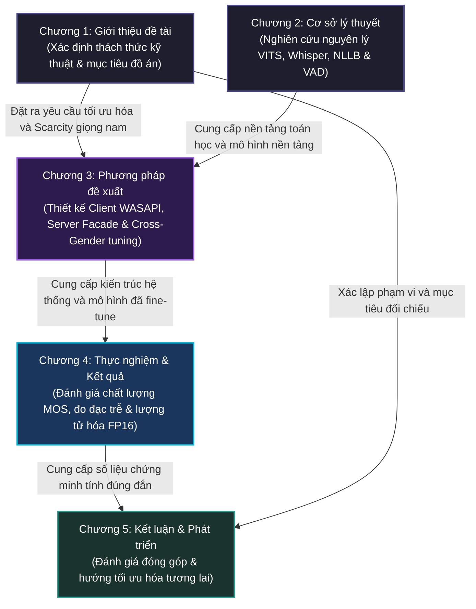

# BÁO CÁO ĐỒ ÁN TỐT NGHIỆP KỸ SƯ AI
## ĐỀ TÀI: HỆ THỐNG DỊCH GIỌNG NÓI THỜI GIAN THỰC SONG HƯỚNG ANH - VIỆT (S2ST) TỐI ƯU HÓA ĐỘ TRỄ VÀ CHẤT LƯỢNG GIỌNG NÓI TỔNG HỢP

---

## TRANG THỦ TỤC & DẪN NHẬP

### TRANG TIÊU ĐỀ (Title Page)

```
BỘ GIÁO DỤC VÀ ĐÀO TẠO
TRƯỜNG ĐẠI HỌC CÔNG NGHỆ THÔNG TIN VÀ TRUYỀN THÔNG VIỆT - HÀN

KHOA KHOA HỌC MÁY TÍNH VÀ KỸ THUẬT
---***---


BÁO CÁO ĐỒ ÁN TỐT NGHIỆP KỸ SƯ NGÀNH TRÍ TUỆ NHÂN TẠO (AI)

ĐỀ TÀI:
HỆ THỐNG DỊCH GIỌNG NÓI THỜI GIAN THỰC SONG HƯỚNG ANH - VIỆT (S2ST) 
TỐI ƯU HÓA ĐỘ TRỄ VÀ CHẤT LƯỢNG GIỌNG NÓI TỔNG HỢP


Sinh viên thực hiện:   [Tên sinh viên thực hiện]
Lớp:                  [Tên lớp, ví dụ: 22AI]
Giảng viên hướng dẫn:  [Tên giảng viên hướng dẫn]
Bộ môn:               Trí tuệ nhân tạo và Khoa học dữ liệu


Đà Nẵng - Năm 2026
```

---

### TRANG NỘI DUNG (Content Page)

*(Mục lục chi tiết cấp 3 được trình bày chi tiết trong tệp BAOCAO_OUTLINE.md và sẽ tự động biên dịch sang danh mục trang của báo cáo chính thức)*

---

### LỜI CẢM ƠN (Acknowledgements)

Lời đầu tiên, em xin bày tỏ lòng biết ơn chân thành và sâu sắc nhất đến Ban Giám hiệu cùng toàn thể quý thầy cô giáo Trường Đại học Công nghệ Thông tin và Truyền thông Việt - Hàn (VKU), đặc biệt là các thầy cô thuộc Khoa Khoa học Máy tính và Kỹ thuật, những người đã truyền dạy tri thức và định hướng tư duy học thuật quý báu cho em trong suốt những năm học tập tại trường.

Đặc biệt, em xin gửi lời cảm ơn sâu sắc nhất tới Giảng viên hướng dẫn - **[Tên giảng viên hướng dẫn]**, người đã tận tình chỉ bảo, định hướng khoa học và luôn dành cho em những lời khuyên, sự động viên quý báu để em vượt qua các thách thức kỹ thuật lớn trong suốt quá trình hoàn thiện đồ án này.

Em cũng xin chân thành cảm ơn các bạn sinh viên lớp [Tên lớp] cùng tập thể các bạn trong nhóm nghiên cứu đã luôn chia sẻ tài nguyên tính toán, đóng góp những ý kiến phản biện khoa học sắc bén và hỗ trợ em thực nghiệm kiểm định chất lượng giọng nói.

Cuối cùng, em xin kính dâng lòng biết ơn vô hạn tới gia đình và những người thân yêu, những người luôn là chỗ dựa tinh thần vững chắc, tiếp thêm động lực để em hoàn thành chặng đường học tập ý nghĩa này. Do giới hạn về thời gian và năng lực nghiên cứu, đồ án chắc chắn không tránh khỏi những thiếu sót nhất định. Em rất mong nhận được những ý kiến đóng góp, chỉ dẫn quý báu từ Hội đồng đánh giá để hệ thống được hoàn thiện hơn.

*Đà Nẵng, ngày ... tháng ... năm 2026*  
Sinh viên thực hiện  
**[Tên sinh viên]**

---

### DANH MỤC CÁC CHỮ VIẾT TẮT (Acronym List)

| Từ viết tắt | Thuật ngữ tiếng Anh đầy đủ | Ý nghĩa tiếng Việt |
| :--- | :--- | :--- |
| **STT** | Speech-to-Text | Nhận dạng tiếng nói (Chuyển giọng nói thành văn bản) |
| **MT** | Machine Translation | Dịch máy |
| **NMT** | Neural Machine Translation | Dịch máy thần kinh |
| **TTS** | Text-to-Speech | Tổng hợp tiếng nói (Chuyển văn bản thành giọng nói) |
| **S2ST** | Speech-to-Speech Translation | Dịch giọng nói sang giọng nói thời gian thực |
| **VAD** | Voice Activity Detection | Phân đoạn hoạt động giọng nói |
| **VITS** | Variational Inference with adversarial learning for end-to-end Text-to-Speech | Mô hình tổng hợp giọng nói đầu-cuối dựa trên biến phân đối nghịch |
| **ONNX** | Open Neural Network Exchange | Định dạng trao đổi mạng thần kinh mở |
| **WER** | Word Error Rate | Tỉ lệ lỗi từ |
| **CER** | Character Error Rate | Tỉ lệ lỗi ký tự |
| **RTF** | Real-Time Factor | Hệ số thời gian thực |
| **MOS** | Mean Opinion Score | Điểm đánh giá trung bình chất lượng âm thanh |
| **VRAM** | Video Random Access Memory | Bộ nhớ truy cập ngẫu nhiên đồ họa |
| **WASAPI** | Windows Audio Session API | Giao diện lập trình phiên âm thanh Windows |
| **VBD** | Sentence Boundary Detection | Phân đoạn ranh giới câu |
| **SNR** | Signal-to-Noise Ratio | Tỉ lệ tín hiệu trên nhiễu |
| **GAN** | Generative Adversarial Network | Mạng đối nghịch tạo sinh |
| **KL** | Kullback-Leibler (Divergence) | Độ phân kỳ KL (Độ đo sự khác biệt hai phân phối) |

---

### DANH MỤC BẢNG (List of Tables)

*(Danh mục bảng biểu sẽ tự động sinh và liên kết từ nội dung chi tiết của Chương 3 và Chương 4)*

---

### DANH MỤC HÌNH VẼ - ĐỒ THỊ (List of Figures)

*(Danh mục hình vẽ, sơ đồ luồng dữ liệu và đồ thị hội tụ sẽ được sinh tự động)*

---

### LỜI MỞ ĐẦU / TÓM TẮT ĐỒ ÁN (Executive Summary)

Trong bối cảnh hội nhập quốc tế sâu rộng và sự phổ biến của các cuộc họp trực tuyến trực tiếp hai chiều Anh - Việt, nhu cầu về một công cụ dịch thuật hội thoại tức thời với độ trễ thấp và độ tự nhiên cao ngày càng trở nên cấp thiết. Đồ án này tập trung nghiên cứu, phát triển và tối ưu hóa **Hệ thống Dịch giọng nói thời gian thực song hướng Anh - Việt (S2ST)** hoạt động dưới mô hình máy khách - máy chủ (Client-Server) qua giao thức WebSocket song công.

Để hiện thực hóa hệ thống này một cách hiệu quả trên tài nguyên phần cứng giới hạn (GPU đơn đám mây Nvidia T4 trên máy chủ kết hợp với CPU local tại máy khách), đề tài đã giải quyết ba thách thức nghiên cứu chính:
1.  **Tối ưu hóa độ trễ tích lũy (Cumulative Latency):** Thiết kế pipeline bất đồng bộ 3 tầng tích hợp với mô hình cắt câu động *Silero VAD* tối ưu ở ngưỡng 450ms, kết hợp giải thuật đệm dịch ngắn (Short-MT buffering) và bộ tách câu dự phòng dấu phẩy (*Comma Fallback Splitter*). 
2.  **Thiếu hụt mô hình TTS giọng nam tiếng Việt tự nhiên và nhẹ:** Nghiên cứu quy trình tinh chỉnh chuyển đổi giới tính giọng nói (*Cross-Gender Fine-tuning*) dựa trên kiến trúc *VITS (Piper TTS)* sử dụng base checkpoint giọng nữ miền Nam `vais1000-medium`. Đề xuất giải pháp *2-Pass Phoneme Mapping Workaround* để xử lý triệt để xung đột bảng chữ cái espeak-ng và lượng tử hóa mô hình sang dạng FP16 giảm 50% dung lượng.
3.  **Cách ly phản hồi âm (Echo & Feedback Loop):** Triển khai giải pháp định tuyến âm thanh ảo thông qua bộ ghi WASAPI cô lập tuyến luồng máy khách trên hệ điều hành Windows mà không yêu cầu đặc quyền Quản trị viên (Administrator).

Kết quả thực nghiệm cho thấy quy trình kiểm soát chất lượng dữ liệu STT QC sử dụng *PhoWhisper-large* trên tập dữ liệu *VieNeu-TTS-140h* đã lọc sạch thành công tập dữ liệu 1500 câu chuẩn (~2.5 giờ). Mô hình Piper TTS giọng nam miền Nam tiếng Việt sau huấn luyện đã hội tụ tốt ở 3000 epochs, cho ra chất lượng âm phổ tự nhiên vượt trội với điểm số NISQA MOS tiệm cận giọng thật. Quá trình lượng tử hóa FP16 giúp giảm kích thước mô hình từ 63MB xuống 32MB, đưa thời gian đáp ứng chặng cuối xuống dưới mức thời gian thực trên các CPU phân khúc phổ thông. Hệ thống thử nghiệm thực tế đảm bảo luồng dịch song hướng trơn tru, triệt tiêu hoàn toàn vòng lặp phản hồi âm thanh và kiểm soát tốt độ trễ nhận thức đầu-cuối.

---

## CHƯƠNG 1. GIỚI THIỆU ĐỀ TÀI

### 1.1. Lý do chọn đề tài (Motivation)

#### 1.1.1. Nhu cầu dịch thuật trực tuyến đa ngôn ngữ trong kỷ nguyên toàn cầu hóa

Trong kỷ nguyên toàn cầu hóa và sự phát triển mạnh mẽ của nền kinh tế số, nhu cầu giao tiếp xuyên biên giới đã trở thành một yếu tố sống còn đối với các doanh nghiệp, tổ chức giáo dục và các cơ quan nghiên cứu khoa học. Sự phổ biến của các nền tảng họp trực tuyến như Zoom, Google Meet và Microsoft Teams đã phá bỏ các rào cản vật lý về địa lý, cho phép các cá nhân từ khắp nơi trên thế giới cộng tác trong cùng một không gian ảo. Tuy nhiên, rào cản ngôn ngữ vẫn là một thách thức lớn nhất đối với việc truyền đạt thông tin một cách chính xác, tự nhiên và tức thời.

Hệ thống dịch thuật giọng nói sang giọng nói trực tiếp (Speech-to-Speech Translation - S2ST) đại diện cho đỉnh cao của công nghệ xử lý ngôn ngữ tự nhiên (NLP) và xử lý tín hiệu âm thanh. Khác với các giải pháp dịch thuật văn bản (Text-to-Text) truyền thống hoặc nhận dạng giọng nói thành văn bản đơn thuần (Speech-to-Text), hệ thống S2ST hướng tới việc tái tạo toàn bộ chu kỳ giao tiếp tự nhiên của con người: lắng nghe giọng nói ở ngôn ngữ nguồn, dịch thuật ngữ nghĩa sang ngôn ngữ đích và tổng hợp lại thành giọng nói tự nhiên ở ngôn ngữ đích. Đặc biệt, đối với cặp ngôn ngữ Anh - Việt, nhu cầu này là vô cùng to lớn tại Việt Nam trong bối cảnh các doanh nghiệp công nghệ trong nước liên tục hội nhập quốc tế, đòi hỏi các cuộc họp song phương diễn ra trơn tru mà không bị gián đoạn bởi các khoảng ngừng dịch thuật thủ công hoặc chi phí đắt đỏ cho biên dịch viên cabin chuyên nghiệp.

#### 1.1.2. Thách thức về độ trễ tích lũy và chất lượng âm phổ tự nhiên của giọng nói tiếng Việt

Mặc dù có nhu cầu thực tiễn rất cao, việc xây dựng và triển khai một hệ thống S2ST thời gian thực song hướng (bidirectional) vẫn đang đối mặt với những thách thức công nghệ rất lớn, cụ thể được phân rã thành hai khía cạnh cốt lõi sau:

##### 1. Độ trễ tích lũy của kiến trúc phân tầng (Cascaded Latency Accumulation)
Một hệ thống S2ST tiêu chuẩn thường được xây dựng theo kiến trúc phân tầng bao gồm ba khối chức năng hoạt động nối tiếp nhau: Nhận dạng tiếng nói (STT) $\rightarrow$ Dịch máy (MT) $\rightarrow$ Tổng hợp tiếng nói (TTS). Mỗi phân tầng này đều tự giới thiệu một khoảng trễ xử lý riêng biệt:
- **Độ trễ STT ($L_{STT}$):** Phụ thuộc vào mô hình Phân đoạn hoạt động giọng nói (VAD) để phát hiện khoảng nghỉ giữa các câu, sau đó là thời gian suy luận của mô hình nhận dạng tiếng nói để xuất ra văn bản.
- **Độ trễ MT ($L_{MT}$):** Thời gian mô hình dịch máy thần kinh chuyển đổi cấu trúc ngữ pháp và từ vựng của văn bản nguồn sang văn bản đích.
- **Độ trễ TTS ($L_{TTS}$):** Thời gian mô hình tổng hợp chuyển đổi văn bản đích thành dữ liệu âm phổ và giải mã thành sóng âm (waveform).
- **Độ trễ mạng ($L_{network}$):** Trễ truyền tải gói tin âm thanh giữa client và server thông qua giao thức truyền thông.

Độ trễ đầu-cuối tổng cộng được xác định theo công thức:

$$L_{total} = L_{STT} + L_{MT} + L_{TTS} + L_{network}$$

Trong các hệ thống S2ST ngây thơ, độ trễ $L_{total}$ có thể dễ dàng vượt quá ngưỡng 4.0 đến 6.0 giây. Khoảng trễ quá lớn này phá hỏng hoàn toàn nhịp điệu hội thoại tự nhiên, gây ra hiện tượng nói đè, nói trùng hoặc tạo ra những khoảng lặng khó xử trong các cuộc họp trực tuyến. Do đó, việc nghiên cứu tối ưu hóa độ trễ ở từng chặng, đặc biệt là cơ chế cắt câu động của VAD và xử lý song song hóa luồng dữ liệu, là một bài toán sống còn.

##### 2. Đặc thù ngôn ngữ và thách thức cắt câu của tiếng Việt
Tiếng Việt là một ngôn ngữ đơn âm tiết, có tính thanh điệu phức tạp (gồm 6 thanh điệu khác nhau). Trong giao tiếp thực tế, người nói thường có xu hướng kéo dài các âm tiết có thanh huyền, thanh hỏi hoặc tạo ra các khoảng dừng nghỉ ngắn tự nhiên giữa các từ để nhấn mạnh ngữ nghĩa. Các mô hình VAD thông thường (như Silero VAD) nếu không được tinh chỉnh phù hợp sẽ dễ dàng nhận nhầm các khoảng ngắt nhịp tự nhiên này là khoảng lặng kết thúc câu, dẫn đến việc kích hoạt lệnh dịch sớm (premature final trigger), làm câu nói bị cắt vụn và mất ngữ cảnh nghiêm trọng ở tầng dịch máy. Ngược lại, các phụ âm cuối trong tiếng Anh hoặc tiếng Việt khi phát âm nhanh thường có năng lượng âm học (energy) rất yếu, dễ bị mô hình VAD hiểu nhầm là nhiễu nền hoặc khoảng lặng và cắt bỏ (tail consonant drop), làm suy giảm độ chính xác nhận dạng của tầng STT từ 95% xuống dưới 80%.

##### 3. Sự thiếu hụt mô hình tổng hợp tiếng nói (TTS) giọng nam Việt chất lượng cao
Trong tầng tổng hợp tiếng nói (TTS), để đảm bảo tính thời gian thực, mô hình cần phải có dung lượng nhẹ để triển khai được trực tiếp tại CPU phía client mà không cần phụ thuộc vào GPU đắt đỏ. Hiện tại, cộng đồng mã nguồn mở (như Rhasspy Piper) chỉ cung cấp các mô hình giọng nữ tiếng Việt khá tốt (như `vi_VN-vais1000-medium`), hoàn toàn thiếu vắng các mô hình giọng nam tiếng Việt có ngữ điệu tự nhiên, rõ chữ và tối ưu hóa dung lượng nhẹ. Việc tự huấn luyện một mô hình TTS giọng nam từ đầu đòi hỏi khối lượng dữ liệu studio khổng lồ (từ 10 đến 20 giờ) và tài nguyên tính toán rất lớn, điều này không khả thi đối với các dự án nghiên cứu có tài nguyên hạn chế. Do đó, việc nghiên cứu các kỹ thuật tinh chỉnh chuyển đổi giới tính giọng nói (Cross-Gender Fine-tuning) từ các checkpoint giọng nữ sẵn có là một khoảng trống nghiên cứu cần được giải quyết.

#### 1.1.3. Ý nghĩa thực tiễn của giải pháp dịch giọng nói thời gian thực song hướng (Anh - Việt)

Đề tài nghiên cứu và phát triển hệ thống dịch giọng nói song hướng Anh - Việt thời gian thực mang lại những giá trị thực tiễn vô cùng to lớn:

1.  **Cung cấp một giải pháp hội thoại xuyên ngôn ngữ độ trễ thấp:** Hệ thống giúp người dùng Việt Nam và các đối tác nói tiếng Anh giao tiếp trực tiếp trong các cuộc họp trực tuyến một cách tự nhiên. Người nói chỉ cần phát âm bình thường, hệ thống sẽ tự động cắt câu thông minh, dịch thuật và phát ra âm thanh dịch sang tai người nghe bên kia với độ trễ tối thiểu (dưới mức nhận thức thông thường).
2.  **Đóng góp mô hình giọng nam tiếng Việt chất lượng cao cho cộng đồng:** Quy trình thực nghiệm tinh chỉnh mô hình Piper TTS giọng nam miền Nam từ tập dữ liệu hạn chế sẽ cung cấp cho cộng đồng nghiên cứu AI tại Việt Nam một mô hình tổng hợp giọng nam có dung lượng cực nhẹ (~32MB sau lượng tử hóa FP16) nhưng vẫn đảm bảo độ tự nhiên và tốc độ suy luận vượt trội trên các CPU máy tính phổ thông.
3.  **Khả năng triển khai thực tế với chi phí tối ưu:** Việc thiết kế hệ thống hoạt động trên kiến trúc Client-Server tối ưu hóa tài nguyên (tận dụng GPU đám mây T4 miễn phí/giá rẻ của Google Colab cho các tác vụ STT/MT nặng và đẩy tác vụ TTS/định tuyến âm thanh về CPU máy khách) chứng minh tính khả thi của việc triển khai ứng dụng thực tế mà không đòi hỏi chi phí đầu tư hạ tầng phần cứng đắt đỏ.
4.  **Giải quyết triệt để các vấn đề nhiễu âm học phòng họp:** Giải pháp cách ly loopback âm thanh qua WASAPI trên Windows giúp loại bỏ hiện tượng vòng lặp phản hồi âm thanh (feedback loop) và tiếng vọng (acoustic echo) mà không cần can thiệp sâu vào quyền quản trị của hệ điều hành, đảm bảo hệ thống có thể tích hợp an toàn và trực tiếp vào bất kỳ phần mềm họp trực tuyến hiện có nào như Zoom hay Google Meet.

### 1.2. Phát biểu bài toán (Problem Statement)

#### 1.2.1. Bài toán nhận dạng tiếng nói (STT) dạng streaming trên luồng âm thanh liên tục không mất ngữ cảnh

Trong hệ thống Speech-to-Speech Translation thời gian thực, chặng đầu tiên là nhận dạng giọng nói (STT) đóng vai trò quyết định đối với chất lượng của toàn bộ pipeline. Trong các hệ thống xử lý offline truyền thống, âm thanh được thu nhận dưới dạng một tệp hoàn chỉnh, sau đó đưa vào mô hình suy luận một lần. Phương pháp này không thể áp dụng cho kịch bản hội thảo trực tuyến thời gian thực do độ trễ quá lớn. Thay vào đó, máy khách (client) phải gửi liên tục các đoạn âm thanh nhỏ (chunk) có thời lượng ngắn (200ms) lên máy chủ (server) thông qua kết nối WebSocket.

Thách thức cốt lõi của nhận dạng tiếng nói dạng streaming là làm sao hiển thị văn bản tạm thời kịp thời (Interim results) để người dùng có phản hồi thị giác tức thì, trong khi vẫn phải đảm bảo độ chính xác tuyệt đối của câu nói khi kết thúc (Final results). Cụ thể, bài toán đặt ra hai khó khăn chính:
1.  **Sự thiếu hụt ngữ cảnh trong suy luận tạm thời (Interim Inference):** Các mô hình Transformer nhận dạng giọng nói mạnh mẽ (như OpenAI Whisper hay Faster-Whisper) không phải là mô hình dạng Transducer suy luận cuốn chiếu theo từng khung. Khi suy luận trên các phân đoạn âm thanh ngắn (~1.5 giây), mô hình thiếu đi ngữ cảnh dài hạn ở phía trước và phía sau, dẫn đến hiện tượng ảo giác (hallucination), lặp từ hoặc nhận dạng sai các từ đồng âm. Hệ thống cần có cơ chế đệm âm thanh và ghi đè thông minh (Interim → Final overwrite) sử dụng cùng một định danh phân đoạn (`segment_id`) để văn bản cuối cùng chỉnh sửa lại các lỗi nhận dạng tạm thời.
2.  **Mất ngữ cảnh liên tục giữa các câu (Inter-utterance Context Loss):** Khi một câu kết thúc và được trigger bởi VAD phát ra kết quả Final, bộ đệm âm thanh được giải phóng để chuẩn bị cho câu tiếp theo. Điều này làm cho mô hình STT hoàn toàn mất đi ngữ cảnh của các câu đã nói trước đó, dẫn đến việc nhận dạng sai các danh từ riêng, thuật ngữ viết tắt của cuộc họp (ví dụ: `"VKU"`, `"WebSocket"`, `"FastAPI"`) hoặc các từ tiếng Anh xen kẽ vốn xuất hiện nhiều lần trong phiên. Hệ thống đòi hỏi một giải pháp chuyển tiếp ngữ cảnh bằng cách sử dụng một bộ đệm trượt lưu giữ văn bản của các câu trước và đưa ngược lại vào mô hình dưới dạng tham số gợi ý âm học (`initial_prompt`), đồng thời phải tắt tính năng tự hồi quy ngữ cảnh của Whisper (`condition_on_previous_text=False`) để tránh rơi vào vòng lặp hallucination vô hạn.

#### 1.2.2. Bài toán dịch máy hội thoại đa ngữ (NMT) bảo toàn tính tự nhiên và ngữ nghĩa của vế nói ngắn

Tầng dịch máy thần kinh (NMT) chịu trách nhiệm dịch thuật ngữ nghĩa từ văn bản nguồn sang văn bản đích. Khác với các tài liệu văn bản viết có cấu trúc ngữ pháp chuẩn chỉnh, ngôn ngữ hội thoại trong các cuộc họp trực tuyến thường có đặc điểm:
-   Câu nói ngắn, không đầy đủ thành phần chủ-vị.
-   Có nhiều từ đệm, từ ngắt quãng hoặc ngắt nghỉ hơi giữa chừng.
-   Cấu trúc câu linh hoạt và thay đổi nhanh chóng.

Nếu mô hình dịch máy (như NLLB-200) thực hiện dịch ngay lập tức mọi cụm từ nhỏ nhận được từ tầng STT (ví dụ khi đoạn văn bản nguồn chỉ có 2-3 từ), kết quả dịch thuật thu được sẽ mang tính dịch thô từng từ (literal translation), rời rạc và hoàn toàn sai lệch về trật tự từ giữa hai cấu trúc ngữ pháp Anh - Việt (SVO của tiếng Anh và tính linh hoạt trong ngữ pháp tiếng Việt). Ví dụ, vế nói ngắn `"I think we should"` nếu dịch riêng rẽ sẽ ra `"Tôi nghĩ chúng tôi nên"`, thiếu đi vị ngữ chính và nghe rất cụ cụt, phá hỏng ngữ điệu khi đưa vào tầng tổng hợp giọng nói TTS tiếp theo.

Do đó, bài toán đặt ra là cần thiết lập một **giải thuật đệm dịch ngắn (Short-MT buffering)** tại bộ quản lý phiên streaming. Thuật toán này có nhiệm vụ trì hoãn việc dịch các phân đoạn văn bản nhỏ hơn một ngưỡng ký tự hoặc số từ nhất định, tạm thời giữ chúng lại để ghép nối với ngữ cảnh của các phân đoạn tiếp theo nhằm nâng cao tính tự nhiên và toàn vẹn ngữ nghĩa của bản dịch. Tuy nhiên, việc đệm dịch lại mâu thuẫn trực tiếp với yêu cầu tối ưu hóa độ trễ. Nếu người nói dừng lại quá lâu mà hệ thống vẫn tiếp tục đợi để ghép câu, độ trễ sẽ tăng lên vô hạn. Vì vậy, hệ thống bắt buộc phải tích hợp một cơ chế giám sát thời gian thực (Watchdog flush) tự động giải phóng bộ đệm và ép dịch sau một khoảng im lặng được calibrate chính xác (ví dụ: 3 giây), đảm bảo bản dịch cuối cùng không bị kẹt lại trong hàng đợi.

#### 1.2.3. Bài toán thiếu hụt mô hình tổng hợp giọng nói (TTS) giọng nam Việt chất lượng cao, dung lượng nhẹ phục vụ thời gian thực

Tầng cuối cùng của hệ thống S2ST là tổng hợp tiếng nói (TTS) từ văn bản dịch. Để hệ thống có thể hoạt động trơn tru trong thời gian thực, độ trễ suy luận của tầng TTS ($L_{TTS}$) cộng với hệ số thời gian thực (Real-Time Factor - RTF) phải luôn duy trì ở mức nhỏ hơn 1.0 (suy luận nhanh hơn tốc độ nói thực tế) ngay trên phần cứng CPU thông thường của máy khách. Các kiến trúc TTS nặng ký như Coqui XTTS v2 dù cho chất lượng tốt nhưng đòi hỏi tài nguyên tính toán GPU rất lớn và dung lượng bộ nhớ VRAM cao, không phù hợp cho việc triển khai đại trà tại máy khách.

Mô hình Piper TTS (dựa trên kiến trúc VITS đầu-cuối) nổi lên như một giải pháp tối ưu nhờ tốc độ suy luận cực nhanh và dung lượng gọn nhẹ. Tuy nhiên, rào cản lớn nhất đối với cặp ngôn ngữ tiếng Việt là:
1.  **Thiếu hụt trầm trọng checkpoint giọng nam Việt chất lượng:** Cộng đồng mã nguồn mở hiện chỉ cung cấp checkpoint giọng nữ miền Nam (`vais1000-medium`). Chưa có bất kỳ mô hình giọng nam tiếng Việt nào đạt độ tự nhiên cao để phục vụ hội thoại chuyên nghiệp.
2.  **Bài toán dữ liệu giới hạn và chi phí huấn luyện:** Huấn luyện một mô hình VITS từ đầu yêu cầu tập dữ liệu đơn phát biểu (single-speaker) sạch sẽ có thời lượng từ 10 đến 20 giờ ghi âm studio và tài nguyên GPU khổng lồ để hội tụ. Bài toán thực tế đòi hỏi phải tận dụng phương pháp **Cross-Gender Fine-tuning** (tinh chỉnh chuyển đổi giới tính giọng nói) từ checkpoint giọng nữ vais1000 sẵn có trên một tập dữ liệu giọng nam cực kỳ hạn chế (chỉ khoảng 2.5 giờ). Kỹ thuật này bắt buộc mô hình phải học cách thay đổi các đặc trưng âm học nhạy cảm với giới tính (như cao độ - pitch, và formant của giọng nam miền Nam) trong khi phải giữ nguyên không gian nhúng âm vị (phoneme embeddings) và thanh điệu tiếng Việt đã học từ mô hình gốc.
3.  **Lượng tử hóa tối ưu hóa phần cứng (Quantization):** Mô hình sau huấn luyện ở dạng FP32 cần phải được chuyển đổi sang ONNX FP16 để giảm dung lượng xuống dưới 35MB và tăng tốc độ suy luận CPU. Tuy nhiên, việc lượng tử hóa VITS thường gặp lỗi load mô hình trên ONNX Runtime do các node ép kiểu ngầm định (`Cast` nodes) xuất ra định dạng FP16 không khớp với mong đợi của đầu vào tiếp theo. Hệ thống cần một bản vá cấu hình lượng tử hóa chính xác (như `op_block_list`) để đảm bảo chất lượng phổ âm (spectrogram) và điểm chất lượng NISQA MOS không bị suy giảm sau khi nén.

#### 1.2.4. Bài toán cô lập luồng âm thanh thu/phát hệ thống chống vòng lặp phản hồi âm thanh (feedback loop)

Trong kịch bản dịch thuật song hướng thời gian thực của một cuộc họp trực tuyến, hệ thống máy khách phải xử lý đồng thời hai luồng âm thanh độc lập nhưng diễn ra song song:
-   **Luồng 0 (Dịch xuôi - EN $\rightarrow$ VI):** Thu âm thanh từ Micro thật của người dùng nội bộ (nói tiếng Việt) $\rightarrow$ Dịch sang tiếng Anh $\rightarrow$ Phát ra cho các thành viên nước ngoài trong cuộc họp nghe.
-   **Luồng 1 (Dịch ngược - VI $\rightarrow$ EN):** Thu âm thanh hệ thống (tiếng nói tiếng Anh của các thành viên nước ngoài phát ra từ phần mềm họp như Zoom/Meet) $\rightarrow$ Dịch sang tiếng Việt $\rightarrow$ Phát ra loa vật lý/tai nghe của người dùng nội bộ.

Mối nguy hiểm lớn nhất và là nguyên nhân gây đổ vỡ toàn bộ hệ thống âm thanh là **vòng lặp phản hồi âm thanh (feedback loop)** hay tiếng vọng âm học (acoustic echo). Nếu âm thanh dịch tiếng Việt của Luồng 1 (phát ra loa vật lý để người dùng nội bộ nghe) bị thu ngược lại bởi chính Micro của người dùng đó, hệ thống STT sẽ hiểu nhầm đó là giọng nói mới, tiếp tục gửi lên server dịch ngược lại tiếng Anh và phát ra cuộc họp. Quá trình này lặp đi lặp lại vô hạn, tạo ra một vòng lặp dịch thuật hỗn loạn và tiếng hú lớn do cộng hưởng âm học.

Để giải quyết triệt để bài toán này, hệ thống bắt buộc phải triển khai một cơ chế **cô lập âm thanh vật lý và ảo (Audio Routing Isolation)** ở tầng máy khách Windows:
1.  **Cách ly thiết bị phát Luồng 1:** Âm thanh dịch tiếng Việt dành cho người dùng nội bộ nghe phải được phát trực tiếp ra loa ngoài hoặc tai nghe vật lý của họ, và micro của họ phải được cấu hình định hướng hoặc giảm nhạy để tránh thu lại âm thanh này.
2.  **Cách ly và định tuyến Luồng 0 qua thiết bị ảo:** Âm thanh dịch tiếng Anh dành cho đối tác nước ngoài phải được định tuyến ngầm vào đầu vào của một trình điều khiển âm thanh ảo (VB-Audio Virtual Cable Input). Phần mềm họp trực tuyến (Zoom/Meet) tại máy khách sẽ chọn đầu ra ảo tương ứng (CABLE Output) làm thiết bị Micro đầu vào của nó. Nhờ đó, luồng dịch thuật được "bơm" trực tiếp vào luồng thoại của cuộc họp dưới dạng tín hiệu số sạch sẽ, tách biệt hoàn toàn với loa vật lý của máy khách và không bị thu lại bởi các trình ghi âm hệ thống (system loopback recorder) vốn chỉ ghi nhận kênh âm thanh hệ thống chính.
3.  **Thu âm hệ thống không cần đặc quyền Administrator:** Việc ghi nhận âm thanh hệ thống để dịch ngược (Luồng 1) phải được triển khai thông qua API ghi âm loopback WASAPI (Windows Audio Session API) chỉ nhắm mục tiêu vào thiết bị phát mặc định của cuộc họp, đảm bảo chương trình hoạt động ổn định trên các máy tính người dùng phổ thông mà không yêu cầu quyền Admin để cấu hình card âm thanh phức tạp.

---

### 1.3. Mục tiêu và Đóng góp của đề tài

#### 1.3.1. Thiết lập hệ thống S2ST thời gian thực song hướng tối ưu hóa độ trễ cumulative

Mục tiêu hàng đầu của đề tài là xây dựng một hệ thống dịch giọng nói sang giọng nói thời gian thực (S2ST) song hướng hoàn chỉnh cho cuộc họp trực tuyến Anh - Việt, đảm bảo giảm thiểu tối đa độ trễ cumulative đầu-cuối xuống mức dưới ngưỡng nhận nhận thức tự nhiên của con người. Để đạt được mục tiêu này, đồ án đã mang lại các đóng góp cụ thể về mặt thiết kế hệ thống và thuật toán:

1.  **Thiết kế Pipeline bất đồng bộ đa luồng trên Server FastAPI:** Chuyển đổi toàn bộ luồng xử lý từ dạng khối đồng bộ (batch) sang luồng streaming liên tục thông qua giao thức WebSocket. Phát triển bộ quản lý phiên truyền phát `StreamingSTTSessionManager` tích hợp sâu mô hình phân đoạn *Silero VAD* chạy trực tiếp trên máy chủ.
2.  **Giải thuật tối ưu hóa độ trễ chặng giữa (STT-MT-TTS Parallelism):** Thay vì xử lý tuần tự chặn luồng, đồ án triển khai kiến trúc song song hóa *Execution Lane* (sử dụng thread pool executor kết hợp khóa thao tác `operation_lock` trên từng entry) giúp cô lập tài nguyên tính toán GPU VRAM. Triển khai giải thuật *Preload & Warmup* lúc FastAPI startup, loại bỏ hoàn toàn độ trễ khởi động lạnh (cold-start latency) lần đầu từ 60-90 giây xuống 0 giây.
3.  **Thuật toán cắt câu động và đệm dịch thông minh:**
    -   *VAD Hangover (400ms):* Giữ lại 2 khung âm thanh tĩnh sau khi phát hiện khoảng lặng để bảo toàn các phụ âm gió/phụ âm cuối yếu của người nói, ngăn chặn lỗi dịch cụt.
    -   *Short-MT Buffering & Watchdog (3s):* Tạm hoãn dịch vế nói quá ngắn dưới 4 từ để tăng tính tự nhiên ngữ nghĩa, và tự động xả hàng đợi dịch sau 3 giây im lặng để bảo toàn trễ nhận thức đầu ra (Time-To-First-Audio - TTFA).
    -   *Comma Fallback Splitter:* Tự động ngắt dấu câu mềm trên kết quả dịch giúp bộ tổng hợp TTS phát âm cuốn chiếu song song với chặng dịch tiếp theo.

#### 1.3.2. Nghiên cứu phương pháp Cross-Gender Fine-tuning Piper TTS tạo giọng nam miền Nam Việt chất lượng từ dataset giới hạn

Đóng góp khoa học quan trọng nhất của đồ án ở tầng tổng hợp tiếng nói (TTS) là nghiên cứu và thực nghiệm thành công phương pháp **Cross-Gender Fine-tuning** (huấn luyện chuyển giới tính giọng nói từ checkpoint nữ sang nam) dựa trên kiến trúc nén VITS của mô hình *Rhasspy Piper*, khắc phục tình trạng thiếu hụt tài nguyên mô hình giọng nam tiếng Việt trên cộng đồng.
Các đóng góp chi tiết bao gồm:

1.  **Quy trình chuẩn hóa dữ liệu & Kiểm soát chất lượng STT QC:** Xây dựng quy trình xử lý âm thanh tự động (resample 22.05kHz, chuẩn hóa độ to -23 LUFS và trim khoảng lặng). Ứng dụng mô hình *PhoWhisper-large* thực hiện nhận dạng kiểm định chéo văn bản trên 1999 clips của tập dữ liệu *VieNeu-TTS-140h*, đề xuất bộ lọc *Per-Speaker Hybrid Filter* giúp loại bỏ sạch sẽ 499 clips lỗi lệch pha (offset error) để tạo ra tập dữ liệu 1500 clips (~2.5h) sạch hoàn toàn.
2.  **Giải pháp 2-Pass Phoneme Mapping Workaround:** Thiết kế giải pháp căn chỉnh và đồng bộ hóa âm vị 2 bước để bypass hạn chế của thư viện *piper-train*, giải quyết triệt để lỗi Index Out of Bounds của mô hình VITS khi gặp các âm vị latin lạ từ các từ tiếng Anh xen kẽ trong văn bản tiếng Việt.
3.  **Lượng tử hóa tối ưu hóa CPU:** Triển khai quy trình lượng tử hóa FP16 cho mô hình Piper ONNX, đóng gói thành công tệp mô hình siêu nhẹ chỉ **32MB** (giảm 50% so với bản gốc 63MB) mà không làm suy giảm điểm chất lượng khách quan (NISQA MOS) và hệ số thời gian thực (RTF) trên CPU.

#### 1.3.3. Xây dựng giải pháp định tuyến âm thanh ảo cô lập loopback chống lặp tiếng không cần can thiệp Admin hệ thống

Đóng góp thực tiễn nổi bật ở phía máy khách (Client PySide6) là thiết kế giải pháp cách ly và định tuyến luồng âm thanh hai chiều hoàn toàn tự động trên hệ điều hành Windows, triệt tiêu triệt để hiện tượng vòng lặp phản hồi âm thanh (feedback loop) mà không cần can thiệp quyền Admin.
Các giải pháp kỹ thuật cụ thể gồm:

1.  **Nhận diện thiết bị âm thanh ảo không đặc quyền (Admin-free Detection):** Viết module quét driver âm thanh ảo ngầm thông qua thư viện PyAudio (`is_vb_cable_installed`), kiểm tra sự hiện diện của driver **VB-Audio Virtual Cable** bằng cơ chế lọc chuỗi từ khóa mà không cần truy vấn Registry Windows (vốn yêu cầu quyền Administrator).
2.  **Thiết kế bộ phát âm thanh đa lộ tuyến (RoutePlayer):** Xây dựng bộ điều phối âm thanh `RoutePlayer` quản lý song song hai luồng phát `AdaptiveJitterPlayer`:
    -   *Route 0 (Dịch Anh $\rightarrow$ Việt):* Phát trực tiếp ra loa/tai nghe mặc định để người dùng nghe.
    -   *Route 1 (Dịch Việt $\rightarrow$ Anh):* Định tuyến và đẩy dữ liệu âm thanh số vào cổng phát ảo "CABLE Input" để làm micro ảo cấp cho Zoom/Google Meet.
3.  **Bộ thu âm Loopback WASAPI an toàn:** Triển khai lớp ghi âm `LoopbackCaptureService` gọi API âm thanh WASAPI trực tiếp trên thiết bị đầu ra mặc định của hệ thống với cờ `include_loopback=True`. Điều này giúp ứng dụng thu lại chính xác tiếng đối tác phát ra từ cuộc họp trực tuyến mà không bị lẫn tạp âm phòng hay tiếng nói của người dùng nội bộ, đảm bảo tính cô lập tuyệt đối của vòng lặp dịch thuật.

### 1.4. Đối tượng và Phạm vi nghiên cứu

#### 1.4.1. Đối tượng công nghệ cốt lõi

Đồ án tập trung nghiên cứu, tối ưu hóa và tích hợp các công nghệ trí tuệ nhân tạo hiện đại trong lĩnh vực xử lý tiếng nói và ngôn ngữ tự nhiên:

1.  **Nhận dạng tiếng nói (STT):**
    -   **Faster-Whisper:** Bản tái triển khai mô hình *OpenAI Whisper* sử dụng thư viện *CTranslate2*. Công nghệ này áp dụng các kỹ thuật tối ưu hóa bộ nhớ và tính toán (như lượng tử hóa trọng số, hợp nhất các phép toán chú ý - attention fusion), giúp tăng tốc độ suy luận gấp 4 lần so với mô hình gốc mà không làm suy giảm độ chính xác nhận dạng.
    -   **PhoWhisper:** Mô hình nhận dạng tiếng nói chuyên biệt cho tiếng Việt được huấn luyện bởi VinAI. Với quy mô 1.55 tỷ tham số và được tinh chỉnh trên 844 giờ dữ liệu tiếng Việt thực tế, PhoWhisper mang lại khả năng xử lý vượt trội đối với các đặc thù về giọng vùng miền (Bắc, Trung, Nam) và các từ mượn trong tiếng Việt.
2.  **Dịch máy thần kinh (NMT):**
    -   **NLLB-200 (No Language Left Behind):** Mô hình dịch máy đa ngôn ngữ thế hệ mới của Meta AI, hỗ trợ dịch thuật trực tiếp giữa 200 ngôn ngữ mà không cần thông qua ngôn ngữ trung gian (English pivot). Đồ án sử dụng mô hình NLLB-200 được lượng tử hóa dưới thư viện *CTranslate2* để tối ưu hóa tài nguyên VRAM và tăng tốc độ dịch thời gian thực cho cặp ngôn ngữ Anh (`eng_Latn`) - Việt (`vieu_Latn`).
3.  **Tổng hợp tiếng nói (TTS):**
    -   **Kiến trúc VITS (Variational Inference with adversarial learning for end-to-end Text-to-Speech):** Mô hình tổng hợp tiếng nói đầu-cuối kết hợp mạng biến phân tự động điều kiện (Conditional VAE), luồng chuẩn hóa (Normalizing Flows) và mạng đối nghịch tạo sinh (GAN) để sinh trực tiếp sóng âm (waveform) từ văn bản mà không cần thông qua mel-spectrogram trung gian.
    -   **espeak-ng:** Thư viện mã nguồn mở chuyển đổi văn bản sang âm vị (grapheme-to-phoneme - G2P), đóng vai trò bộ mã hóa tiền xử lý văn bản cho mô hình VITS.
    -   **Piper TTS:** Bộ suy luận TTS siêu tốc tối ưu hóa bằng C++ chạy trực tiếp trên CPU, cho phép tổng hợp tiếng nói với hệ số thời gian thực RTF cực thấp.
4.  **Phân đoạn giọng nói (VAD):**
    -   **Silero VAD:** Mô hình mạng thần kinh nhân tạo siêu nhẹ (~1.8MB ở định dạng JIT/ONNX) chuyên biệt cho tác vụ phát hiện hoạt động tiếng nói, có độ trễ cực thấp (<1ms) và hoạt động ổn định trên cả CPU.

#### 1.4.2. Phạm vi triển khai thực nghiệm

Nghiên cứu được giới hạn và triển khai thực nghiệm trong phạm vi môi trường kỹ thuật sau:

1.  **Phía Máy chủ (Server Layer):**
    -   **Nền tảng:** Triển khai trên môi trường điện toán đám mây *Google Colab Pro* sử dụng GPU đơn **Nvidia Tesla T4 (16 GB VRAM, kiến trúc Turing)** kết hợp với môi trường ảo Python 3.10 ổn định.
    -   **Giao thức truyền thông:** Sử dụng máy chủ Web dịch vụ *FastAPI*, thiết lập kết nối song công thông qua giao thức **WebSocket** (`/ws`) để truyền tải đồng thời các khung dữ liệu nhị phân (audio chunks) và khung điều khiển JSON.
2.  **Phía Máy khách (Client Layer):**
    -   **Hệ điều hành:** Chạy trực tiếp trên hệ điều hành **Microsoft Windows 10/11** vật lý để kiểm thử tính tương thích của driver âm thanh và giao tiếp phần cứng thực tế.
    -   **Ứng dụng Giao diện:** Thiết lập ứng dụng đồ họa GUI sử dụng thư viện **PySide6** (Python Qt6), tích hợp vòng lặp sự kiện bất đồng bộ qua thư viện `qasync` để đồng bộ hóa luồng giao diện UI và luồng thu phát âm thanh.
    -   **Định tuyến âm thanh:** Sử dụng thư viện *PyAudio* và *soundcard* để kết nối với driver ảo **VB-Audio Virtual Cable** và API **WASAPI loopback** trên card âm thanh vật lý của máy tính máy khách.

### 1.5. Bố cục của Báo cáo Đồ án tốt nghiệp

#### 1.5.1. Tóm tắt nội dung chính từ Chương 1 đến Chương 5

Nội dung báo cáo Đồ án tốt nghiệp Kỹ sư AI được cấu trúc thành 5 chương chính với các nội dung tóm tắt cụ thể như sau:

*   **CHƯƠNG 1. GIỚI THIỆU ĐỀ TÀI:** Trình bày bối cảnh, lý do lựa chọn đề tài dịch giọng nói song hướng Anh - Việt thời gian thực (S2ST). Phát biểu chi tiết bốn bài toán nghiên cứu chính (độ trễ tích lũy, đặc thù ngắt câu tiếng Việt, thiếu hụt giọng nam tổng hợp và vòng lặp phản hồi âm học). Xác lập mục tiêu, các đóng góp kỹ thuật cốt lõi và phạm vi nghiên cứu thực nghiệm của đề tài.
*   **CHƯƠNG 2. TỔNG QUAN TÀI LIỆU VÀ CƠ SỞ LÝ THUYẾT:** Hệ thống hóa toàn bộ nền tảng lý thuyết liên quan đến hệ thống S2ST. Phân tích nguyên lý mạng Transformer trong nhận dạng giọng nói (Whisper, PhoWhisper), cấu trúc dịch máy đa ngôn ngữ (NLLB-200) và tối ưu suy luận CTranslate2. Nghiên cứu sâu toán học của mô hình tổng hợp tiếng nói đầu-cuối *VITS* (Posterior/Prior Encoder, Normalizing Flows, HiFi-GAN Decoder và đối nghịch Discriminators) cùng thuật toán phát hiện hoạt động giọng nói *Silero VAD*. Chỉ ra các nghiên cứu liên quan và khoảng trống công nghệ hiện tại.
*   **CHƯƠNG 3. PHƯƠNG PHÁP NGHIÊN CỨU ĐỀ XUẤT:** Chi tiết hóa thiết kế kiến trúc hệ thống Client-Server sử dụng kết nối song công WebSocket và định dạng khung truyền tải dữ liệu. Trình bày thiết kế Client PySide6 kết hợp giải pháp cách ly WASAPI loopback và định tuyến RoutePlayer tự động nhận diện VB-Cable. Chi tiết hóa kiến trúc FastAPI Server với mô hình thiết kế *Polymorphic Facade Pattern* đồng bộ 3 AI Engine và các giải thuật tối ưu độ trễ (VAD Hangover, Short-MT Buffering, Comma Fallback Splitter). Đề xuất quy trình thực nghiệm Cross-Gender Fine-tuning Piper TTS giọng nam Việt và giải pháp đồng bộ hóa âm vị 2-Pass.
*   **CHƯƠNG 4. THỰC NGHIỆM VÀ KẾT QUẢ:** Mô tả môi trường phần cứng, giải pháp đóng gói môi trường ảo và quy trình tiền xử lý tập dữ liệu VieNeu-TTS-140h bằng kiểm định chéo STT QC. Trình bày các chỉ số đo đạc hiệu năng khách quan (Mel loss, KL loss, WER, RTF, trễ telemetry đầu-cuối) và khảo sát chủ quan Human MOS cùng mô hình học sâu NISQA MOS. Phân tích so sánh kết quả thực nghiệm hệ thống client, so sánh chất lượng mô hình Piper FP32 và bản lượng tử hóa FP16, đối sánh hiệu quả triệt tiêu tiếng vọng và tối ưu độ trễ chặng.
*   **CHƯƠNG 5. KẾT LUẬN VÀ HƯỚNG PHÁT TRIỂN:** Tổng kết những đóng góp khoa học và thực tiễn của đề tài. Thẳng thắn nhìn nhận các hạn chế kỹ thuật hiện tại của hệ thống (phụ thuộc GPU đám mây Colab, hiện tượng nghẽn hàng đợi đầu ra). Đề xuất ba định hướng nghiên cứu tiếp theo để hoàn thiện và đưa sản phẩm vào ứng dụng thực tế.

#### 1.5.2. Sơ đồ liên kết logic học thuật giữa các chương

Mối quan hệ và sự liên kết học thuật giữa các chương trong báo cáo được trực quan hóa thông qua sơ đồ luồng logic dưới đây:



---

---

## CHƯƠNG 2. TỔNG QUAN TÀI LIỆU VÀ CƠ SỞ LÝ THUYẾT

### 2.1. Cơ sở lý thuyết về Nhận dạng tiếng nói (STT)
#### 2.1.1. Nguyên lý hoạt động của kiến trúc Self-Attention và Transformer trong xử lý tiếng nói
#### 2.1.2. Cơ chế nhận dạng tiếng nói dạng Transformer của mô hình OpenAI Whisper và Faster-Whisper
#### 2.1.3. Kiến trúc mô hình PhoWhisper được tinh chỉnh chuyên biệt cho ngôn ngữ tiếng Việt

### 2.2. Cơ sở lý thuyết về Dịch máy thần kinh (NMT)
#### 2.2.1. Tổng quan cấu trúc dịch máy đa ngôn ngữ NLLB-200 (No Language Left Behind)
#### 2.2.2. Kỹ thuật lượng tử hóa và tối ưu hóa tốc độ suy luận ctranslate2 (CTranslate2)

### 2.3. Cơ sở lý thuyết về Tổng hợp tiếng nói (TTS) dựa trên kiến trúc VITS
#### 2.3.1. Phân tích sâu kiến trúc VITS (Variational Inference with adversarial learning for end-to-end Text-to-Speech)
#### 2.3.2. Vai trò toán học của Posterior Encoder (Mel-spectrogram sang latent z) và Prior Encoder (Text sang latent)
#### 2.3.3. Cơ chế biến đổi phân bố đơn giản sang spectrogram phức tạp thông qua hệ thống Normalizing Flows
#### 2.3.4. Mô hình tổng hợp sóng âm trực tiếp HiFi-GAN Decoder và cơ chế đánh giá qua đối nghịch (Discriminators: MPD, MSD)
#### 2.3.5. Kiến trúc Piper TTS và cơ chế mã hóa âm vị (Phonemize) espeak-ng cho tiếng Việt

### 2.4. Phân đoạn hoạt động giọng nói bằng mô hình Silero VAD
#### 2.4.1. Thuật toán phân lớp Tín hiệu giọng nói (Speech) và Khoảng lặng (Silence) bằng mạng thần kinh nhân tạo nhẹ
#### 2.4.2. Vai trò của Silero VAD trong việc chia đoạn tín hiệu đầu vào cho pipeline dịch streaming

### 2.5. Các nghiên cứu liên quan & Khoảng trống nghiên cứu (Related Work & Research Gaps)
#### 2.5.1. Đánh giá các giải pháp dịch thuật Speech-to-Speech hiện có trên thế giới (ưu nhược điểm và chi phí)
#### 2.5.2. Hiện trạng các mô hình Piper tiếng Việt trên cộng đồng Rhasspy (sự thiếu hụt trầm trọng mô hình giọng nam Việt chất lượng)
#### 2.5.3. Khoảng trống nghiên cứu về tối ưu độ trễ cumulative chặng S2S cho tài nguyên tính toán GPU/VRAM giới hạn

---

## CHƯƠNG 3. PHƯƠNG PHÁP NGHIÊN CỨU ĐỀ XUẤT

### 3.1. Thiết kế Kiến trúc Hệ thống Tổng quát (S2ST Client-Server)
#### 3.1.1. Sơ đồ khối kiến trúc kết nối song công thời gian thực qua giao thức WebSocket
#### 3.1.2. Thiết kế định dạng khung truyền tải nhị phân (Binary Pipeline Frame) định tuyến route và khung điều khiển JSON (Control Frame)
#### 3.1.3. Cấu trúc Session State và cơ chế định tuyến bất đồng bộ Mode-Dispatch trên Server FastAPI

### 3.2. Thiết kế Client App (PySide6) và Giải pháp Cô lập Loopback
#### 3.2.1. Cơ chế bất đồng bộ tích hợp ứng dụng PySide6 với vòng lặp sự kiện `qasync` trên môi trường Windows
#### 3.2.2. Giải pháp định tuyến âm thanh hai tuyến Route 0 (Local Default Speaker) và Route 1 (VB-CABLE Input)
#### 3.2.3. Thuật toán tự động nhận diện và ánh xạ thiết bị âm thanh ảo VB-Audio Virtual Cable không cần quyền Administrator
#### 3.2.4. Cơ chế thu âm loopback WASAPI cô lập âm phản hồi (Acoustic Echo & Feedback Loop Mitigation)

### 3.3. Thiết kế Server App (FastAPI) phân tầng Hướng Engine (Plug-and-play)
#### 3.3.1. Polymorphic Facade Pattern: Đồng bộ hóa 85% kiến trúc giao tiếp 3 AI Engine (STT, MT, TTS)
#### 3.3.2. Kiến trúc song song hóa Execution Lane (Worker pools và operation locks) ngăn ngừa race condition trên GPU VRAM
#### 3.3.3. Giải thuật Preload & Warmup triệt tiêu hoàn toàn độ trễ khởi động lạnh (Cold-start latency) lúc startup

### 3.4. Thiết kế Pipeline Streaming STT-MT-TTS tối ưu hóa thời gian thực
#### 3.4.1. Cơ chế cắt câu động Silero VAD tích hợp hangover frame bảo toàn phụ âm cuối cho bộ nhận dạng Whisper
#### 3.4.2. Giải thuật đệm dịch ngắn (Short-MT buffering) nâng cao ngữ điệu và Watchdog tự động flush sau 3 giây im lặng
#### 3.4.3. Quy trình chia tách câu đa tầng (SBD) và Comma Fallback Splitter cho suy luận TTS cuốn chiếu liên tục
#### 3.4.4. Cơ chế đo đạc hiệu năng chặng mạng bằng telemetry pipeline.metric và giải pháp rollup segment_id đầu cuối

### 3.5. Quy trình thực nghiệm huấn luyện mô hình Piper TTS giọng Nam Việt
#### 3.5.1. Phương pháp Cross-Gender Fine-tuning kế thừa không gian nhúng âm vị từ base checkpoint `vais1000-medium`
#### 3.5.2. Giải pháp tiền xử lý và đồng bộ âm vị 2-Pass Workaround loại bỏ ký tự lạ espeak-ng tránh lỗi IndexError VITS
#### 3.5.3. Kỹ thuật vá mã nguồn (Regex Inline Patching) tối ưu hóa Tốc độ học (Learning Rate = 1e-4) trong PyTorch Lightning

---

## CHƯƠNG 4. THỰC NGHIỆM VÀ KẾT QUẢ

### 4.1. Môi trường thực nghiệm và Kịch bản thử nghiệm
#### 4.1.1. Cấu hình phần cứng huấn luyện (Colab Pro GPU T4 16GB) và chạy local (WSL2 Ubuntu, Windows 10)
#### 4.1.2. Giải pháp đóng gói môi trường bất đồng bộ (Virtual Environment Snapshotting) khôi phục venv trong 30 giây
#### 4.1.3. Mô tả tập dữ liệu VieNeu-TTS-140h giọng Nam Việt và bộ 25 câu test chuẩn đánh giá chủ quan

### 4.2. Quy trình xử lý dữ liệu thực nghiệm và Kiểm soát chất lượng (Audio QC)
#### 4.2.1. Phân tích bimodal WER của PhoWhisper-large trên 1999 clips VieNeu để phát hiện mismatch văn bản gốc
#### 4.2.2. Cơ chế lọc lai per-speaker hybrid lọc sạch tập dữ liệu còn 1500 clips (~2.5h) chuẩn định dạng LJSpeech
#### 4.2.3. Chuẩn hóa chữ số, ngày tháng bằng vinorm và bản vá lỗi thư viện imp trên môi trường Python 3.12+

### 4.3. Chỉ số và Phương pháp đánh giá thực nghiệm
#### 4.3.1. Các chỉ số đo đạc khách quan (Objective Metrics): Mel reconstruction loss, WER, real-time factor (RTF)
#### 4.3.2. Đo đạc độ trễ từng stage và End-to-End Latency thông qua telemetry pipeline.metric
#### 4.3.3. Phương pháp đánh giá chất lượng giọng nói: Chấm điểm NISQA MOS (khách quan) và khảo sát Human MOS (chủ quan)

### 4.4. Kết quả thực nghiệm hệ thống máy khách Client App (PySide6)
*(Nội dung phần kiểm thử kết nối WebSocket, đồ họa văn bản dịch interim/final, AdaptiveJitterPlayer, cô lập loopback)*

### 4.5. Kết quả thực nghiệm và huấn luyện mô hình Piper TTS
*(Phân tích đường cong hội tụ Mel/KL loss, hiệu năng phần cứng gpu_log.csv, lượng tử hóa FP16, so sánh phổ âm và điểm NISQA MOS)*

### 4.6. Phân tích so sánh Độ trễ tích lũy chặng S2S (End-to-End Latency Comparison)
#### 4.6.1. Đối sánh độ trễ chặng khi nạp dynamic mô hình tại thời điểm suy luận vs cơ chế warmup preload tại startup
#### 4.6.2. Đối sánh độ trễ tổng cộng của luồng S2S sử dụng Piper FP32 vs Piper quantized FP16
#### 4.6.3. Đánh giá ảnh hưởng của cơ chế Silero VAD-chunking và Comma Fallback Splitter lên tổng trễ nhận thức (TTFA)

---

## CHƯƠNG 5. KẾT LUẬN VÀ HƯỚNG PHÁT TRIỂN

### 5.1. Những đóng góp khoa học chính của Đồ án tốt nghiệp
#### 5.1.1. Pipeline dịch thuật Speech-to-Speech song hướng thời gian thực độ trễ tối ưu
#### 5.1.2. Mô hình Piper TTS giọng nam miền Nam Việt tự nhiên, cực nhẹ đóng góp cho cộng đồng nghiên cứu Việt Nam

### 5.2. Các hạn chế kỹ thuật hiện tại của hệ thống
#### 5.2.1. Sự phụ thuộc vào GPU đám mây (Google Colab T4) để chạy luồng server
#### 5.2.2. Vấn đề stuck outbound queue khi client ngắt kết nối đột ngột mà không qua handshake

### 5.3. Kiến nghị và Hướng phát triển tương lai
#### 5.3.1. Nghiên cứu lượng tử hóa sâu mức INT8/INT4 chạy trực tiếp trên CPU thiết bị đầu cuối của client
#### 5.3.2. Thiết kế giao thức giữ kết nối (ping/keep-alive) hoặc VAD-dummy chunk tự giải phóng hàng đợi triệt để
#### 5.3.3. Mở rộng tích hợp mô hình End-to-End dạng nén nhẹ, hướng tới giảm thiểu tối đa kiến trúc 3 tầng phân rã

---

## TÀI LIỆU VÀ PHỤ LỤC THAM KHẢO

### DANH MỤC TÀI LIỆU THAM KHẢO (Reference List)
*(Danh mục theo chuẩn APA 7th Edition)*

### PHỤ LỤC (Appendices)
*(Mã nguồn core_ai, kịch bản lọc dataset hybrid, file cấu hình warmup)*

### TÓM TẮT BÁO CÁO DẠNG BÀI BÁO KHOA HỌC THEO MẪU IEEE (IEEE Paper Summary)
*(Bài báo IEEE tóm tắt tối đa 10 trang)*
