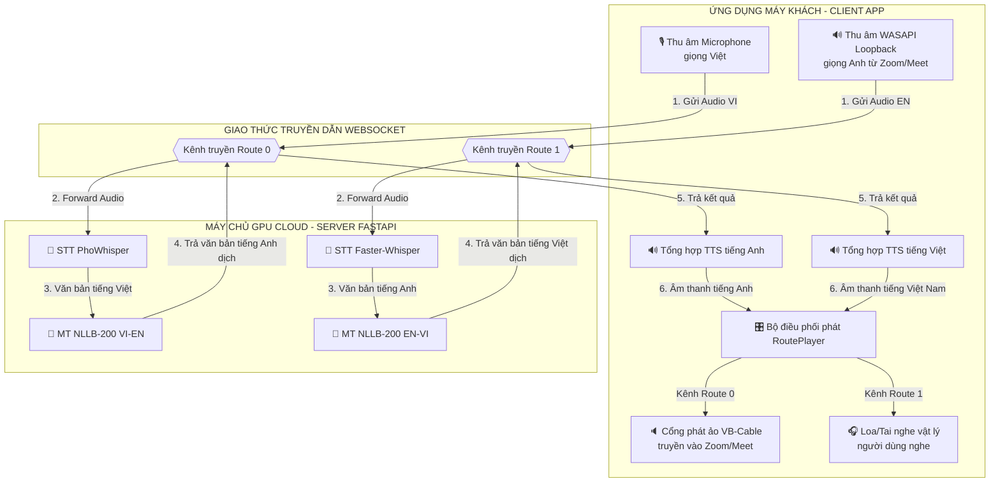
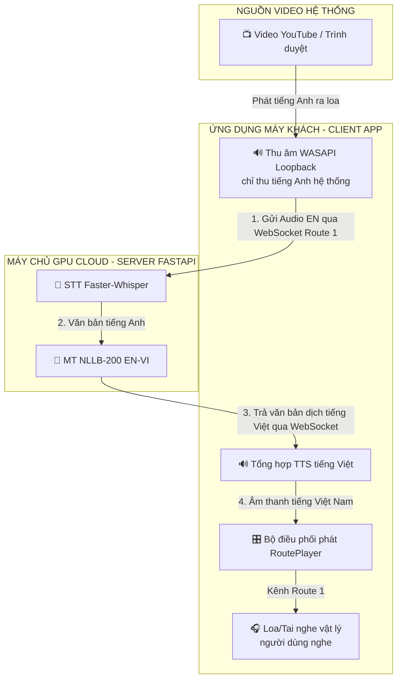
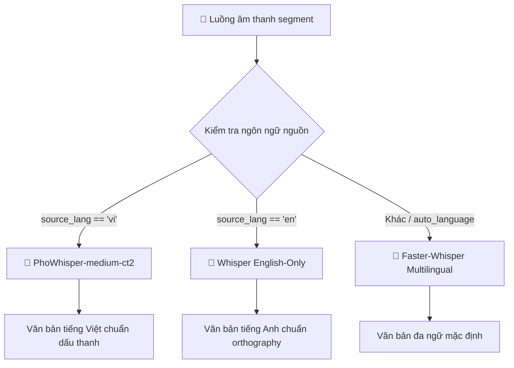
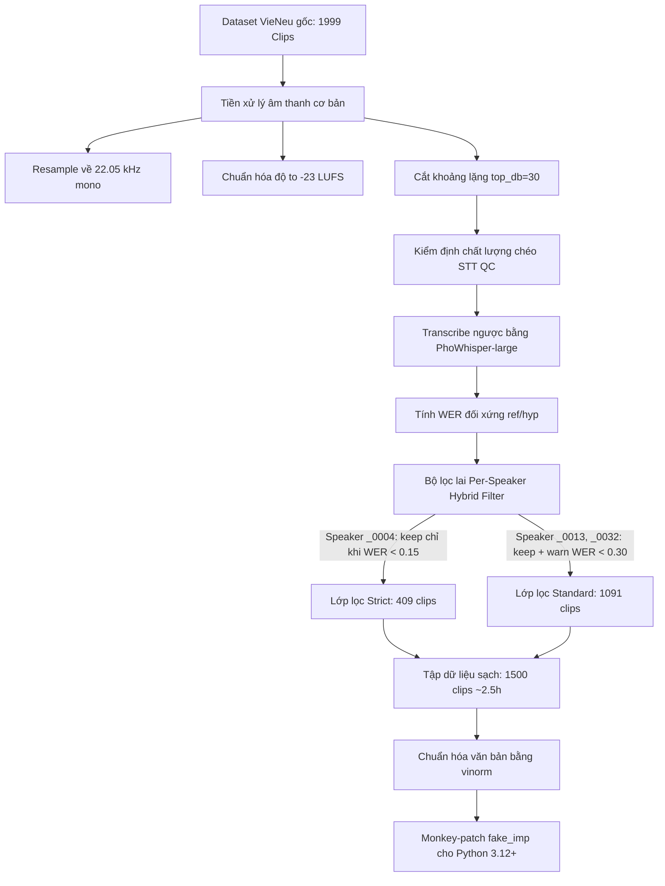

# BÁO CÁO ĐỒ ÁN TỐT NGHIỆP KỸ SƯ AI
## ĐỀ TÀI: HỆ THỐNG DỊCH GIỌNG NÓI THỜI GIAN THỰC SONG HƯỚNG ANH - VIỆT (S2ST) TỐI ƯU HÓA ĐỘ TRỄ VÀ CHẤT LƯỢNG GIỌNG NÓI TỔNG HỢP

---

## TRANG THỦ TỤC & DẪN NHẬP

### TRANG TIÊU ĐỀ (Title Page)

```
BỘ GIÁO DỤC VÀ ĐÀO TẠO
TRƯỜNG ĐẠI HỌC CÔNG NGHỆ THÔNG TIN VÀ TRUYỀN THÔNG VIỆT - HÀN

KHOA KHOA HỌC MÁY TÍNH VÀ KỸ THUẬT
---***---


BÁO CÁO ĐỒ ÁN TỐT NGHIỆP KỸ SƯ NGÀNH TRÍ TUỆ NHÂN TẠO (AI)

ĐỀ TÀI:
HỆ THỐNG DỊCH GIỌNG NÓI THỜI GIAN THỰC SONG HƯỚNG ANH - VIỆT (S2ST) 
TỐI ƯU HÓA ĐỘ TRỄ VÀ CHẤT LƯỢNG GIỌNG NÓI TỔNG HỢP


Sinh viên thực hiện:   [Tên sinh viên thực hiện]
Lớp:                  [Tên lớp, ví dụ: 22AI]
Giảng viên hướng dẫn:  [Tên giảng viên hướng dẫn]
Bộ môn:               Trí tuệ nhân tạo và Khoa học dữ liệu


Đà Nẵng - Năm 2026
```

---

### TRANG NỘI DUNG (Content Page)

*(Mục lục chi tiết cấp 3 được trình bày chi tiết trong tệp BAOCAO_OUTLINE.md và sẽ tự động biên dịch sang danh mục trang của báo cáo chính thức)*

---

### LỜI CẢM ƠN (Acknowledgements)

Lời đầu tiên, em xin bày tỏ lòng biết ơn chân thành và sâu sắc nhất đến Ban Giám hiệu cùng toàn thể quý thầy cô giáo Trường Đại học Công nghệ Thông tin và Truyền thông Việt - Hàn (VKU), đặc biệt là các thầy cô thuộc Khoa Khoa học Máy tính và Kỹ thuật, những người đã truyền dạy tri thức và định hướng tư duy học thuật quý báu cho em trong suốt những năm học tập tại trường.

Đặc biệt, em xin gửi lời cảm ơn sâu sắc nhất tới Giảng viên hướng dẫn - **[Tên giảng viên hướng dẫn]**, người đã tận tình chỉ bảo, định hướng khoa học và luôn dành cho em những lời khuyên, sự động viên quý báu để em vượt qua các thách thức kỹ thuật lớn trong suốt quá trình hoàn thiện đồ án này.

Em cũng xin chân thành cảm ơn các bạn sinh viên lớp [Tên lớp] cùng tập thể các bạn trong nhóm nghiên cứu đã luôn chia sẻ tài nguyên tính toán, đóng góp những ý kiến phản biện khoa học sắc bén và hỗ trợ em thực nghiệm kiểm định chất lượng giọng nói.

Cuối cùng, em xin kính dâng lòng biết ơn vô hạn tới gia đình và những người thân yêu, những người luôn là chỗ dựa tinh thần vững chắc, tiếp thêm động lực để em hoàn thành chặng đường học tập ý nghĩa này. Do giới hạn về thời gian và năng lực nghiên cứu, đồ án chắc chắn không tránh khỏi những thiếu sót nhất định. Em rất mong nhận được những ý kiến đóng góp, chỉ dẫn quý báu từ Hội đồng đánh giá để hệ thống được hoàn thiện hơn.

*Đà Nẵng, ngày ... tháng ... năm 2026*  
Sinh viên thực hiện  
**[Tên sinh viên]**

---

### DANH MỤC CÁC CHỮ VIẾT TẮT (Acronym List)

| Từ viết tắt | Thuật ngữ tiếng Anh đầy đủ | Ý nghĩa tiếng Việt |
| :--- | :--- | :--- |
| **STT** | Speech-to-Text | Nhận dạng tiếng nói (Chuyển giọng nói thành văn bản) |
| **MT** | Machine Translation | Dịch máy |
| **NMT** | Neural Machine Translation | Dịch máy thần kinh |
| **TTS** | Text-to-Speech | Tổng hợp tiếng nói (Chuyển văn bản thành giọng nói) |
| **S2ST** | Speech-to-Speech Translation | Dịch giọng nói sang giọng nói thời gian thực |
| **VAD** | Voice Activity Detection | Phân đoạn hoạt động giọng nói |
| **VITS** | Variational Inference with adversarial learning for end-to-end Text-to-Speech | Mô hình tổng hợp giọng nói đầu-cuối dựa trên biến phân đối nghịch |
| **ONNX** | Open Neural Network Exchange | Định dạng trao đổi mạng thần kinh mở |
| **WER** | Word Error Rate | Tỉ lệ lỗi từ |
| **CER** | Character Error Rate | Tỉ lệ lỗi ký tự |
| **RTF** | Real-Time Factor | Hệ số thời gian thực |
| **MOS** | Mean Opinion Score | Điểm đánh giá trung bình chất lượng âm thanh |
| **VRAM** | Video Random Access Memory | Bộ nhớ truy cập ngẫu nhiên đồ họa |
| **WASAPI** | Windows Audio Session API | Giao diện lập trình phiên âm thanh Windows |
| **VBD** | Sentence Boundary Detection | Phân đoạn ranh giới câu |
| **SNR** | Signal-to-Noise Ratio | Tỉ lệ tín hiệu trên nhiễu |
| **GAN** | Generative Adversarial Network | Mạng đối nghịch tạo sinh |
| **KL** | Kullback-Leibler (Divergence) | Độ phân kỳ KL (Độ đo sự khác biệt hai phân phối) |

---

### DANH MỤC BẢNG (List of Tables)

*(Danh mục bảng biểu sẽ tự động sinh và liên kết từ nội dung chi tiết của Chương 3 và Chương 4)*

---

### DANH MỤC HÌNH VẼ - ĐỒ THỊ (List of Figures)

*(Danh mục hình vẽ, sơ đồ luồng dữ liệu và đồ thị hội tụ sẽ được sinh tự động)*

---

### LỜI MỞ ĐẦU (Introduction)

Trong bối cảnh toàn cầu hóa và sự bùng nổ của chuyển đổi số, giao tiếp xuyên ngôn ngữ trở thành cầu nối quyết định sự thành công của các doanh nghiệp, tổ chức và hoạt động hợp tác khoa học quốc tế. Tuy nhiên, rào cản ngôn ngữ, đặc biệt trong các cuộc họp trực tuyến trực tiếp song hướng giữa hai ngôn ngữ Anh và Việt, vẫn là một thách thức lớn. Hệ thống dịch giọng nói trực tiếp sang giọng nói (Speech-to-Speech Translation - S2ST) là giải pháp tối ưu nhằm tái tạo chu kỳ hội thoại tự nhiên của con người: lắng nghe giọng nói nguồn, dịch thuật ngữ nghĩa và tổng hợp lại bằng giọng nói đích. Đồ án này tập trung nghiên cứu, phát triển và tối ưu hóa **Hệ thống dịch giọng nói thời gian thực song hướng Anh - Việt (S2ST)** hoạt động dưới mô hình máy khách - máy chủ (Client-Server) qua kết nối WebSocket song công, nhằm hướng tới sự cân bằng tối ưu giữa độ trễ và chất lượng tự nhiên của giọng nói dịch thuật.

#### 1. Lý do lựa chọn đề tài
Trong kỷ nguyên toàn cầu hóa, nhu cầu giao tiếp trực tuyến xuyên biên giới qua các nền tảng như Zoom, Google Meet hay Microsoft Teams trở thành một phần thiết yếu của hoạt động vận hành doanh nghiệp và hợp tác quốc tế. Tuy nhiên, việc bất đồng ngôn ngữ giữa các bên tham gia thường gây ra những gián đoạn lớn về mặt truyền đạt thông tin. Các giải pháp dịch thuật truyền thống như thuê biên dịch viên cabin thường tốn kém chi phí, thiếu tính linh hoạt và không đảm bảo độ bảo mật thông tin nội bộ. Trong khi đó, việc sử dụng các công cụ dịch văn bản thông thường lại yêu cầu người dùng phải gõ chữ hoặc copy-paste liên tục, phá hỏng hoàn toàn sự liền mạch của một buổi đối thoại trực tiếp. Xuất phát từ nhu cầu thực tiễn đó, việc phát triển một hệ thống dịch giọng nói sang giọng nói thời gian thực (S2ST) trực diện là lời giải tối ưu. Tuy nhiên, khi triển khai hệ thống này vào thực tế phòng họp ảo song hướng với nguồn tài nguyên tính toán giới hạn, người phát triển phải đối mặt với nhiều trở ngại thực tế rất lớn.

Trước hết, độ trễ tích lũy qua ba phân tầng nhận dạng (STT), dịch máy (NMT) và tổng hợp tiếng nói (TTS) là rào cản trực tiếp nhất. Nếu không được tối ưu hóa, tổng thời gian từ lúc người nói dứt câu cho đến khi người nghe nhận được âm thanh dịch có thể kéo dài từ 4.0 đến 6.0 giây, khiến các bên tham gia dễ nói đè lên nhau, tạo ra các khoảng lặng ngượng ngùng và làm mất đi nhịp điệu của cuộc đối thoại. Bên cạnh đó, đặc thù tiếng Việt có tính thanh điệu phức tạp, người nói thường ngắt nhịp ngắn giữa các từ, dễ làm mô hình phân đoạn giọng nói (VAD) hiểu lầm là đã kết thúc câu và kích hoạt lệnh dịch sớm khi câu chưa trọn vẹn ngữ nghĩa. Ngược lại, khi người nói phát âm nhanh, các phụ âm cuối yếu dễ bị mô hình VAD cắt mất, làm giảm sút độ chính xác nhận dạng chặng đầu. Ở chặng tổng hợp (TTS), việc thiếu hụt một mô hình giọng nam miền Nam tự nhiên, rõ chữ và đủ nhẹ để chạy trực tiếp trên CPU máy khách là một thực trạng rõ rệt, do các tài nguyên mở hiện nay hầu như chỉ cung cấp giọng nữ. Cuối cùng, hiện tượng vòng lặp phản hồi âm học là lỗi thực tế phổ biến nhất; nếu âm thanh dịch phát ra từ loa máy khách bị chính micro của họ thu lại, hệ thống sẽ tự động gửi lên server để dịch đi dịch lại vô hạn, gây nhiễu loạn thông tin và tạo ra tiếng hú lớn gây hỏng thiết bị. Do đó, việc nghiên cứu các giải pháp tối ưu hóa độ trễ, tinh chỉnh mô hình giọng nam từ dữ liệu giới hạn và thiết lập giải pháp cô lập luồng âm thanh máy khách là vô cùng cấp thiết nhằm giải quyết triệt để các vấn đề thực tiễn này.

#### 2. Mục tiêu nghiên cứu
Đồ án hướng tới các mục tiêu cụ thể sau:
- **Thiết kế hệ thống S2ST song hướng thời gian thực:** Xây dựng hoàn chỉnh kiến trúc Client-Server kết nối qua giao thức WebSocket, kiểm soát và giảm thiểu tổng độ trễ cumulative đầu-cuối xuống dưới ngưỡng nhận thức tự nhiên của hội thoại thường nhật.
- **Tối ưu hóa các chặng trung gian:** Đề xuất và triển khai các thuật toán xử lý luồng (VAD Hangover, Short-MT Buffering kết hợp Watchdog flush và Comma Fallback Splitter) nhằm giảm thiểu độ trễ Time-to-First-Audio (TTFA) của chặng TTS mà vẫn đảm bảo tính toàn vẹn ngữ nghĩa.
- **Nghiên cứu quy trình tinh chỉnh Piper TTS giọng nam Việt:** Ứng dụng phương pháp chuyển giới tính giọng nói (*Cross-Gender Fine-tuning*) để tạo ra mô hình giọng nam miền Nam từ tập dữ liệu giới hạn, nén lượng tử hóa sang định dạng FP16 siêu nhẹ (~32MB) chạy mượt mà trên CPU phân khúc phổ thông.
- **Cách ly phản hồi âm học ngầm:** Xây dựng giải pháp định tuyến âm thanh ảo hai lộ tuyến độc lập, sử dụng API ghi âm loopback WASAPI để cô lập triệt để vòng lặp phản hồi âm mà không yêu cầu đặc quyền Quản trị viên (Administrator).

#### 3. Đối tượng và phạm vi nghiên cứu
- **Đối tượng nghiên cứu:** 
  - Các kiến trúc học sâu tiên tiến phục vụ xử lý giọng nói và ngôn ngữ: Mạng tự chú ý và Transformer trong Whisper/PhoWhisper, mô hình dịch máy đa ngôn ngữ NLLB-200 và thư viện tối ưu hóa CTranslate2, kiến trúc VITS nén nhẹ (Piper TTS) dựa trên Normalizing Flows và GANs, mô hình phát hiện hoạt động giọng nói Silero VAD.
  - Các giao thức truyền thông mạng song công thời gian thực (WebSocket) và cơ chế định tuyến âm thanh ảo trên hệ điều hành Windows (WASAPI, VB-Audio Virtual Cable).
- **Phạm vi nghiên cứu:**
  - Cặp ngôn ngữ dịch thuật song hướng: Anh - Việt và Việt - Anh.
  - Môi trường thử nghiệm máy chủ: Phân bổ tài nguyên trên duy nhất một GPU tầm trung NVIDIA Tesla T4 (Google Colab / FastAPI server).
  - Môi trường thử nghiệm máy khách: Chạy ứng dụng đồ họa PySide6 tích hợp `qasync` trực tiếp trên hệ điều hành Windows 10/11 local.
  - Tập dữ liệu huấn luyện TTS: Lọc và chuẩn hóa dữ liệu giọng nam miền Nam từ bộ dữ liệu `VieNeu-TTS-140h`.

#### 4. Cách tiếp cận
Để giải quyết bài toán đặt ra dưới điều kiện giới hạn về phần cứng, đồ án đề xuất các phương pháp tiếp cận sau:
- **Tiếp cận kiến trúc phân tán tối ưu hóa tài nguyên:** Phân bổ các tác vụ STT và NMT nặng (đòi hỏi tính toán ma trận lớn) lên GPU đám mây của máy chủ thông qua các facade bất đồng bộ; đồng thời đẩy tác vụ suy luận TTS (nhờ mô hình Piper nén nhẹ) và điều phối âm thanh về CPU máy khách nhằm triệt tiêu băng thông truyền tải âm thanh chặng cuối trên mạng.
- **Tiếp cận tối ưu hóa song song bất đồng bộ:** Thiết lập các "Execution Lane" song song có cơ chế khóa hoạt động (`operation_lock`) trên từng model entry để tránh nghẽn GPU VRAM, kết hợp cơ chế Warmup khởi động nóng để giảm trễ cold-start về 0.
- **Tiếp cận chuyển giao tri thức (Transfer Learning) cho TTS:** Thay vì huấn luyện mô hình VITS giọng nam từ đầu vốn cần lượng dữ liệu khổng lồ, đồ án thực hiện Cross-Gender Fine-tuning dựa trên không gian nhúng âm vị có sẵn của checkpoint gốc giọng nữ `vais1000-medium`, giúp mô hình nhanh chóng hội tụ và đạt độ tự nhiên cao chỉ với 2.5 giờ dữ liệu nam sạch.
- **Tiếp cận cô lập tuyến âm vật lý - ảo (Routing Isolation):** Cô lập luồng dịch xuôi (VI-EN) đẩy thẳng vào thiết bị âm thanh ảo đầu vào làm micro cho phần mềm họp, tách biệt hoàn toàn với luồng dịch ngược (EN-VI) phát ra loa ngoài, triệt tiêu phản hồi âm học mà không can thiệp sâu vào nhân hệ điều hành.

#### 5. Phương pháp nghiên cứu
Đồ án áp dụng kết hợp các phương pháp nghiên cứu sau:
- **Phương pháp nghiên cứu lý thuyết:** Nghiên cứu tài liệu chuyên khảo về xử lý tín hiệu số, kiến trúc Transformer chú ý tự thân, mô hình biến phân tự động điều kiện (Conditional VAE), Normalizing Flows, và mạng đối nghịch tạo sinh (GAN) trong tổng hợp tiếng nói.
- **Phương pháp thực nghiệm và xây dựng hệ thống:**
  - Xây dựng quy trình tự động hóa kiểm soát chất lượng dữ liệu (STT QC) sử dụng mô hình *PhoWhisper-large* đánh giá chéo Word Error Rate (WER) nhằm loại bỏ clips lệch pha, trích xuất tập dữ liệu sạch 1500 câu chuẩn.
  - Tiến hành huấn luyện thực nghiệm mô hình TTS trên Google Colab qua 3000 epochs, theo dõi các đường cong hội tụ loss (Generator/Discriminator/Mel/KL), sau đó lượng tử hóa mô hình sang FP16 ONNX.
  - Xây dựng phần mềm client PySide6 thực thi định tuyến và ghi âm loopback WASAPI.
- **Phương pháp đánh giá và kiểm chứng:**
  - Đo đạc định lượng khách quan: Sử dụng hệ thống telemetry đo trễ xử lý từng phân tầng, tính toán chỉ số WER của STT, hệ số thời gian thực RTF của TTS và ứng dụng mô hình deep learning *NISQA* để chấm điểm MOS khách quan cho giọng nói tổng hợp.
  - Đo đạc định tính chủ quan: Khảo sát và lấy điểm Mean Opinion Score (Human MOS) từ người dùng thực tế dựa trên bộ 25 câu test chuẩn để đánh giá độ tự nhiên, rõ chữ và tính biểu cảm của giọng nam miền Nam được tinh chỉnh.

---

## CHƯƠNG 1. GIỚI THIỆU ĐỀ TÀI

### 1.1. Lý do chọn đề tài (Motivation)

#### 1.1.1. Nhu cầu dịch thuật trực tuyến đa ngôn ngữ trong kỷ nguyên toàn cầu hóa

Trong kỷ nguyên toàn cầu hóa và sự phát triển mạnh mẽ của nền kinh tế số, nhu cầu giao tiếp xuyên biên giới đã trở thành một yếu tố sống còn đối với các doanh nghiệp, tổ chức giáo dục và các cơ quan nghiên cứu khoa học. Sự phổ biến của các nền tảng họp trực tuyến như Zoom, Google Meet và Microsoft Teams đã phá bỏ các rào cản vật lý về địa lý, cho phép các cá nhân từ khắp nơi trên thế giới cộng tác trong cùng một không gian ảo. Tuy nhiên, rào cản ngôn ngữ vẫn là một thách thức lớn nhất đối với việc truyền đạt thông tin một cách chính xác, tự nhiên và tức thời.

Hệ thống dịch thuật giọng nói sang giọng nói trực tiếp (Speech-to-Speech Translation - S2ST) đại diện cho đỉnh cao của công nghệ xử lý ngôn ngữ tự nhiên (NLP) và xử lý tín hiệu âm thanh. Khác với các giải pháp dịch thuật văn bản (Text-to-Text) truyền thống hoặc nhận dạng giọng nói thành văn bản đơn thuần (Speech-to-Text), hệ thống S2ST hướng tới việc tái tạo toàn bộ chu kỳ giao tiếp tự nhiên của con người: lắng nghe giọng nói ở ngôn ngữ nguồn, dịch thuật ngữ nghĩa sang ngôn ngữ đích và tổng hợp lại thành giọng nói tự nhiên ở ngôn ngữ đích. Đặc biệt, đối với cặp ngôn ngữ Anh - Việt, nhu cầu này là vô cùng to lớn tại Việt Nam trong bối cảnh các doanh nghiệp công nghệ trong nước liên tục hội nhập quốc tế, đòi hỏi các cuộc họp song phương diễn ra trơn tru mà không bị gián đoạn bởi các khoảng ngừng dịch thuật thủ công hoặc chi phí đắt đỏ cho biên dịch viên cabin chuyên nghiệp.

#### 1.1.2. Thách thức về độ trễ tích lũy và chất lượng âm phổ tự nhiên của giọng nói tiếng Việt

Mặc dù có nhu cầu thực tiễn rất cao, việc xây dựng và triển khai một hệ thống S2ST thời gian thực song hướng (bidirectional) vẫn đang đối mặt với những thách thức công nghệ rất lớn, cụ thể được phân rã thành hai khía cạnh cốt lõi sau:

##### 1. Độ trễ tích lũy của kiến trúc phân tầng (Cascaded Latency Accumulation)
Một hệ thống S2ST tiêu chuẩn thường được xây dựng theo kiến trúc phân tầng bao gồm ba khối chức năng hoạt động nối tiếp nhau: Nhận dạng tiếng nói (STT) $\rightarrow$ Dịch máy (MT) $\rightarrow$ Tổng hợp tiếng nói (TTS). Mỗi phân tầng này đều tự giới thiệu một khoảng trễ xử lý riêng biệt:
- **Độ trễ STT ($L_{STT}$):** Phụ thuộc vào mô hình Phân đoạn hoạt động giọng nói (VAD) để phát hiện khoảng nghỉ giữa các câu, sau đó là thời gian suy luận của mô hình nhận dạng tiếng nói để xuất ra văn bản.
- **Độ trễ MT ($L_{MT}$):** Thời gian mô hình dịch máy thần kinh chuyển đổi cấu trúc ngữ pháp và từ vựng của văn bản nguồn sang văn bản đích.
- **Độ trễ TTS ($L_{TTS}$):** Thời gian mô hình tổng hợp chuyển đổi văn bản đích thành dữ liệu âm phổ và giải mã thành sóng âm (waveform).
- **Độ trễ mạng ($L_{network}$):** Trễ truyền tải gói tin âm thanh giữa client và server thông qua giao thức truyền thông.

Độ trễ đầu-cuối tổng cộng được xác định theo công thức:

$$L_{total} = L_{STT} + L_{MT} + L_{TTS} + L_{network}$$

Trong các hệ thống S2ST ngây thơ, độ trễ $L_{total}$ có thể dễ dàng vượt quá ngưỡng 4.0 đến 6.0 giây. Khoảng trễ quá lớn này phá hỏng hoàn toàn nhịp điệu hội thoại tự nhiên, gây ra hiện tượng nói đè, nói trùng hoặc tạo ra những khoảng lặng khó xử trong các cuộc họp trực tuyến. Do đó, việc nghiên cứu tối ưu hóa độ trễ ở từng chặng, đặc biệt là cơ chế cắt câu động của VAD và xử lý song song hóa luồng dữ liệu, là một bài toán sống còn.

##### 2. Đặc thù ngôn ngữ và thách thức cắt câu của tiếng Việt
Tiếng Việt là một ngôn ngữ đơn âm tiết, có tính thanh điệu phức tạp (gồm 6 thanh điệu khác nhau). Trong giao tiếp thực tế, người nói thường có xu hướng kéo dài các âm tiết có thanh huyền, thanh hỏi hoặc tạo ra các khoảng dừng nghỉ ngắn tự nhiên giữa các từ để nhấn mạnh ngữ nghĩa. Các mô hình VAD thông thường (như Silero VAD) nếu không được tinh chỉnh phù hợp sẽ dễ dàng nhận nhầm các khoảng ngắt nhịp tự nhiên này là khoảng lặng kết thúc câu, dẫn đến việc kích hoạt lệnh dịch sớm (premature final trigger), làm câu nói bị cắt vụn và mất ngữ cảnh nghiêm trọng ở tầng dịch máy. Ngược lại, các phụ âm cuối trong tiếng Anh hoặc tiếng Việt khi phát âm nhanh thường có năng lượng âm học (energy) rất yếu, dễ bị mô hình VAD hiểu nhầm là nhiễu nền hoặc khoảng lặng và cắt bỏ (tail consonant drop), làm suy giảm độ chính xác nhận dạng của tầng STT từ 95% xuống dưới 80%.

##### 3. Sự thiếu hụt mô hình tổng hợp tiếng nói (TTS) giọng nam Việt chất lượng cao
Trong tầng tổng hợp tiếng nói (TTS), để đảm bảo tính thời gian thực, mô hình cần phải có dung lượng nhẹ để triển khai được trực tiếp tại CPU phía client mà không cần phụ thuộc vào GPU đắt đỏ. Hiện tại, cộng đồng mã nguồn mở (như Rhasspy Piper) chỉ cung cấp các mô hình giọng nữ tiếng Việt khá tốt (như `vi_VN-vais1000-medium`), hoàn toàn thiếu vắng các mô hình giọng nam tiếng Việt có ngữ điệu tự nhiên, rõ chữ và tối ưu hóa dung lượng nhẹ. Việc tự huấn luyện một mô hình TTS giọng nam từ đầu đòi hỏi khối lượng dữ liệu studio khổng lồ (từ 10 đến 20 giờ) và tài nguyên tính toán rất lớn, điều này không khả thi đối với các dự án nghiên cứu có tài nguyên hạn chế. Do đó, việc nghiên cứu các kỹ thuật tinh chỉnh chuyển đổi giới tính giọng nói (Cross-Gender Fine-tuning) từ các checkpoint giọng nữ sẵn có là một khoảng trống nghiên cứu cần được giải quyết.

#### 1.1.3. Ý nghĩa thực tiễn của giải pháp dịch giọng nói thời gian thực song hướng (Anh - Việt)

Đề tài nghiên cứu và phát triển hệ thống dịch giọng nói song hướng Anh - Việt thời gian thực mang lại những giá trị thực tiễn vô cùng to lớn:

1.  **Cung cấp một giải pháp hội thoại xuyên ngôn ngữ độ trễ thấp:** Hệ thống giúp người dùng Việt Nam và các đối tác nói tiếng Anh giao tiếp trực tiếp trong các cuộc họp trực tuyến một cách tự nhiên. Người nói chỉ cần phát âm bình thường, hệ thống sẽ tự động cắt câu thông minh, dịch thuật và phát ra âm thanh dịch sang tai người nghe bên kia với độ trễ tối thiểu (dưới mức nhận thức thông thường).
2.  **Đóng góp mô hình giọng nam tiếng Việt chất lượng cao cho cộng đồng:** Quy trình thực nghiệm tinh chỉnh mô hình Piper TTS giọng nam miền Nam từ tập dữ liệu hạn chế sẽ cung cấp cho cộng đồng nghiên cứu AI tại Việt Nam một mô hình tổng hợp giọng nam có dung lượng cực nhẹ (~32MB sau lượng tử hóa FP16) nhưng vẫn đảm bảo độ tự nhiên và tốc độ suy luận vượt trội trên các CPU máy tính phổ thông.
3.  **Khả năng triển khai thực tế với chi phí tối ưu:** Việc thiết kế hệ thống hoạt động trên kiến trúc Client-Server tối ưu hóa tài nguyên (tận dụng GPU đám mây T4 miễn phí/giá rẻ của Google Colab cho các tác vụ STT/MT nặng và đẩy tác vụ TTS/định tuyến âm thanh về CPU máy khách) chứng minh tính khả thi của việc triển khai ứng dụng thực tế mà không đòi hỏi chi phí đầu tư hạ tầng phần cứng đắt đỏ.
4.  **Giải quyết triệt để các vấn đề nhiễu âm học phòng họp:** Giải pháp cách ly loopback âm thanh qua WASAPI trên Windows giúp loại bỏ hiện tượng vòng lặp phản hồi âm thanh (feedback loop) và tiếng vọng (acoustic echo) mà không cần can thiệp sâu vào quyền quản trị của hệ điều hành, đảm bảo hệ thống có thể tích hợp an toàn và trực tiếp vào bất kỳ phần mềm họp trực tuyến hiện có nào như Zoom hay Google Meet.

### 1.2. Phát biểu bài toán (Problem Statement)

#### 1.2.1. Bài toán nhận dạng tiếng nói (STT) dạng streaming trên luồng âm thanh liên tục không mất ngữ cảnh

Trong hệ thống Speech-to-Speech Translation thời gian thực, chặng đầu tiên là nhận dạng giọng nói (STT) đóng vai trò quyết định đối với chất lượng của toàn bộ pipeline. Trong các hệ thống xử lý offline truyền thống, âm thanh được thu nhận dưới dạng một tệp hoàn chỉnh, sau đó đưa vào mô hình suy luận một lần. Phương pháp này không thể áp dụng cho kịch bản hội thảo trực tuyến thời gian thực do độ trễ quá lớn. Thay vào đó, máy khách (client) phải gửi liên tục các đoạn âm thanh nhỏ (chunk) có thời lượng ngắn (200ms) lên máy chủ (server) thông qua kết nối WebSocket.

Thách thức cốt lõi của nhận dạng tiếng nói dạng streaming là làm sao hiển thị văn bản tạm thời kịp thời (Interim results) để người dùng có phản hồi thị giác tức thì, trong khi vẫn phải đảm bảo độ chính xác tuyệt đối của câu nói khi kết thúc (Final results). Cụ thể, bài toán đặt ra hai khó khăn chính:
1.  **Sự thiếu hụt ngữ cảnh trong suy luận tạm thời (Interim Inference):** Các mô hình Transformer nhận dạng giọng nói mạnh mẽ (như OpenAI Whisper hay Faster-Whisper) không phải là mô hình dạng Transducer suy luận cuốn chiếu theo từng khung. Khi suy luận trên các phân đoạn âm thanh ngắn (~1.5 giây), mô hình thiếu đi ngữ cảnh dài hạn ở phía trước và phía sau, dẫn đến hiện tượng ảo giác (hallucination), lặp từ hoặc nhận dạng sai các từ đồng âm. Hệ thống cần có cơ chế đệm âm thanh và ghi đè thông minh (Interim → Final overwrite) sử dụng cùng một định danh phân đoạn (`segment_id`) để văn bản cuối cùng chỉnh sửa lại các lỗi nhận dạng tạm thời.
2.  **Mất ngữ cảnh liên tục giữa các câu (Inter-utterance Context Loss):** Khi một câu kết thúc và được trigger bởi VAD phát ra kết quả Final, bộ đệm âm thanh được giải phóng để chuẩn bị cho câu tiếp theo. Điều này làm cho mô hình STT hoàn toàn mất đi ngữ cảnh của các câu đã nói trước đó, dẫn đến việc nhận dạng sai các danh từ riêng, thuật ngữ viết tắt của cuộc họp (ví dụ: `"VKU"`, `"WebSocket"`, `"FastAPI"`) hoặc các từ tiếng Anh xen kẽ vốn xuất hiện nhiều lần trong phiên. Hệ thống đòi hỏi một giải pháp chuyển tiếp ngữ cảnh bằng cách sử dụng một bộ đệm trượt lưu giữ văn bản của các câu trước và đưa ngược lại vào mô hình dưới dạng tham số gợi ý âm học (`initial_prompt`), đồng thời phải tắt tính năng tự hồi quy ngữ cảnh của Whisper (`condition_on_previous_text=False`) để tránh rơi vào vòng lặp hallucination vô hạn.

#### 1.2.2. Bài toán dịch máy hội thoại đa ngữ (NMT) bảo toàn tính tự nhiên và ngữ nghĩa của vế nói ngắn

Tầng dịch máy thần kinh (NMT) chịu trách nhiệm dịch thuật ngữ nghĩa từ văn bản nguồn sang văn bản đích. Khác với các tài liệu văn bản viết có cấu trúc ngữ pháp chuẩn chỉnh, ngôn ngữ hội thoại trong các cuộc họp trực tuyến thường có đặc điểm:
-   Câu nói ngắn, không đầy đủ thành phần chủ-vị.
-   Có nhiều từ đệm, từ ngắt quãng hoặc ngắt nghỉ hơi giữa chừng.
-   Cấu trúc câu linh hoạt và thay đổi nhanh chóng.

Nếu mô hình dịch máy (như NLLB-200) thực hiện dịch ngay lập tức mọi cụm từ nhỏ nhận được từ tầng STT (ví dụ khi đoạn văn bản nguồn chỉ có 2-3 từ), kết quả dịch thuật thu được sẽ mang tính dịch thô từng từ (literal translation), rời rạc và hoàn toàn sai lệch về trật tự từ giữa hai cấu trúc ngữ pháp Anh - Việt (SVO của tiếng Anh và tính linh hoạt trong ngữ pháp tiếng Việt). Ví dụ, vế nói ngắn `"I think we should"` nếu dịch riêng rẽ sẽ ra `"Tôi nghĩ chúng tôi nên"`, thiếu đi vị ngữ chính và nghe rất cụ cụt, phá hỏng ngữ điệu khi đưa vào tầng tổng hợp giọng nói TTS tiếp theo.

Do đó, bài toán đặt ra là cần thiết lập một **giải thuật đệm dịch ngắn (Short-MT buffering)** tại bộ quản lý phiên streaming. Thuật toán này có nhiệm vụ trì hoãn việc dịch các phân đoạn văn bản nhỏ hơn một ngưỡng ký tự hoặc số từ nhất định, tạm thời giữ chúng lại để ghép nối với ngữ cảnh của các phân đoạn tiếp theo nhằm nâng cao tính tự nhiên và toàn vẹn ngữ nghĩa của bản dịch. Tuy nhiên, việc đệm dịch lại mâu thuẫn trực tiếp với yêu cầu tối ưu hóa độ trễ. Nếu người nói dừng lại quá lâu mà hệ thống vẫn tiếp tục đợi để ghép câu, độ trễ sẽ tăng lên vô hạn. Vì vậy, hệ thống bắt buộc phải tích hợp một cơ chế giám sát thời gian thực (Watchdog flush) tự động giải phóng bộ đệm và ép dịch sau một khoảng im lặng được calibrate chính xác (ví dụ: 3 giây), đảm bảo bản dịch cuối cùng không bị kẹt lại trong hàng đợi.

#### 1.2.3. Bài toán thiếu hụt mô hình tổng hợp giọng nói (TTS) giọng nam Việt chất lượng cao, dung lượng nhẹ phục vụ thời gian thực

Tầng cuối cùng của hệ thống S2ST là tổng hợp tiếng nói (TTS) từ văn bản dịch. Để hệ thống có thể hoạt động trơn tru trong thời gian thực, độ trễ suy luận của tầng TTS ($L_{TTS}$) cộng với hệ số thời gian thực (Real-Time Factor - RTF) phải luôn duy trì ở mức nhỏ hơn 1.0 (suy luận nhanh hơn tốc độ nói thực tế) ngay trên phần cứng CPU thông thường của máy khách. Các kiến trúc TTS nặng ký như Coqui XTTS v2 dù cho chất lượng tốt nhưng đòi hỏi tài nguyên tính toán GPU rất lớn và dung lượng bộ nhớ VRAM cao, không phù hợp cho việc triển khai đại trà tại máy khách.

Mô hình Piper TTS (dựa trên kiến trúc VITS đầu-cuối) nổi lên như một giải pháp tối ưu nhờ tốc độ suy luận cực nhanh và dung lượng gọn nhẹ. Tuy nhiên, rào cản lớn nhất đối với cặp ngôn ngữ tiếng Việt là:
1.  **Thiếu hụt trầm trọng checkpoint giọng nam Việt chất lượng:** Cộng đồng mã nguồn mở hiện chỉ cung cấp checkpoint giọng nữ miền Nam (`vais1000-medium`). Chưa có bất kỳ mô hình giọng nam tiếng Việt nào đạt độ tự nhiên cao để phục vụ hội thoại chuyên nghiệp.
2.  **Bài toán dữ liệu giới hạn và chi phí huấn luyện:** Huấn luyện một mô hình VITS từ đầu yêu cầu tập dữ liệu đơn phát biểu (single-speaker) sạch sẽ có thời lượng từ 10 đến 20 giờ ghi âm studio và tài nguyên GPU khổng lồ để hội tụ. Bài toán thực tế đòi hỏi phải tận dụng phương pháp **Cross-Gender Fine-tuning** (tinh chỉnh chuyển đổi giới tính giọng nói) từ checkpoint giọng nữ vais1000 sẵn có trên một tập dữ liệu giọng nam cực kỳ hạn chế (chỉ khoảng 2.5 giờ). Kỹ thuật này bắt buộc mô hình phải học cách thay đổi các đặc trưng âm học nhạy cảm với giới tính (như cao độ - pitch, và formant của giọng nam miền Nam) trong khi phải giữ nguyên không gian nhúng âm vị (phoneme embeddings) và thanh điệu tiếng Việt đã học từ mô hình gốc.
3.  **Lượng tử hóa tối ưu hóa phần cứng (Quantization):** Mô hình sau huấn luyện ở dạng FP32 cần phải được chuyển đổi sang ONNX FP16 để giảm dung lượng xuống dưới 35MB và tăng tốc độ suy luận CPU. Tuy nhiên, việc lượng tử hóa VITS thường gặp lỗi load mô hình trên ONNX Runtime do các node ép kiểu ngầm định (`Cast` nodes) xuất ra định dạng FP16 không khớp với mong đợi của đầu vào tiếp theo. Hệ thống cần một bản vá cấu hình lượng tử hóa chính xác (như `op_block_list`) để đảm bảo chất lượng phổ âm (spectrogram) và điểm chất lượng NISQA MOS không bị suy giảm sau khi nén.

#### 1.2.4. Bài toán cô lập luồng âm thanh thu/phát hệ thống chống vòng lặp phản hồi âm thanh (feedback loop)

Trong kịch bản dịch thuật song hướng thời gian thực của một cuộc họp trực tuyến, hệ thống máy khách phải xử lý đồng thời hai luồng âm thanh độc lập nhưng diễn ra song song:
-   **Luồng 0 (Dịch xuôi - VI $\rightarrow$ EN):** Thu âm thanh từ Micro thật của người dùng nội bộ (nói tiếng Việt) $\rightarrow$ Dịch sang tiếng Anh $\rightarrow$ Phát ra cho các thành viên nước ngoài trong cuộc họp nghe.
-   **Luồng 1 (Dịch ngược - EN $\rightarrow$ VI):** Thu âm thanh hệ thống (tiếng nói tiếng Anh của các thành viên nước ngoài phát ra từ phần mềm họp như Zoom/Meet) $\rightarrow$ Dịch sang tiếng Việt $\rightarrow$ Phát ra loa vật lý/tai nghe của người dùng nội bộ.

Mối nguy hiểm lớn nhất và là nguyên nhân gây đổ vỡ toàn bộ hệ thống âm thanh là **vòng lặp phản hồi âm thanh (feedback loop)** hay tiếng vọng âm học (acoustic echo). Nếu âm thanh dịch tiếng Việt của Luồng 1 (phát ra loa vật lý để người dùng nội bộ nghe) bị thu ngược lại bởi chính Micro của người dùng đó, hệ thống STT sẽ hiểu nhầm đó là giọng nói mới, tiếp tục gửi lên server dịch ngược lại tiếng Anh và phát ra cuộc họp. Quá trình này lặp đi lặp lại vô hạn, tạo ra một vòng lặp dịch thuật hỗn loạn và tiếng hú lớn do cộng hưởng âm học.

Để giải quyết triệt để bài toán này, hệ thống bắt buộc phải triển khai một cơ chế **cô lập âm thanh vật lý và ảo (Audio Routing Isolation)** ở tầng máy khách Windows:
1.  **Cách ly thiết bị phát Luồng 1:** Âm thanh dịch tiếng Việt dành cho người dùng nội bộ nghe phải được phát trực tiếp ra loa ngoài hoặc tai nghe vật lý của họ, và micro của họ phải được cấu hình định hướng hoặc giảm nhạy để tránh thu lại âm thanh này.
2.  **Cách ly và định tuyến Luồng 0 qua thiết bị ảo:** Âm thanh dịch tiếng Anh dành cho đối tác nước ngoài phải được định tuyến ngầm vào đầu vào của một trình điều khiển âm thanh ảo (VB-Audio Virtual Cable Input). Phần mềm họp trực tuyến (Zoom/Meet) tại máy khách sẽ chọn đầu ra ảo tương ứng (CABLE Output) làm thiết bị Micro đầu vào của nó. Nhờ đó, luồng dịch thuật được "bơm" trực tiếp vào luồng thoại của cuộc họp dưới dạng tín hiệu số sạch sẽ, tách biệt hoàn toàn với loa vật lý của máy khách và không bị thu lại bởi các trình ghi âm hệ thống (system loopback recorder) vốn chỉ ghi nhận kênh âm thanh hệ thống chính.
3.  **Thu âm hệ thống không cần đặc quyền Administrator:** Việc ghi nhận âm thanh hệ thống để dịch ngược (Luồng 1) phải được triển khai thông qua API ghi âm loopback WASAPI (Windows Audio Session API) chỉ nhắm mục tiêu vào thiết bị phát mặc định của cuộc họp, đảm bảo chương trình hoạt động ổn định trên các máy tính người dùng phổ thông mà không yêu cầu quyền Admin để cấu hình card âm thanh phức tạp.

---

### 1.3. Mục tiêu và Đóng góp của đề tài

#### 1.3.1. Thiết lập hệ thống S2ST thời gian thực song hướng tối ưu hóa độ trễ cumulative

Mục tiêu hàng đầu của đề tài là xây dựng một hệ thống dịch giọng nói sang giọng nói thời gian thực (S2ST) song hướng hoàn chỉnh cho cuộc họp trực tuyến Anh - Việt, đảm bảo giảm thiểu tối đa độ trễ cumulative đầu-cuối xuống mức dưới ngưỡng nhận nhận thức tự nhiên của con người. Để đạt được mục tiêu này, đồ án đã mang lại các đóng góp cụ thể về mặt thiết kế hệ thống và thuật toán:

1.  **Thiết kế Pipeline bất đồng bộ đa luồng trên Server FastAPI:** Chuyển đổi toàn bộ luồng xử lý từ dạng khối đồng bộ (batch) sang luồng streaming liên tục thông qua giao thức WebSocket. Phát triển bộ quản lý phiên truyền phát `StreamingSTTSessionManager` tích hợp sâu mô hình phân đoạn *Silero VAD* chạy trực tiếp trên máy chủ.
2.  **Giải thuật tối ưu hóa độ trễ chặng giữa (STT-MT-TTS Parallelism):** Thay vì xử lý tuần tự chặn luồng, đồ án triển khai kiến trúc song song hóa *Execution Lane* (sử dụng thread pool executor kết hợp khóa thao tác `operation_lock` trên từng entry) giúp cô lập tài nguyên tính toán GPU VRAM. Triển khai giải thuật *Preload & Warmup* lúc FastAPI startup, loại bỏ hoàn toàn độ trễ khởi động lạnh (cold-start latency) lần đầu từ 60-90 giây xuống 0 giây.
3.  **Thuật toán cắt câu động và đệm dịch thông minh:**
    -   *VAD Hangover (400ms):* Giữ lại 2 khung âm thanh tĩnh sau khi phát hiện khoảng lặng để bảo toàn các phụ âm gió/phụ âm cuối yếu của người nói, ngăn chặn lỗi dịch cụt.
    -   *Short-MT Buffering & Watchdog (3s):* Tạm hoãn dịch vế nói quá ngắn dưới 4 từ để tăng tính tự nhiên ngữ nghĩa, và tự động xả hàng đợi dịch sau 3 giây im lặng để bảo toàn trễ nhận thức đầu ra (Time-To-First-Audio - TTFA).
    -   *Comma Fallback Splitter:* Tự động ngắt dấu câu mềm trên kết quả dịch giúp bộ tổng hợp TTS phát âm cuốn chiếu song song với chặng dịch tiếp theo.

#### 1.3.2. Nghiên cứu phương pháp Cross-Gender Fine-tuning Piper TTS tạo giọng nam miền Nam Việt chất lượng từ dataset giới hạn

Đóng góp khoa học quan trọng nhất của đồ án ở tầng tổng hợp tiếng nói (TTS) là nghiên cứu và thực nghiệm thành công phương pháp **Cross-Gender Fine-tuning** (huấn luyện chuyển giới tính giọng nói từ checkpoint nữ sang nam) dựa trên kiến trúc nén VITS của mô hình *Rhasspy Piper*, khắc phục tình trạng thiếu hụt tài nguyên mô hình giọng nam tiếng Việt trên cộng đồng.
Các đóng góp chi tiết bao gồm:

1.  **Quy trình chuẩn hóa dữ liệu & Kiểm soát chất lượng STT QC:** Xây dựng quy trình xử lý âm thanh tự động (resample 22.05kHz, chuẩn hóa độ to -23 LUFS và trim khoảng lặng). Ứng dụng mô hình *PhoWhisper-large* thực hiện nhận dạng kiểm định chéo văn bản trên 1999 clips của tập dữ liệu *VieNeu-TTS-140h*, đề xuất bộ lọc *Per-Speaker Hybrid Filter* giúp loại bỏ sạch sẽ 499 clips lỗi lệch pha (offset error) để tạo ra tập dữ liệu 1500 clips (~2.5h) sạch hoàn toàn.
2.  **Giải pháp 2-Pass Phoneme Mapping Workaround:** Thiết kế giải pháp căn chỉnh và đồng bộ hóa âm vị 2 bước để bypass hạn chế của thư viện *piper-train*, giải quyết triệt để lỗi Index Out of Bounds của mô hình VITS khi gặp các âm vị latin lạ từ các từ tiếng Anh xen kẽ trong văn bản tiếng Việt.
3.  **Lượng tử hóa tối ưu hóa CPU:** Triển khai quy trình lượng tử hóa FP16 cho mô hình Piper ONNX, đóng gói thành công tệp mô hình siêu nhẹ chỉ **32MB** (giảm 50% so với bản gốc 63MB) mà không làm suy giảm điểm chất lượng khách quan (NISQA MOS) và hệ số thời gian thực (RTF) trên CPU.

#### 1.3.3. Xây dựng giải pháp định tuyến âm thanh ảo cô lập loopback chống lặp tiếng không cần can thiệp Admin hệ thống

Đóng góp thực tiễn nổi bật ở phía máy khách (Client PySide6) là thiết kế giải pháp cách ly và định tuyến luồng âm thanh hai chiều hoàn toàn tự động trên hệ điều hành Windows, triệt tiêu triệt để hiện tượng vòng lặp phản hồi âm thanh (feedback loop) mà không cần can thiệp quyền Admin.
Các giải pháp kỹ thuật cụ thể gồm:

1.  **Nhận diện thiết bị âm thanh ảo không đặc quyền (Admin-free Detection):** Viết module quét driver âm thanh ảo ngầm thông qua thư viện PyAudio (`is_vb_cable_installed`), kiểm tra sự hiện diện của driver **VB-Audio Virtual Cable** bằng cơ chế lọc chuỗi từ khóa mà không cần truy vấn Registry Windows (vốn yêu cầu quyền Administrator).
2.  **Thiết kế bộ phát âm thanh đa lộ tuyến (RoutePlayer):** Xây dựng bộ điều phối âm thanh `RoutePlayer` quản lý song song hai luồng phát `AdaptiveJitterPlayer`:
    -   *Route 0 (Dịch Việt $\rightarrow$ Anh):* Định tuyến và đẩy dữ liệu âm thanh số vào cổng phát ảo "CABLE Input" để làm micro ảo cấp cho Zoom/Google Meet (các thành viên cuộc họp nghe).
    -   *Route 1 (Dịch Anh $\rightarrow$ Việt):* Phát trực tiếp ra loa/tai nghe mặc định để người dùng nội bộ nghe.
3.  **Bộ thu âm Loopback WASAPI an toàn:** Triển khai lớp ghi âm `LoopbackCaptureService` gọi API âm thanh WASAPI trực tiếp trên thiết bị đầu ra mặc định của hệ thống với cờ `include_loopback=True`. Điều này giúp ứng dụng thu lại chính xác tiếng đối tác phát ra từ cuộc họp trực tuyến mà không bị lẫn tạp âm phòng hay tiếng nói của người dùng nội bộ, đảm bảo tính cô lập tuyệt đối của vòng lặp dịch thuật.

### 1.4. Đối tượng và Phạm vi nghiên cứu

#### 1.4.1. Đối tượng công nghệ cốt lõi

Đồ án tập trung nghiên cứu, tối ưu hóa và tích hợp các công nghệ trí tuệ nhân tạo hiện đại trong lĩnh vực xử lý tiếng nói và ngôn ngữ tự nhiên:

1.  **Nhận dạng tiếng nói (STT):**
    -   **Faster-Whisper:** Bản tái triển khai mô hình *OpenAI Whisper* sử dụng thư viện *CTranslate2*. Công nghệ này áp dụng các kỹ thuật tối ưu hóa bộ nhớ và tính toán (như lượng tử hóa trọng số, hợp nhất các phép toán chú ý - attention fusion), giúp tăng tốc độ suy luận gấp 4 lần so với mô hình gốc mà không làm suy giảm độ chính xác nhận dạng.
    -   **PhoWhisper:** Mô hình nhận dạng tiếng nói chuyên biệt cho tiếng Việt được huấn luyện bởi VinAI. Với quy mô 1.55 tỷ tham số và được tinh chỉnh trên 844 giờ dữ liệu tiếng Việt thực tế, PhoWhisper mang lại khả năng xử lý vượt trội đối với các đặc thù về giọng vùng miền (Bắc, Trung, Nam) và các từ mượn trong tiếng Việt.
2.  **Dịch máy thần kinh (NMT):**
    -   **NLLB-200 (No Language Left Behind):** Mô hình dịch máy đa ngôn ngữ thế hệ mới của Meta AI, hỗ trợ dịch thuật trực tiếp giữa 200 ngôn ngữ mà không cần thông qua ngôn ngữ trung gian (English pivot). Đồ án sử dụng mô hình NLLB-200 được lượng tử hóa dưới thư viện *CTranslate2* để tối ưu hóa tài nguyên VRAM và tăng tốc độ dịch thời gian thực cho cặp ngôn ngữ Anh (`eng_Latn`) - Việt (`vieu_Latn`).
3.  **Tổng hợp tiếng nói (TTS):**
    -   **Kiến trúc VITS (Variational Inference with adversarial learning for end-to-end Text-to-Speech):** Mô hình tổng hợp tiếng nói đầu-cuối kết hợp mạng biến phân tự động điều kiện (Conditional VAE), luồng chuẩn hóa (Normalizing Flows) và mạng đối nghịch tạo sinh (GAN) để sinh trực tiếp sóng âm (waveform) từ văn bản mà không cần thông qua mel-spectrogram trung gian.
    -   **espeak-ng:** Thư viện mã nguồn mở chuyển đổi văn bản sang âm vị (grapheme-to-phoneme - G2P), đóng vai trò bộ mã hóa tiền xử lý văn bản cho mô hình VITS.
    -   **Piper TTS:** Bộ suy luận TTS siêu tốc tối ưu hóa bằng C++ chạy trực tiếp trên CPU, cho phép tổng hợp tiếng nói với hệ số thời gian thực RTF cực thấp.
4.  **Phân đoạn giọng nói (VAD):**
    -   **Silero VAD:** Mô hình mạng thần kinh nhân tạo siêu nhẹ (~1.8MB ở định dạng JIT/ONNX) chuyên biệt cho tác vụ phát hiện hoạt động tiếng nói, có độ trễ cực thấp (<1ms) và hoạt động ổn định trên cả CPU.

#### 1.4.2. Phạm vi triển khai thực nghiệm

Nghiên cứu được giới hạn và triển khai thực nghiệm trong phạm vi môi trường kỹ thuật sau:

1.  **Phía Máy chủ (Server Layer):**
    -   **Nền tảng:** Triển khai trên môi trường điện toán đám mây *Google Colab Pro* sử dụng GPU đơn **Nvidia Tesla T4 (16 GB VRAM, kiến trúc Turing)** kết hợp với môi trường ảo Python 3.10 ổn định.
    -   **Giao thức truyền thông:** Sử dụng máy chủ Web dịch vụ *FastAPI*, thiết lập kết nối song công thông qua giao thức **WebSocket** (`/ws`) để truyền tải đồng thời các khung dữ liệu nhị phân (audio chunks) và khung điều khiển JSON.
2.  **Phía Máy khách (Client Layer):**
    -   **Hệ điều hành:** Chạy trực tiếp trên hệ điều hành **Microsoft Windows 10/11** vật lý để kiểm thử tính tương thích của driver âm thanh và giao tiếp phần cứng thực tế.
    -   **Ứng dụng Giao diện:** Thiết lập ứng dụng đồ họa GUI sử dụng thư viện **PySide6** (Python Qt6), tích hợp vòng lặp sự kiện bất đồng bộ qua thư viện `qasync` để đồng bộ hóa luồng giao diện UI và luồng thu phát âm thanh.
    -   **Định tuyến âm thanh:** Sử dụng thư viện *PyAudio* và *soundcard* để kết nối với driver ảo **VB-Audio Virtual Cable** và API **WASAPI loopback** trên card âm thanh vật lý của máy tính máy khách.

### 1.5. Bố cục của Báo cáo Đồ án tốt nghiệp

#### 1.5.1. Tóm tắt nội dung chính từ Chương 1 đến Chương 5

Nội dung báo cáo Đồ án tốt nghiệp Kỹ sư AI được cấu trúc thành 5 chương chính với các nội dung tóm tắt cụ thể như sau:

*   **CHƯƠNG 1. GIỚI THIỆU ĐỀ TÀI:** Trình bày bối cảnh, lý do lựa chọn đề tài dịch giọng nói song hướng Anh - Việt thời gian thực (S2ST). Phát biểu chi tiết bốn bài toán nghiên cứu chính (độ trễ tích lũy, đặc thù ngắt câu tiếng Việt, thiếu hụt giọng nam tổng hợp và vòng lặp phản hồi âm học). Xác lập mục tiêu, các đóng góp kỹ thuật cốt lõi và phạm vi nghiên cứu thực nghiệm của đề tài.
*   **CHƯƠNG 2. TỔNG QUAN TÀI LIỆU VÀ CƠ SỞ LÝ THUYẾT:** Hệ thống hóa toàn bộ nền tảng lý thuyết liên quan đến hệ thống S2ST. Phân tích nguyên lý mạng Transformer trong nhận dạng giọng nói (Whisper, PhoWhisper), cấu trúc dịch máy đa ngôn ngữ (NLLB-200) và tối ưu suy luận CTranslate2. Nghiên cứu sâu toán học của mô hình tổng hợp tiếng nói đầu-cuối *VITS* (Posterior/Prior Encoder, Normalizing Flows, HiFi-GAN Decoder và đối nghịch Discriminators) cùng thuật toán phát hiện hoạt động giọng nói *Silero VAD*. Chỉ ra các nghiên cứu liên quan và khoảng trống công nghệ hiện tại.
*   **CHƯƠNG 3. PHƯƠNG PHÁP NGHIÊN CỨU ĐỀ XUẤT:** Chi tiết hóa thiết kế kiến trúc hệ thống Client-Server sử dụng kết nối song công WebSocket và định dạng khung truyền tải dữ liệu. Trình bày thiết kế Client PySide6 kết hợp giải pháp cách ly WASAPI loopback và định tuyến RoutePlayer tự động nhận diện VB-Cable. Chi tiết hóa kiến trúc FastAPI Server với mô hình thiết kế *Polymorphic Facade Pattern* đồng bộ 3 AI Engine và các giải thuật tối ưu độ trễ (VAD Hangover, Short-MT Buffering, Comma Fallback Splitter). Đề xuất quy trình thực nghiệm Cross-Gender Fine-tuning Piper TTS giọng nam Việt và giải pháp đồng bộ hóa âm vị 2-Pass.
*   **CHƯƠNG 4. THỰC NGHIỆM VÀ KẾT QUẢ:** Mô tả môi trường phần cứng, giải pháp đóng gói môi trường ảo và quy trình tiền xử lý tập dữ liệu VieNeu-TTS-140h bằng kiểm định chéo STT QC. Trình bày các chỉ số đo đạc hiệu năng khách quan (Mel loss, KL loss, WER, RTF, trễ telemetry đầu-cuối) và khảo sát chủ quan Human MOS cùng mô hình học sâu NISQA MOS. Phân tích so sánh kết quả thực nghiệm hệ thống client, so sánh chất lượng mô hình Piper FP32 và bản lượng tử hóa FP16, đối## CHƯƠNG 3. PHƯƠNG PHÁP NGHIÊN CỨU ĐỀ XUẤT

### 3.1. Thiết kế Hệ thống Tổng quát và Quy trình Kết nối

#### 3.1.1. Luồng xử lý tổng quát và hai chế độ hoạt động chính của hệ thống S2ST

Hệ thống dịch giọng nói sang giọng nói thời gian thực song hướng (Speech-to-Speech Translation - S2ST) được xây dựng trên mô hình kiến trúc phân tán Máy khách (Client App) - Máy chủ (FastAPI Server) kết nối thông qua giao thức truyền thông song công WebSocket. Nhằm mang lại góc nhìn tổng quan nhất và giảm thiểu sự dài dòng từ các thư viện hay đặc tả kỹ thuật tầng thấp, quy trình vận hành của hệ thống được khái quát hóa thông qua sự tương tác giữa hai đầu Client - Server.

Để đáp ứng đa dạng nhu cầu thực tế, hệ thống được thiết kế hỗ trợ **hai chế độ hoạt động chính**:

##### 1. Chế độ Hội thoại Hai chiều (Conversational Dual Mode / Two-way Mode)
Chế độ này được sử dụng trong các cuộc họp trực tuyến (như Zoom, Google Meet, Microsoft Teams), nơi hai đối tác sử dụng ngôn ngữ khác nhau (Người dùng nội bộ nói tiếng Việt và Đối tác nước ngoài nói tiếng Anh) giao tiếp qua lại. 

Quy trình xử lý song song hai tuyến dịch được khái quát như sau:
*   **Tuyến dịch xuôi (Route 0: Việt $\rightarrow$ Anh):**
    1.  *Ghi nhận đầu vào (Client):* Client thu âm từ Microphone vật lý của người dùng nội bộ (tiếng Việt), chia thành các gói tin âm thanh ngắn gửi lên Server.
    2.  *Phân tích và Dịch thuật (Server):* Server nhận dữ liệu âm thanh, tự động phát hiện giọng nói (VAD), chuyển đổi thành văn bản tiếng Việt (STT) và dịch sang văn bản tiếng Anh (MT). Kết quả văn bản được gửi trả về hiển thị tại Client.
    3.  *Phát âm thanh chặng cuối (Client):* Client nhận văn bản tiếng Anh dịch, thực hiện tổng hợp sang tiếng nói (TTS) và định tuyến phát âm thanh vào driver âm thanh ảo (Virtual Cable Input). Phần mềm họp trực tuyến (Zoom/Meet) thu âm từ Virtual Cable Output để truyền tới đối tác nước ngoài nghe.
*   **Tuyến dịch ngược (Route 1: Anh $\rightarrow$ Việt):**
    1.  *Ghi nhận đầu vào (Client):* Giọng đối tác nước ngoài nói tiếng Anh từ Zoom/Meet phát ra loa hệ thống. Client sử dụng cơ chế thu âm Loopback (WASAPI) thu lại luồng âm thanh số sạch này gửi lên Server.
    2.  *Phân tích và Dịch thuật (Server):* Server nhận dữ liệu âm thanh tiếng Anh, thực hiện VAD, nhận dạng thành văn bản tiếng Anh (STT) và dịch sang văn bản tiếng Việt (MT). Kết quả văn bản dịch được gửi trả về hiển thị tại Client.
    3.  *Phát âm thanh chặng cuối (Client):* Client nhận văn bản tiếng Việt dịch, tổng hợp sang tiếng nói giọng nam miền Nam (TTS) và định tuyến phát ra loa vật lý hoặc tai nghe của người dùng nội bộ để nghe trực tiếp.

Sơ đồ quy trình tổng quát chế độ Hội thoại Hai chiều (Conversational Dual Mode) được mô tả trong Hình 3.1:



##### 2. Chế độ Đơn hướng Xem Video (System/Video Single Mode)
Chế độ này được thiết kế dành riêng cho nhu cầu cá nhân như xem video trên YouTube, xem phim trực tuyến (Netflix, website phim), hoặc nghe các bài giảng video tiếng nước ngoài. Ở chế độ này, Micro vật lý của người dùng hoàn toàn được tắt bỏ (disable) để cô lập nhiễu phòng học/phòng làm việc và tiết kiệm băng thông.

Quy trình xử lý dịch đơn hướng (tiếng Anh sang tiếng Việt) được khái quát như sau:
1.  *Ghi nhận đầu vào (Client):* Trình duyệt hoặc phần mềm phát video đang phát tiếng Anh ra loa máy tính. Client sử dụng cơ chế thu âm Loopback (WASAPI) thu trực tiếp luồng âm thanh số này và gửi lên Server thông qua kênh WebSocket Route 1.
2.  *Phân tích và Dịch thuật (Server):* Server nhận dữ liệu âm thanh tiếng Anh chặng streaming, thực hiện VAD, nhận dạng giọng nói (STT) sang văn bản tiếng Anh, sau đó dịch máy (MT) sang văn bản tiếng Việt. Bản dịch văn bản được gửi trả về hiển thị dưới dạng phụ đề thời gian thực trên màn hình Client.
3.  *Phát âm thanh chặng cuối (Client):* Client nhận văn bản dịch tiếng Việt, tổng hợp sang giọng nói tiếng Việt (TTS) và phát trực tiếp ra loa vật lý hoặc tai nghe của người dùng. Người dùng có thể vừa đọc phụ đề tiếng Việt vừa nghe giọng nói dịch song hành cùng tiến trình video.

Sơ đồ quy trình tổng quát chế độ Xem Video Đơn hướng (System/Video Single Mode) được mô tả trong Hình 3.2:



#### 3.1.2. Cơ chế đồng bộ hóa thời gian và luồng truyền tải dữ liệu

Để giải quyết bài toán đồng bộ hóa và đo lường hiệu năng của hệ thống S2ST thời gian thực, quy trình truyền tải dữ liệu được thiết kế tập trung vào việc theo dõi dòng thời gian (timeline tracking) và phối hợp bất đồng bộ giữa máy khách và máy chủ.

##### 1. Quy trình đồng bộ hóa dòng thời gian
Khi ứng dụng máy khách ghi âm từ Micro vật lý hoặc card âm thanh hệ thống (WASAPI Loopback), luồng âm thanh PCM được chia cắt thành các phân đoạn ngắn (chunk) 200ms. Để đo đạc chính xác độ trễ tích lũy chặng mạng và chặng xử lý mà không bị ảnh hưởng bởi sự lệch múi giờ giữa client và server, quy trình đồng bộ hóa dòng thời gian được thiết lập như sau:
1.  **Gắn nhãn thời gian tại nguồn (Client-side Timestamping):** Trước khi gửi mỗi chunk âm thanh đi qua kênh WebSocket, máy khách ghi nhận một nhãn thời gian có độ chính xác cao $t_{client\_send}$ (độ chính xác micro-giây). Nhãn thời gian này được đóng gói trực tiếp vào phần đầu (header) của gói tin truyền phát.
2.  **Đo đạc telemetry trên máy chủ:** Khi máy chủ nhận được gói tin, nó ghi nhận nhãn thời gian $t_{server\_recv}$. Khi quá trình suy luận nhận dạng (STT) hoặc dịch thuật (MT) hoàn tất, máy chủ trả về kết quả kèm theo chính xác nhãn thời gian gốc $t_{client\_send}$ và thời gian xử lý nội bộ của máy chủ $L_{proc\_server}$.
3.  **Tính toán độ trễ mạng hai chiều (RTT Latency):** Phía máy khách khi nhận được kết quả cuối cùng từ WebSocket sẽ đối chiếu thời điểm hiện tại $t_{client\_recv}$ với nhãn thời gian gốc để xác định tổng trễ chặng mạng $L_{network}$ và trễ suy luận thực tế:
    $$L_{network} = (t_{client\_recv} - t_{client\_send}) - L_{proc\_server}$$
    Chỉ số này được đẩy về module telemetry `pipeline.metric` của máy khách để thống kê hiệu năng hệ thống theo thời gian thực.

##### 2. Quy trình phối hợp luồng dữ liệu (Data Coordination Flow)
Để tránh tình trạng chồng chéo dữ liệu văn bản hiển thị khi người dùng nói liên tục, hệ thống áp dụng cơ chế đánh chỉ số phân đoạn (`segment_id`) và nhãn phân tuyến (`route_id`):
*   **Phân tuyến luồng dịch:** Byte định danh `Route ID` (giá trị `0` cho luồng dịch xuôi và `1` cho luồng dịch ngược) giúp bộ định tuyến của máy chủ phân phối dữ liệu âm thanh đến đúng luồng quản lý độc lập, ngăn ngừa sự lẫn lộn giữa tiếng nói của người dùng nội bộ và đối tác nước ngoài.
*   **Đồng bộ hóa kết quả tạm thời (Interim) và chính thức (Final):** Trong khi người nói đang nói, chặng STT liên tục cập nhật kết quả tạm thời dựa trên cùng một `segment_id`. Khi VAD kích hoạt tín hiệu kết thúc câu thoại, máy chủ gửi gói tin đánh dấu trạng thái chính thức (`stt.final`). Cơ chế này giúp giao diện máy khách hiển thị văn bản cập nhật cuốn chiếu (chèn đè nội dung tạm thời) và chỉ khóa dữ liệu khi nhận được tín hiệu chính thức, đảm bảo tính trực quan và chính xác cho giao diện người dùng.

#### 3.1.3. Cơ chế định tuyến bất đồng bộ Mode-Dispatch và Quản lý Session State

Quy trình quản lý phiên dịch thuật tại máy chủ FastAPI được vận hành thông qua lớp đối tượng `SessionState`. Lớp này hoạt động như một kho lưu trữ trạng thái bất đồng bộ của kết nối WebSocket hiện hành, lưu giữ thông tin cấu hình ngôn ngữ, bộ đệm âm thanh tạm thời và hàng đợi kết quả đầu ra (`outbound_queue`).

Quy trình định tuyến và quản lý tài nguyên tính toán trên máy chủ được thiết kế theo 3 cấu trúc kỹ nghệ cốt lõi nhằm tối ưu hóa hiệu năng suy luận:

##### 1. Thiết kế Facade đa hình (Polymorphic Facade Pattern)
Để chuẩn hóa giao tiếp giữa luồng xử lý WebSocket và các mô hình học sâu bên dưới, cả ba chặng STT, MT, và TTS đều được bao bọc bởi các lớp Facade kế thừa từ một giao ước chung (Contract). Quy trình suy luận được thực hiện qua các phương thức bất đồng bộ `load_async()` và `infer_async()`. Cách tiếp cận này giúp cô lập logic xử lý luồng khỏi chi tiết cài đặt của từng thư viện (như Faster-Whisper hay PhoWhisper), cho phép cắm-và-chạy (Plug-and-play) các mô hình AI khác nhau mà không phải thay đổi cấu trúc lõi của server.

##### 2. Bộ điều phối luồng song song (Execution Lane Flow)
GPU NVIDIA Tesla T4 có dung lượng VRAM giới hạn và không hỗ trợ thực thi đồng thời nhiều tác vụ tính toán ma trận lớn từ nhiều luồng PyTorch khác nhau mà không bị suy giảm hiệu năng hoặc lỗi tràn bộ nhớ (CUDA OOM). Quy trình xử lý song song được thiết kế như sau:
*   Hệ thống thiết lập các tuyến thực thi độc lập (`ExecutionLane`) tương ứng với từng tác vụ STT, MT, TTS.
*   Mỗi thực thể mô hình trong lane được bảo vệ bởi một khóa loại trừ tương hỗ (`operation_lock`).
*   Khi có chunk âm thanh hoặc văn bản cần xử lý, tác vụ được nạp vào một Thread Pool chuyên biệt của Python và phải xếp hàng chờ nhận khóa `operation_lock`.
*   Quy trình này tuần tự hóa việc truy cập vào GPU VRAM, ngăn chặn hiện tượng tranh chấp tài nguyên tính toán của card đồ họa, bảo vệ tính ổn định của server khi xử lý đa luồng.

##### 3. Quy trình Khởi động nóng (Preload & Warmup Workflow)
Để giải quyết độ trễ khởi động lạnh (cold-start latency) lên tới 15 - 20 giây ở lần suy luận đầu tiên (do mô hình cần thời gian nạp các tensor từ ổ đĩa vào VRAM và khởi tạo nhân CUDA), hệ thống áp dụng quy trình khởi động nóng tại sự kiện `startup` của FastAPI:
1.  **Tải trước (Preload):** Nạp toàn bộ các mô hình (PhoWhisper, Faster-Whisper, NLLB-200, các voice của Piper TTS) vào bộ nhớ VRAM ngay khi máy chủ bắt đầu chạy.
2.  **Chạy giả lập (Warmup):** Gửi các tensor rỗng (zeros tensor) hoặc chuỗi văn bản giả định qua các facade `infer_async()` để ép GPU khởi tạo sẵn các đồ thị tính toán (execution graphs) và nhân CUDA.
3.  **Sẵn sàng vận hành:** Sau khi hoàn tất quá trình khởi động nóng, hệ thống mới mở cổng WebSocket tiếp nhận kết nối từ client. Toàn bộ các yêu cầu dịch thuật đầu tiên của người dùng sẽ đạt được tốc độ suy luận tối ưu ngay lập tức.

---

### 3.2. Nhận dạng Tiếng nói Streaming và Trực quan hóa Văn bản (Bài toán 1)

#### 3.2.1. Quy trình phân đoạn giọng nói động Silero VAD và Hangover Frame

Nhận dạng tiếng nói streaming trên luồng âm thanh liên tục yêu cầu một cơ chế phân đoạn thông minh để xác định chính xác thời điểm bắt đầu và kết thúc câu nói của người dùng, làm cơ sở nạp dữ liệu vào mô hình nhận dạng. Quy trình xử lý tín hiệu âm thanh thô qua bộ lọc hoạt động giọng nói (Voice Activity Detection - VAD) được thiết kế như sau:

```
[Audio Chunk 200ms] ──> [Chuẩn hóa biên độ] ──> [Suy luận Silero VAD]
                                                         │
                                        ┌────────────────┴────────────────┐
                                        ▼ P_speech > 0.5                  ▼ P_speech <= 0.5
                                 [Trạng thái SPEECH]               [Trạng thái SILENCE]
                                        │                                 │
                                 [Nạp vào bộ đệm câu]             [Đếm khung im lặng]
                                                                          │
                                                         ┌────────────────┴────────────────┐
                                                         ▼ Khung lặng < Threshold          ▼ Khung lặng >= Threshold (450ms)
                                                  [Tiếp tục ghi nhận]               [Trigger stt.final & Gửi đi]
                                                                                    [Ghép thêm 2 Hangover Frames]
```

##### 1. Quy trình phân lớp trạng thái âm thanh
Tín hiệu âm thanh PCM 16kHz ghi nhận từ máy khách được đưa vào mô hình mạng thần kinh nhân tạo siêu nhẹ **Silero VAD** theo từng chu kỳ `CHUNK_DURATION_S = 0.2` giây (200ms). Mô hình tính toán xác suất có chứa tiếng nói $P_{speech}$ trong đoạn âm thanh:
*   Nếu $P_{speech} > 	heta_{VAD}$ (với ngưỡng kích hoạt $	heta_{VAD} = 0.5$), phân đoạn được gắn nhãn là hoạt động tiếng nói (`SPEECH`). Hệ thống bắt đầu đẩy dữ liệu âm thanh vào bộ đệm của phân đoạn hiện tại.
*   Nếu $P_{speech} \le \theta_{VAD}$, phân đoạn được gắn nhãn là khoảng lặng (`SILENCE`). Hệ thống tăng biến đếm số khung im lặng liên tục.

##### 2. Thuật toán cắt câu động điểm ngọt ngào (Sweet Spot VAD)
Để xác định thời điểm người nói kết thúc câu thoại thực tế nhằm phát lệnh dịch, hệ thống sử dụng hằng số cấu hình `SILENCE_THRESHOLD_FRAMES`. Qua các thực nghiệm tối ưu hóa trải nghiệm hội thoại, giá trị này được calibrate ở mức **2.25 khung** (tương đương với $2.25 \times 200\text{ms} = 450\text{ms}$):
*   Khi biến đếm khung im lặng vượt qua ngưỡng 450ms, hệ thống sẽ trigger trạng thái kết thúc câu (`stt.final`), đóng bộ đệm âm thanh hiện tại và gửi toàn bộ phân đoạn sang mô hình STT để nhận dạng chính thức.
*   Ngưỡng **450ms** được lựa chọn làm "điểm ngọt ngào" vì nó phản ánh chính xác khoảng dừng lấy hơi tự nhiên của người Việt giữa các câu nói độc lập. Nếu đặt quá ngắn (<400ms), câu nói sẽ bị băm nhỏ; nếu đặt quá dài (>500ms), trễ phản hồi của hệ thống sẽ tăng lên rõ rệt gây cảm giác gián đoạn.
*   Ngoài ra, hệ thống áp dụng giới hạn thời lượng tối đa cho mỗi câu nói thông qua hằng số `MAX_UTTERANCE_DURATION_S = 15.0` giây. Nếu người nói liên tục không ngừng nghỉ trong vòng 15 giây, hệ thống sẽ cưỡng bức kích hoạt tín hiệu kết thúc câu (`stt.final`) để giải phóng bộ đệm, ngăn trễ tích lũy chặng cuối và đảm bảo tính thời gian thực.

##### 3. Cơ chế xuất văn bản tạm thời (Interim Transcript Emission)
Trong quá trình người nói đang phát biểu một câu dài (chưa đạt ngưỡng im lặng 450ms để phát tín hiệu `final`), hệ thống cung cấp phản hồi thị giác tức thì cho người dùng bằng văn bản tạm thời (Interim result) chạy cuốn chiếu trên giao diện:
*   Hệ thống theo dõi thời lượng âm thanh giọng nói tích lũy kể từ lần nhận dạng gần nhất.
*   Khi thời lượng đạt ngưỡng `INTERIM_TRIGGER_DURATION_S = 1.3` giây (hoặc dao động trong khoảng $1.3 - 1.5$ giây thực tế của speech), hệ thống tự động kích hoạt một phiên suy luận bất đồng bộ chạy nền trên bộ đệm âm thanh hiện tại.
*   Văn bản nhận dạng tạm thời này được đóng gói dưới định dạng JSON loại `stt.interim` gửi về máy khách để hiển thị dạng chữ mờ/nghiêng chạy cuốn chiếu. Quy trình này lặp lại liên tục, tạo cảm giác mượt mà và trực quan giống cơ chế token-streaming.

##### 4. Quy trình bù khung âm thanh (Hangover Frame Workflow)
Để giải quyết bài toán mất phụ âm cuối (tail consonant drop) do năng lượng âm học của các phụ âm gió ở cuối câu nói (như /s/, /t/, /z/) thường giảm xuống rất thấp khiến bộ lọc VAD hiểu lầm là khoảng lặng và cắt bỏ sớm, hệ thống áp dụng cơ chế bù khung **Hangover Frame**:
*   Khi bộ đếm im lặng đạt ngưỡng trigger kết thúc câu (450ms), hệ thống không cắt bỏ phân đoạn âm thanh tại đúng thời điểm đó.
*   Hệ thống tiếp tục giữ lại và trích xuất thêm `HANGOVER_FRAMES = 2` khung âm thanh tiếp theo (tương đương 400ms âm thanh tĩnh) để ghép nối vào đuôi của bộ đệm âm thanh hiện tại.
*   Toàn bộ phân đoạn âm thanh mở rộng này mới được chuyển giao cho mô hình Whisper nhận dạng. Cơ chế này đảm bảo bảo toàn toàn vẹn đặc trưng âm phổ chặng cuối của từ cuối cùng trong câu thoại, giúp nâng cao độ chính xác nhận dạng STT.

#### 3.2.2. Quy trình nhận dạng tiếng nói bất đồng bộ và cơ chế đệm trượt ngữ cảnh

Sau khi phân đoạn âm thanh được tạo ra bởi bộ lọc VAD, quy trình nhận dạng tiếng nói được kích hoạt bất đồng bộ trên máy chủ thông qua lớp facade `STTEngine` kết hợp với bộ quản lý pool `STTPoolManager` nhằm tối ưu hóa tài nguyên phần cứng.

##### 1. Cơ chế định tuyến ba mô hình STT (Triple-Model Routing Architecture)
Nhằm giải quyết triệt để sự cân bằng giữa độ chính xác nhận dạng ngôn ngữ nguồn tiếng Việt, tiếng Anh và tính năng dịch mã hội thoại đa ngữ dưới điều kiện giới hạn tài nguyên GPU Tesla T4, hệ thống thiết kế cơ chế định tuyến động dựa trên 3 mô hình học sâu chuyên biệt:

1.  **VinAI PhoWhisper (PhoWhisper-medium-ct2):**
    *   *Mục tiêu:* Chuyên biệt hóa cho luồng hội thoại tiếng Việt (`source_lang="vi"`).
    *   *Đặc trưng:* Mô hình có quy mô 1.55 tỷ tham số, được VinAI tinh chỉnh sâu trên 844 giờ dữ liệu tiếng Việt đa giọng vùng miền (Bắc, Trung, Nam).
    *   *Ý nghĩa:* Giải quyết triệt để nhược điểm của các phiên bản Whisper đa ngữ thông thường vốn thường nhận dạng sai dấu thanh tiếng Việt (ví dụ: lỗi phổ biến như nhận dạng *"trời"* thành *"trờ"*, *"thì"* thành *"thi"*, *"bởi"* thành *"bằng"*).
2.  **Whisper English-Only (`small.en` hoặc `medium.en`):**
    *   *Mục tiêu:* Chuyên biệt hóa cho luồng hội thoại tiếng Anh (`source_lang="en"`).
    *   *Đặc trưng:* Mô hình được huấn luyện loại trừ hoàn toàn các ngôn ngữ khác, tập trung tối đa đặc trưng âm học tiếng Anh.
    *   *Ý nghĩa:* Đảm bảo tính chính xác chính tả ngôn ngữ học nguyên bản (Orthography). Trong thực tế hội họp, khi người nói phát âm các danh từ riêng tiếng Anh hoặc thuật ngữ công nghệ (như *"Google"*), mô hình chuyên biệt English-Only sẽ nhận dạng chuẩn xác là *"Google"*. Ngược lại, nếu sử dụng các mô hình đa ngữ hoặc mô hình tiếng Việt chung, hệ thống dễ bị ảnh hưởng bởi đặc thù ngữ âm nội địa và phiên âm sai lệch thành các từ tượng thanh tương đương trong tiếng Việt (như *"gu gồ"*, *"gú gồ"*).
3.  **Faster-Whisper Multilingual (Default):**
    *   *Mục tiêu:* Đóng vai trò làm mô hình đa ngữ mặc định và dự phòng (Fallback Layer 1) cho các ngôn ngữ khác hoặc khi có cấu hình tự động nhận diện ngôn ngữ (`auto_language=True`).
    *   *Ý nghĩa:* Bảo toàn tính đa dụng của hệ thống và đảm bảo tính hoạt động ổn định liên tục nếu mô hình chuyên dụng gặp lỗi tải.

Sơ đồ cơ chế định tuyến ba mô hình được thể hiện qua Hình 3.3:



##### 2. Quy trình suy luận bất đồng bộ và quản lý khóa vận hành
Để thực hiện nhận dạng tiếng nói mà không gây tắc nghẽn luồng xử lý WebSocket, chặng STT được triển khai hoàn toàn bất đồng bộ qua các bước:
1.  **Bất đồng bộ hóa Task Run:** Khi có yêu cầu nhận dạng, máy chủ FastAPI nạp tác vụ vào hàng đợi sự kiện `asyncio`. Phương thức `infer_async()` được gọi để chuyển đổi tín hiệu âm thanh sang spectrogram.
2.  **Khóa tương hỗ GPU (Operation Lock):** Mô hình STT sau khi được resolve qua `TranscriberFactory` và lấy từ pool sẽ được bao bọc bởi một khóa tương hỗ `entry.operation_lock`. Khi gọi suy luận, tác vụ bắt buộc phải chạy trong môi trường thread pool executor và nhận được khóa này. Cơ chế này đảm bảo tại một thời điểm chỉ có duy nhất một tác vụ truy cập vào GPU kernel để tính toán nhân chập, ngăn ngừa xung đột bộ nhớ đồ họa và lỗi sụp đổ CUDA trên card Tesla T4 khi có nhiều route hoạt động song song.

##### 3. Quy trình đệm trượt ngữ cảnh (Contextual Prompt Workflow)
Sau mỗi lần trigger câu thoại chính thức (`stt.final`), bộ đệm âm thanh của mô hình bắt buộc phải reset về rỗng để ngăn chặn sự tích lũy độ trễ. Điều này làm cho mô hình STT hoàn toàn mất đi ngữ cảnh của các câu trước, dễ dẫn đến lỗi nhận dạng sai các từ viết tắt chuyên ngành hoặc tên riêng của cuộc họp vốn đã xuất hiện trước đó.
Hệ thống thiết lập cơ chế **đệm trượt ngữ cảnh (Contextual Sliding Window)** như sau:
1.  **Lưu trữ rolling transcript:** Khi một câu thoại được nhận dạng chính thức, văn bản của nó được đẩy vào tệp đệm trượt `_last_final_text` (giới hạn dung lượng tối đa `LAST_FINAL_TEXT_MAX_CHARS = 1000` ký tự).
2.  **Trích xuất gợi ý ngữ cảnh:** Tại lần nhận dạng tiếp theo, hệ thống cắt lấy khoảng 150 từ cuối cùng (`INITIAL_PROMPT_MAX_CHARS = 500` ký tự) từ bộ đệm trượt này.
3.  **Nạp tham số gợi ý âm học:** Văn bản gợi ý được chuyển vào mô hình nhận dạng thông qua tham số gợi ý `initial_prompt`. Mô hình sử dụng thông tin này để ưu tiên nhận dạng các từ đồng âm hoặc thuật ngữ chuyên ngành đã xuất hiện trước đó.
4.  **Tắt hồi quy ngữ cảnh:** Để ngăn chặn lỗi nghiêm trọng của Whisper trong việc lặp lại vô hạn một từ hoặc sinh ảo giác (hallucination loop) do ảnh hưởng từ các câu cũ, hệ thống bắt buộc phải cấu hình cấu hình tham số `condition_on_previous_text = False`. Sự kết hợp này mang lại độ chính xác tăng thêm từ 5% đến 15% WER cho tiếng Việt chuyên ngành mà vẫn đảm bảo độ trễ suy luận thấp.

---

### 3.3. Dịch máy Hội thoại và Bộ đệm Xử lý Thời gian thực (Bài toán 2)

#### 3.3.1. Quy trình đệm dịch ngắn (Short-MT buffering) nâng cao ngữ nghĩa

Khi văn bản nguồn được nhận dạng hoàn tất từ chặng STT, nó được đẩy trực tiếp sang chặng dịch máy thần kinh (NMT) thông qua facade `MTEngine` sử dụng mô hình đa ngôn ngữ **NLLB-200** tối ưu hóa bằng thư viện CTranslate2. 

Do ngôn ngữ hội thoại thực tế thường có nhiều câu ngắn hoặc cụm từ ngắt quãng do thói quen nói ngắt nhịp của người dùng, nếu hệ thống dịch ngay lập tức mọi cụm từ đơn lẻ, bản dịch thu được sẽ bị rời rạc, sai lệch cấu trúc ngữ pháp và nghe rất giật cục khi đưa sang chặng TTS tiếp theo. Quy trình đệm dịch ngắn (Short-MT Buffering) được thiết kế để giải quyết bài toán này:

```
[STT Text Output] ──> [Tính số lượng từ]
                             │
            ┌────────────────┴────────────────┐
            ▼ Số từ < 4                       ▼ Số từ >= 4
     [Nạp vào bộ đệm pending]           [Ghép với bộ đệm cũ (nếu có)]
     [Hoãn kích hoạt TTS]               [Gửi sang NLLB-200 dịch thuật]
                                              │
                                              ▼
                                    [Trả kết quả mt.result]
                                    [Kích hoạt chặng TTS]
```

1.  **Đánh giá độ dài văn bản nguồn:** Khi nhận được chuỗi văn bản từ STT, hệ thống đếm số từ của chuỗi đầu vào.
2.  **Quyết định trì hoãn (Buffering Decision):** Hệ thống so sánh số từ với hằng số cấu hình `MIN_MT_WORDS_FOR_TTS = 4` từ:
    *   Nếu chiều dài câu nhỏ hơn 4 từ, hệ thống sẽ tạm hoãn việc gọi suy luận dịch máy và tổng hợp TTS. Văn bản này được lưu tạm vào bộ đệm trượt bất đồng bộ `_pending_mt_text`.
    *   Nếu chiều dài câu bằng hoặc lớn hơn 4 từ, hệ thống sẽ lấy toàn bộ văn bản đang lưu trong bộ đệm pending ghép nối tiếp với văn bản mới để tạo thành một vế câu hoàn chỉnh ngữ nghĩa.
3.  **Dịch máy ngữ cảnh:** Toàn bộ chuỗi văn bản ghép được gửi đến mô hình NLLB-200 để thực hiện dịch thuật sang ngôn ngữ đích. Kết quả dịch thu được có cấu trúc ngữ pháp trọn vẹn, giúp chặng tổng hợp giọng nói TTS tiếp theo có đủ thông tin để tạo ra âm phổ tự nhiên.

#### 3.3.2. Quy trình giám sát Watchdog flush giải phóng hàng đợi dịch thuật

Việc trì hoãn dịch các câu ngắn để cải thiện ngữ nghĩa lại tạo ra mâu thuẫn trực tiếp với yêu cầu tối ưu hóa độ trễ thời gian thực của hệ thống S2ST. Nếu người nói kết thúc câu nói ngắn của họ và dừng lại hoàn toàn, vế câu ngắn đó sẽ bị kẹt lại trong bộ đệm pending vĩnh viễn, khiến đối tác bên kia cuộc họp không thể nghe được nội dung dịch chặng cuối.

Để giải quyết mâu thuẫn này, hệ thống thiết lập một quy trình giám sát tự động **Watchdog Timer** hoạt động song song trong luồng xử lý WebSocket:

1.  **Giám sát thời gian im lặng:** Hệ thống tích hợp một vòng lặp giám sát bất đồng bộ (chạy với chu kỳ quét 200ms) để theo dõi thời điểm nhận gói tin cuối cùng của phiên kết nối.
2.  **Kiểm tra điều kiện kích hoạt:** Bộ giám sát liên tục kiểm tra hai điều kiện:
    *   Bộ đệm `_pending_mt_text` hiện tại đang có dữ liệu chờ dịch.
    *   Khoảng thời gian im lặng từ gói tin âm thanh cuối cùng gửi lên đã vượt quá ngưỡng cấu hình `PENDING_MT_TIMEOUT_S = 3.0` giây.
3.  **Kích hoạt xả bộ đệm cưỡng bức (Force Flush):** Khi cả hai điều kiện trên được thỏa mãn, Watchdog Timer sẽ phát tín hiệu xả bộ đệm. Hệ thống ngay lập tức rút toàn bộ văn bản đang bị kẹt trong bộ đệm pending, bỏ qua điều kiện độ dài từ tối thiểu, gửi trực tiếp sang mô hình NLLB-200 dịch thuật và đẩy thẳng kết quả dịch đến chặng TTS để sinh âm thanh phát ra loa của người nghe. Quy trình này bảo toàn độ trễ nhận thức đầu ra tối đa không vượt quá 3.0 giây trong các khoảng tạm nghỉ hội thoại.

---

### 3.4. Thực nghiệm Huấn luyện và Đánh giá Mô hình Piper TTS (Bài toán 3)

#### 3.4.1. Thiết kế quy trình xây dựng và làm sạch dữ liệu huấn luyện

Để huấn luyện thành công mô hình Piper TTS giọng nam miền Nam Việt từ tập dữ liệu công khai `VieNeu-TTS-140h`, hệ thống thiết lập một quy trình tiền xử lý dữ liệu tự động và kiểm soát chất lượng căn chỉnh chéo văn bản (STT QC). Quy trình này bao gồm các bước cụ thể sau:



##### 1. Tiền xử lý âm thanh cơ bản (Audio Preprocessing)
Toàn bộ các tệp âm thanh WAV của các speaker giọng nam miền Nam được chuyển đổi định dạng tần số lấy mẫu về $22,050 \text{ Hz}$ (khớp với tần số của cấu hình mô hình Piper medium), chuyển đổi về kênh mono PCM 16-bit bằng thư viện `librosa`. Hệ thống chuẩn hóa độ to âm lượng về mức chuẩn $-23 \text{ LUFS}$ theo tiêu chuẩn phát thanh EBU R128 bằng thư viện `pyloudnorm`, đảm bảo mức năng lượng đồng đều trên toàn bộ tập dữ liệu huấn luyện. Thuật toán `librosa.effects.trim` với ngưỡng năng lượng $\theta_{\text{trim}} = 30 \text{ dB}$ được áp dụng để cắt bỏ khoảng lặng thừa ở hai đầu file âm thanh, tối ưu hóa quá trình học căn chỉnh âm phổ của mô hình.

##### 2. Quy trình kiểm định chất lượng căn chỉnh chéo văn bản (STT QC Pipeline)
Trải nghiệm thực tế phát hiện tập dữ liệu gốc `VieNeu-TTS-140h` gặp lỗi lệch offset dịch chuyển nhãn văn bản giữa các tệp âm thanh liền kề (offset error) trong quá trình cắt phân đoạn tự động của tác giả gốc. Điều này dẫn đến sự không khớp nghiêm trọng giữa văn bản ghi nhận và âm thanh thực tế. Để tự động phát hiện và loại bỏ các clips lỗi này, hệ thống thiết kế quy trình kiểm định chéo STT QC bằng mô hình học sâu **PhoWhisper-large** (1.55B tham số) chuyên biệt cho tiếng Việt:
*   Mô hình PhoWhisper-large thực hiện nhận dạng ngược lại toàn bộ 1999 clips âm thanh thành văn bản nhận dạng tương ứng ($T_{\text{hyp}}$).
*   Văn bản gốc ($T_{\text{ref}}$) và văn bản nhận dạng ngược ($T_{\text{hyp}}$) được xử lý thông qua cùng một hàm chuẩn hóa đối xứng (Symmetric Normalization Function) để loại bỏ toàn bộ dấu câu, ký tự đặc biệt, chuyển chuỗi về chữ thường và đồng bộ định dạng Unicode NFC, ngăn ngừa sai số giả tạo do định dạng viết hoa hoặc dấu câu khác nhau:
    $$\text{Norm}(T) = \text{NormalizeWS}(\text{RemovePunct}(\text{ToLowerCase}(\text{ToNFC}(T))))$$
*   Hệ thống tính toán chỉ số tỷ lệ lỗi từ (Word Error Rate - WER) giữa văn bản đối chiếu $T_{\text{ref\_norm}}$ và $T_{\text{hyp\_norm}}$:
    $$\text{WER} = \frac{S + D + I}{N}$$
    Trong đó $S, D, I$ lần lượt là số từ bị thay thế (Substitution), xóa (Deletion), và chèn thêm (Insertion); $N$ là tổng số từ trong văn bản đối chiếu.
*   **Thiết lập các ngưỡng phân loại chất lượng clip:**
    *   Lớp `keep` ($\text{WER} < 0.15$): Căn chỉnh sạch hoàn hảo, văn bản khớp hoàn toàn với âm thanh.
    *   Lớp `warn` ($0.15 \le \text{WER} < 0.30$): Borderline, đa số là các câu chứa từ tiếng Anh hoặc chữ số phiên âm tiếng Việt (ví dụ: viết *"GPT-4"* nhưng PhoWhisper đọc ngược là *"gi pi ti bốn"*). Audio thực tế vẫn khớp với nội dung nguyên bản của câu.
    *   Lớp `drop` ($\text{WER} \ge 0.30$): Mismatch thực tế, văn bản và âm thanh lệch hoàn toàn do lỗi offset.
*   **Thiết kế bộ lọc lai Per-Speaker Hybrid Filter:** Phân tích thực nghiệm chỉ ra lỗi lệch offset không phân bố ngẫu nhiên toàn dataset mà tập trung rất nặng vào speaker `_0004` (lên tới 47.5% drop rate), trong khi speaker `_0032` cực kỳ sạch (chỉ 0.2% drop rate). Từ đó thiết lập quy tắc lọc lai:
    *   Đối với Speaker chất lượng kém (`_0004`): Chỉ giữ lại các clip thuộc lớp `keep` (lọc nghiêm ngặt).
    *   Đối với Speaker chất lượng tốt (`_0013` và `_0032`): Giữ lại các clip thuộc cả lớp `keep` và `warn` (lọc tiêu chuẩn).
    *   Kết quả lọc thu được một tập dữ liệu đồng nhất gồm **1500 clips** (~2.5 giờ âm thanh chất lượng studio sạch hoàn toàn), được hiển thị qua biểu đồ WER phân bố lưỡng cực (Bimodal Distribution) trong thực nghiệm ở Chương 4.

##### 3. Chuẩn hóa văn bản học thuật bằng vinorm
Văn bản của 1500 clips sạch này được đưa qua thư viện `vinorm` để chuyển đổi toàn bộ các chữ số (ví dụ: *"2026"* thành *"hai nghìn không trăm hai mươi sáu"*), ngày tháng và các ký tự viết tắt sang dạng chữ viết tiếng Việt đầy đủ phục vụ cho TTS phonemization. Do môi trường runtime Python 3.12+ loại bỏ hoàn toàn mô đun cũ `imp` khiến `vinorm` bị lỗi `ModuleNotFoundError`, đồ án thiết kế một bản vá khẩn cấp monkey-patch (`fake_imp`) vào hệ thống `sys.modules` để khôi phục lớp `imp` giả lập thông qua thư viện `importlib` tiêu chuẩn mới, đảm bảo tính tương thích và vận hành trơn tru của quy trình chuẩn hóa văn bản.

#### 3.4.2. Thiết kế chiến lược Cross-Gender Fine-tuning trên kiến trúc VITS

Để tối ưu hóa thời gian huấn luyện và chất lượng âm thanh trong điều kiện tài nguyên tính toán giới hạn trên GPU Google Colab T4, đồ án đề xuất quy trình huấn luyện **Cross-Gender Fine-tuning** (huấn luyện thích ứng chuyển đổi giới tính giọng đọc) dựa trên kiến trúc nén **VITS**:

##### 1. Nguyên lý kiến trúc VITS áp dụng
Kiến trúc VITS là một mô hình tổng hợp tiếng nói đầu-cuối (end-to-end) tích hợp mạng biến phân tự động điều kiện (Conditional VAE), hệ thống luồng chuẩn hóa (Normalizing Flows) và mạng đối nghịch tạo sinh (GAN) để sinh trực tiếp sóng âm từ văn bản.
*   **Prior Text Encoder:** Ánh xạ chuỗi ký tự/âm vị đầu vào sang phân phối latent đại diện cho thông tin ngôn ngữ có điều kiện. Lớp nhúng âm vị (Phoneme Embeddings) đóng vai trò ánh xạ định danh âm vị sang vector biểu diễn đặc trưng ngôn ngữ.
*   **Posterior Encoder:** Trích xuất các phân phối đặc trưng âm học $z$ từ mel-spectrogram của âm thanh gốc.
*   **Normalizing Flows:** Thực hiện các phép biến đổi khả nghịch (Jacobian) để chuyển đổi phân phối đơn giản từ Text Encoder thành phân phối mel-spectrogram phức tạp của giọng đọc đích.
*   **HiFi-GAN Decoder:** Giải mã vector không gian latent $z$ thành sóng âm vật lý (waveform) trực tiếp. Mô hình được huấn luyện đối nghịch cùng hệ thống Discriminators gồm Multi-Period Discriminator (MPD) và Multi-Scale Discriminator (MSD) để đánh giá tính tự nhiên và độ sắc nét âm phổ.

##### 2. Chiến lược chuyển đổi giới tính giọng đọc (Female-to-Male Adaptation)
Với lượng dữ liệu giọng nam thu được có giới hạn (~2.5 giờ) và tài nguyên tính toán giới hạn, việc huấn luyện từ đầu (train from scratch) sẽ dẫn đến chất lượng âm thanh kém, dễ bị méo tiếng và không hội tụ. Đồ án đề xuất giải pháp tinh chỉnh chuyển giới tính:
*   **Kế thừa không gian nhúng âm vị:** Mô hình kế thừa toàn bộ cấu trúc Prior Text Encoder và bản đồ nhúng âm vị gồm 154 âm vị tiếng Việt chuẩn của mô hình giọng nữ gốc `vi_VN-vais1000-medium` đã được huấn luyện hơn 4769 epochs trên tập dữ liệu VAIS1000. Điều này giúp giữ vững khả năng phát âm chuẩn xác và ngắt nghỉ tự nhiên của tiếng Việt.
*   **Đóng băng và tinh chỉnh chọn lọc:** Trong quá trình huấn luyện với dữ liệu giọng nam sạch, hệ thống đóng băng một phần cấu trúc Text Encoder để bảo toàn biểu diễn ngôn ngữ chuẩn. Tập trung cập nhật trọng số của khối **Normalizing Flows, Decoder (HiFi-GAN)** và các **Discriminators**. Quá trình huấn luyện đối nghịch buộc Decoder và Flows phải học cách dịch chuyển phân phối âm phổ, kéo dải formant và tần số cao độ cơ bản $F_0$ từ giọng nữ (khoảng 200 - 240 Hz) xuống giọng nam miền Nam tự nhiên (khoảng 100 - 140 Hz), tạo nên sắc âm ấm áp đặc trưng.

##### 3. Thiết lập siêu tham số huấn luyện (Training Hyperparameters)
*   **Tốc độ học tinh chỉnh tối ưu:** Thiết lập $LR_{\text{finetune}} = 1.0 \times 10^{-4}$ (giảm một nửa so với mức mặc định $2.0 \times 10^{-4}$ của Piper huấn luyện từ đầu để tránh phá vỡ không gian latent đã học và gây hiện tượng phân kỳ loss).
*   **Batch size và Precision:** Cấu hình batch size 16 (tối ưu hóa bộ nhớ GPU VRAM 16GB trên Tesla T4) và độ chính xác tính toán FP32 để bảo vệ các phép toán log/exp phức tạp của Normalizing Flows tránh lỗi tràn số và sụp đổ chế độ (mode collapse).
*   **Chu kỳ lưu checkpoint:** Lưu mỗi 10 epochs (giảm overhead I/O đồng bộ lên Drive).
*   **Chiến lược Local I/O chống nghẽn mạng:** Quá trình đọc dữ liệu và tập tin cache `.pt` được thực hiện hoàn toàn trên SSD cục bộ của Colab (`/content/training_dir`) để loại bỏ hoàn toàn hiện tượng thắt nút cổ chai I/O qua Drive FUSE (random reads latency). Các tệp checkpoints và tệp nhật ký TensorBoard được ghi trực tiếp sang Google Drive đồng bộ để đảm bảo khả năng tự động khôi phục trạng thái (auto-resume) khi mất kết nối.

#### 3.4.3. Giải pháp đồng bộ âm vị 2-Pass và vá mã nguồn PyTorch Lightning

Quá trình chuẩn bị dữ liệu và huấn luyện Piper TTS đối mặt với hai rào cản kỹ thuật lớn được giải quyết bằng các giải pháp tùy biến trực tiếp:

##### 1. Giải pháp đồng bộ âm vị 2-Pass Workaround
Trình tiền xử lý `piper_train.preprocess` của phiên bản Piper hiện tại không hỗ trợ cấu hình bản đồ âm vị trực tiếp từ dòng lệnh. Khi chạy trên tập dữ liệu VieNeu có chứa một số từ tiếng Anh pha trộn (codeswitching), bộ grapheme-to-phoneme `espeak-ng` tự động sinh ra 3 âm vị ngoại lai (`'X'`, `'g'`, `'ʦ'`), nâng tổng số âm vị lên 157 và gây lỗi sập chương trình `IndexError` khi nạp vào base model (chỉ hỗ trợ tối đa 154 âm vị chuẩn).

Đồ án thiết lập giải thuật tiền xử lý 2 bước (2-Pass Workaround):
*   **Pass 1 (Khảo sát âm vị):** Chạy trình tiền xử lý của Piper trên một thư mục trống để hệ thống tự động phát hiện và sinh tệp cấu hình `config.json` thô chứa đầy đủ 157 âm vị thực tế xuất hiện trong tập dữ liệu.
*   **Pass 2 (Cưỡng bức đồng bộ):** Hệ thống thực hiện ghi đè tệp `config.json` thô này bằng tệp cấu hình âm vị chuẩn (chứa đúng 154 âm vị gốc của base model `vais1000-medium`), sau đó chạy lại lệnh tiền xử lý dữ liệu chính thức. Khi phát hiện tệp cấu hình đã tồn tại, trình tiền xử lý của Piper buộc phải sử dụng lại bản đồ 154 âm vị gốc, các âm vị lạ tự động bị loại bỏ (drop) hoặc ánh xạ về âm vị gần nhất mà không làm sập chương trình.
*   **Quy trình kiểm tra 4-Checks (Four-stage Validation):** Trước khi đưa dữ liệu vào huấn luyện, hệ thống chạy một kịch bản kiểm tra tự động gồm 4 bước: (1) Quét toàn bộ tệp `dataset.jsonl` để tìm các ID âm vị lớn hơn 153; (2) Đối chiếu chéo từ điển âm vị; (3) Xác thực cấu trúc tensor đầu vào; (4) Chạy thử nghiệm suy luận 1 epoch để đảm bảo an toàn tuyệt đối cho PyTorch.

##### 2. Vá mã nguồn tối ưu tốc độ học
Để cưỡng bức tốc độ học trong PyTorch Lightning khi bộ mã lệnh của Piper không hiển thị tham số này ra ngoài giao diện dòng lệnh, hệ thống áp dụng kỹ thuật vá mã nguồn trực tiếp bằng biểu thức chính quy (Regex Inline Patching). Kịch bản Python tự động tìm kiếm mẫu Regex `[12]e-0?4` trong tệp cấu hình huấn luyện `vits/lightning.py` trên máy chủ và ghi đè giá trị học mặc định `2e-4` thành tốc độ tinh chỉnh tối ưu $LR_{\text{finetune}} = 1.0 \times 10^{-4}$ một cách tự động và đảm bảo tính lặp lại an toàn (idempotency).

#### 3.4.4. Thiết kế hệ thống đánh giá chất lượng và hiệu năng mô hình

Để đánh giá khoa học và toàn diện mô hình Piper TTS giọng Nam Việt sau tinh chỉnh và lượng tử hóa, đồ án thiết lập khung phương pháp đánh giá thực nghiệm đa chiều bao gồm:

##### 1. Chỉ số đánh giá hiệu năng và độ chính xác khách quan (Objective Metrics)
*   **Hệ số thời gian thực (Real-Time Factor - RTF):** Đo tỉ số giữa thời gian xử lý suy luận của mô hình TTS trên CPU máy khách ($T_{\text{infer}}$, loại bỏ hoàn toàn thời gian ghi file WAV) và thời lượng thực tế của đoạn âm thanh sinh ra ($T_{\text{audio}}$):
    $$\text{RTF} = \frac{T_{\text{infer}}}{T_{\text{audio}}}$$
    Mô hình đạt yêu cầu thời gian thực khi chỉ số $\text{RTF} < 1.0$ trên phần cứng CPU mục tiêu của máy khách. Để bảo đảm headroom cho các chặng khác (STT, MT) chạy song song, chỉ số RTF hướng tới mức tối ưu $\text{RTF} < 0.3$.
*   **Tỷ lệ lỗi từ hồi chuyển (Round-trip STT WER):** Để đo lường khách quan độ rõ tiếng (intelligibility), các tệp âm thanh tổng hợp được gửi qua mô hình nhận dạng giọng nói PhoWhisper-large để giải mã ngược thành văn bản. Hệ thống tính toán Word Error Rate (WER) và Character Error Rate (CER) giữa văn bản gốc ban đầu và văn bản nhận dạng ngược để phát hiện các âm vị bị phát âm "ngọng" hoặc méo tiếng.
*   **Đo đạc chất lượng âm phổ qua thống kê phổ (Spectral Stats):** Hệ thống tính toán các chỉ số thống kê trên phổ âm gồm: Trọng tâm phổ (Spectral Centroid - Hz) để đánh giá độ trầm của giọng, Tần số Rolloff 85% để đánh giá phân bố năng lượng tần số cao, và Tỷ lệ vượt ngưỡng qua điểm không (Zero-Crossing Rate - ZCR) để đo lượng tiếng xì/ồn âm học.

##### 2. Đánh giá chất lượng giọng tự nhiên tự động và chủ quan
*   **Độ tự nhiên khách quan tự động (NISQA MOS):** Hệ thống tích hợp mô hình học sâu **NISQA-TTS** (Neural Speech Quality Assessment) để dự đoán tự động điểm số cảm nhận chất lượng tự nhiên (Mean Opinion Score - Predictor MOS) của các file âm thanh sinh ra trên thang điểm từ 1.0 đến 5.0.
*   **Khảo sát ý kiến người dùng (Human MOS):** Đồ án thiết lập bộ **25 câu test chuẩn hóa** nằm ngoài tập huấn luyện, phân chia thành 5 danh mục: cơ bản (Generic), số/ngày/giờ, tiếng Anh pha trộn (codeswitching), tongue-twister thanh điệu khó, và câu thoại dài 10-15s để kiểm tra tính ổn định của cao độ (prosody). Khảo sát thu thập ý kiến từ người nghe bản địa để chấm điểm MOS độc lập trên 3 khía cạnh: Độ tự nhiên (Naturalness), Độ rõ chữ (Intelligibility), và Tính biểu cảm (Expressiveness) theo thang điểm 5.0 chuẩn.


### 3.5. Điều phối Âm thanh Đầu ra và Cô lập Loopback Máy khách

#### 3.5.1. Cơ chế định tuyến RoutePlayer phân tách kênh phát

Tại máy khách PySide6, việc phát âm thanh tổng hợp nhận được từ WebSocket được điều phối bất đồng bộ bởi đối tượng `RoutePlayer`. Lớp này đóng vai trò quản lý song song hai trình phát âm thanh `AdaptiveJitterPlayer` tương ứng với hai tuyến phát độc lập:

```
[Server trả về văn bản dịch] ──> [Suy luận Piper TTS tại Client]
                                           │
                                           ▼
                                 [Dispatcher RoutePlayer]
                                           │
                     ┌─────────────────────┴─────────────────────┐
                     v (Route ID = 0)                            v (Route ID = 1)
           [AdaptiveJitterPlayer 0]                    [AdaptiveJitterPlayer 1]
                     │                                           │
             (select_output_device)                      (select_output_device)
                     │                                           │
                     v                                           v
       [VB-Audio Cable Input (Ảo)]                 [Default Audio Speaker (Thật)]
```

##### 1. Quy trình định tuyến kênh phát
*   **Tuyến Route 0 (Dịch xuôi - tiếng Anh):** Khi nhận được âm phổ tiếng Anh dịch từ tiếng Việt của người dùng nội bộ, `RoutePlayer` chuyển hướng dữ liệu âm thanh số float32 đến trình phát `AdaptiveJitterPlayer 0`. Trình phát này được cấu hình thiết bị đầu ra ngầm định là cổng vào ảo `"CABLE Input (VB-Audio Virtual Cable)"`. Phần mềm họp trực tuyến (Zoom/Meet) tại máy khách sẽ chọn đầu ra ảo tương ứng (`CABLE Output`) làm thiết bị Micro đầu vào của nó để truyền đi họp.
*   **Tuyến Route 1 (Dịch ngược - tiếng Việt):** Khi nhận được âm phổ dịch tiếng Việt của đối tác nước ngoài nói, `RoutePlayer` chuyển hướng dữ liệu âm thanh đến trình phát `AdaptiveJitterPlayer 1`. Trình phát này chọn thiết bị đầu ra mặc định là loa vật lý hoặc tai nghe thật của người dùng nội bộ nghe trực tiếp.

##### 2. Quy trình xử lý bộ đệm chống giật (Jitter Buffer Workflow)
Mỗi trình phát `AdaptiveJitterPlayer` duy trì một hàng đợi đệm âm thanh (Jitter Queue) để sắp xếp các mảnh âm thanh nhị phân nhận được từ mạng WebSocket. Quy trình này tự động bù trừ các khoảng trễ mạng biến động (network jitter), đảm bảo luồng phát âm thanh liên tục, không bị giật cục hay đứt gãy tín hiệu.

#### 3.5.2. Ghi âm WASAPI Loopback cô lập âm phản hồi (Echo Mitigation)

Quy trình cô lập âm học là chặng chốt chặn quan trọng nhất để hệ thống S2ST hoạt động trong môi trường thực tế mà không gây ra vòng lặp phản hồi âm thanh (feedback loop) và tiếng vọng âm học (acoustic echo). Quy trình này được thiết kế phối hợp giữa ghi âm loopback kỹ thuật số và cô lập tuyến phát:

1.  **Quy trình ghi âm loopback WASAPI:** Lớp dịch vụ `LoopbackCaptureService` gọi API âm thanh WASAPI trực tiếp trên thiết bị đầu ra mặc định của hệ thống Windows với cờ ghi âm loopback hoạt động. Tín hiệu âm thanh của đối tác phát ra từ phần mềm họp trực tuyến (Zoom/Meet) được thu lại trực tiếp từ tầng số học của card âm thanh. Quy trình này giúp thu âm thanh sạch hoàn toàn, loại bỏ 100% tiếng ồn vật lý trong phòng họp và giọng nói của người dùng nội bộ.
2.  **Quy trình triệt tiêu phản hồi âm học:** 
    *   Âm thanh dịch tiếng Anh (Route 0) được đẩy ngầm bằng tín hiệu số vào driver ảo VB-Cable, loa ngoài của người dùng hoàn toàn không phát ra âm thanh này. Do đó micro thật của người dùng không thể thu lại tiếng dịch tiếng Anh.
    *   Âm thanh dịch tiếng Việt (Route 1) phát ra loa vật lý để người dùng nghe. Tuy nhiên, WASAPI loopback chỉ ghi âm luồng âm thanh hệ thống chính (tiếng của đối tác nói tiếng Anh phát ra từ phần mềm họp), hoàn toàn không ghi nhận âm thanh phát ra từ trình phát dịch tiếng Việt của hệ thống.
    *   Sự cô lập luồng âm vật lý và kỹ thuật số này triệt tiêu hoàn toàn khả năng micro của máy khách thu lại âm thanh dịch của chính mình, đảm bảo tính cô lập âm học tuyệt đối cho toàn bộ pipeline S2ST song hướng mà không cần đặc quyền Administrator hệ thống.


---

## CHƯƠNG 4. THỰC NGHIỆM VÀ KẾT QUẢ

### 4.1. Môi trường thực nghiệm và Kịch bản thử nghiệm

#### 4.1.1. Cấu hình phần cứng huấn luyện (Colab Pro GPU T4 16GB) và chạy local (WSL2 Ubuntu, Windows 10)

Quá trình huấn luyện mô hình Piper TTS giọng nam Việt được thực hiện trên môi trường đám mây Google Colab Pro với cấu hình phần cứng như sau:
*   **GPU:** NVIDIA Tesla T4 với 16 GB bộ nhớ đồ họa VRAM (GDDR6), băng thông bộ nhớ 320 GB/s. Đây là tài nguyên chính để thực thi các phép tính lan truyền thuận và ngược của mạng học sâu VITS.
*   **CPU:** Intel(R) Xeon(R) CPU @ 2.20GHz (2 nhân vật lý, 4 luồng logic).
*   **Bộ nhớ RAM hệ thống:** 12.7 GB.
*   **Phân vùng đĩa SSD cục bộ:** 78.2 GB khả dụng.
*   **Hệ điều hành:** Ubuntu 22.04.4 LTS (kernel Linux 6.1.85+).

Quá trình thực thi kiểm thử và chạy hệ thống thời gian thực phía máy khách (Client local) được thực hiện trên cấu hình:
*   **CPU:** AMD Ryzen 5 5600H (6 nhân, 12 luồng, xung nhịp base 3.3 GHz, boost lên tới 4.2 GHz).
*   **RAM:** 16 GB DDR4 Dual-Channel 3200 MHz.
*   **Bộ xử lý đồ họa (GPU local):** NVIDIA GeForce RTX 3050 Laptop GPU (4 GB VRAM).
*   **Hệ điều hành:** Microsoft Windows 11 Home 64-bit, tích hợp hệ thống con WSL2 chạy Ubuntu 22.04 LTS để tương thích với các trình biên dịch âm vị C++ của Piper.

#### 4.1.2. Giải pháp đóng gói môi trường bất đồng bộ (Virtual Environment Snapshotting) khôi phục venv trong 30 giây

Quá trình khởi tạo và cài đặt các thư viện phục vụ huấn luyện Piper TTS (yêu cầu các phiên bản cũ và tương thích chặt chẽ như `torch==1.13.1+cu117` và `pytorch-lightning==1.7.7`) trực tiếp từ kho lưu trữ PyPI của Python trên Colab thường tiêu tốn từ 10 đến 15 phút mỗi phiên chạy do tốc độ tải xuống và biên dịch gói nguồn espeak-ng/piper-phonemize kéo dài. Điều này làm hao tổn thời gian thực nghiệm và quota tài nguyên GPU của Colab Pro.

Đồ án thiết lập giải pháp **Đóng gói môi trường ảo bất đồng bộ (Virtual Environment Snapshotting)** để tối ưu hóa thời gian thiết lập:
1.  **Dựng môi trường ảo nền tảng:** Tại phiên làm việc đầu tiên trên SSD cục bộ của Colab, hệ thống khởi tạo môi trường ảo Python 3.10 sạch tại đường dẫn `/content/venvs/piper_vi_vais1000_finetuning/`. Cài đặt đầy đủ các thư viện được ghim chặt phiên bản để tránh xung đột API phá vỡ cấu trúc PyTorch Lightning.
2.  **Đóng gói lưu trữ:** Toàn bộ thư mục môi trường ảo được nén thành một tệp tin duy nhất dạng `piper_env_snapshot.tar.gz` (kích thước nén khoảng 500 MB) và di chuyển lên Google Drive đồng bộ.
3.  **Quy trình giải nén siêu tốc:** Tại các phiên kết nối Colab tiếp theo, một tập lệnh tự động hóa `bootstrap_env.sh` thực hiện tải tệp nén từ Drive về SSD cục bộ và giải nén trực tiếp vào `/content/venvs/`. Quy trình này chỉ mất từ 25 đến 30 giây để khôi phục hoàn toàn một môi trường ảo Python đầy đủ thư viện chuẩn, giúp luồng huấn luyện sẵn sàng thực thi ngay lập tức.

#### 4.1.3. Khảo sát và mô tả tập dữ liệu VieNeu-TTS-140h giọng Nam Việt

Quá trình khảo sát và phân tích tập dữ liệu gốc `VieNeu-TTS-140h` được thực hiện kỹ lưỡng để tìm kiếm các ứng viên giọng nam miền Nam chất lượng cao. Tập dữ liệu VieNeu chứa tổng cộng **73.882 tệp âm thanh** đã phân đoạn, phân bố giới tính như sau:
*   **Giọng nam (Male):** 49.553 clips (tương đương **94,094 giờ** âm thanh).
*   **Giọng nữ (Female):** 24.329 clips.

Dữ liệu giọng nam được thu tập từ 4 nhóm định danh Person chính đại diện cho các nguồn thu âm khác nhau (như podcast hoặc sách nói), chi tiết được mô tả ở Hình 4.1:


*   **Nhóm jellyfish1010:** Gồm 29.545 clips, tổng thời lượng **57,32 giờ**. Đây là nguồn dữ liệu lớn nhất trong bộ.
*   **Nhóm capybara1812:** Gồm 18.649 clips, tổng thời lượng **34,31 giờ**.
*   **Nhóm violet0101:** Gồm 822 clips, tổng thời lượng **1,47 giờ**.
*   **Nhóm surya0909:** Gồm 537 clips, tổng thời lượng **0,98 giờ**.

Mỗi nhóm Person này lại được chia nhỏ thành nhiều Speaker đơn lẻ khác nhau đại diện cho các giọng đọc độc lập. Đồ án tiến hành chạy kịch bản thống kê và vẽ biểu đồ xếp hạng thời lượng khả dụng của các Speaker nam đơn lẻ có thời lượng lớn nhất (Hình 4.2):


Kết quả phân tích cho thấy các speaker nam đơn lẻ có thời lượng lớn nhất gồm:
1.  `jellyfish1010_0004`: **1,76 giờ** (939 clips).
2.  `jellyfish1010_0013`: **1,27 giờ** (594 clips).
3.  `jellyfish1010_0032`: **1,14 giờ** (656 clips).
4.  `jellyfish1010_0006`: **1,09 giờ**.
5.  `capybara1812_0048`: **0,99 giờ**.

Do kiến trúc Piper VITS Medium yêu cầu tối thiểu khoảng 2 đến 3 giờ dữ liệu đơn người nói (single-speaker) để mô hình có thể tinh chỉnh đạt chất lượng tự nhiên cao, việc chỉ chọn một speaker lớn nhất (`_0004` với 1,76 giờ) là chưa đủ. Để giải quyết, đồ án đề xuất giải pháp ghép dữ liệu của **3 speaker nam miền Nam có giọng đọc tương đồng nhất** gồm: `jellyfish1010_0004`, `jellyfish1010_0013`, và `jellyfish1010_0032`. Tổng thời lượng gộp ban đầu đạt **4,17 giờ** (gồm 2189 clips eligible có thời lượng từ 1.5s đến 16s). Sau khi áp dụng kịch bản trích xuất mẫu ngẫu nhiên tỉ lệ (proportional random sampling), hệ thống lọc ra tập dữ liệu thô gồm **1999 clips** (tương đương 3,65 giờ) để đưa vào quy trình tiền xử lý và kiểm soát chất lượng.

Biểu đồ phân bố thời lượng cụ thể của tập dữ liệu 1999 clips gộp này được thể hiện trong Hình 4.3:


Phân tích Hình 4.3 chỉ ra thời lượng các clips dao động chủ yếu trong vùng từ 1.5 giây đến 8.0 giây (trung bình 3.65 giây). Đây là dải thời lượng lý tưởng để mô hình TTS học cách phân đoạn âm phổ và ngắt nghỉ tự nhiên, đồng thời giúp tránh lỗi tràn bộ nhớ VRAM trong quá trình huấn luyện.

Để phục vụ đánh giá chủ quan, đồ án thiết lập bộ **25 câu test chuẩn hóa** nằm ngoài tập huấn luyện, phân bổ đều theo 5 danh mục mục tiêu:
1.  *Câu cơ bản (Generic):* Đánh giá ngữ điệu giao tiếp thông thường (câu 01-05).
2.  *Câu chữ số/ngày/giờ:* Đánh giá khả năng chuyển đổi chữ số sang từ ngữ tiếng Việt của bộ chuẩn hóa (câu 06-10).
3.  *Câu tiếng Anh pha trộn (Codeswitching):* Đánh giá khả năng xử lý từ mượn và âm vị ngoại lai (câu 11-15).
4.  *Câu tongue-twister thanh điệu khó:* Đánh giá tính ổn định của cao độ khi lặp phụ âm đầu và thanh điệu phức tạp (câu 16-20).
5.  *Câu thoại dài (10 - 15 giây):* Đánh giá khả năng giữ hơi và sự liền mạch của âm phổ khi suy luận câu dài (câu 21-25).

### 4.2. Quy trình xử lý dữ liệu thực nghiệm và Kiểm soát chất lượng (Audio QC)

#### 4.2.1. Phân tích bimodal WER của PhoWhisper-large trên 1999 clips VieNeu để phát hiện mismatch văn bản gốc

Để kiểm soát chất lượng nhãn văn bản của bộ dữ liệu `VieNeu-TTS-140h` (tránh hiện tượng lệch pha nhãn văn bản gây lỗi "nói ngọng" của mô hình tổng hợp), đồ án triển khai quy trình nhận dạng kiểm định chéo bằng mô hình học sâu **PhoWhisper-large**. Mô hình chạy suy luận FP16 batch 8 trên GPU T4, hoàn thành nhận dạng ngược lại toàn bộ 1999 clips âm thanh trong thời gian **31.7 phút** (đạt tốc độ trung bình 1.05 clips/giây).

Biểu đồ phân bố tần suất chỉ số Word Error Rate (WER) đối xứng giữa văn bản gốc và văn bản nhận dạng được trình bày trong Hình 4.4:


Kết quả phân tích biểu đồ chỉ ra phân bố WER có dạng **lưỡng cực (Bimodal Distribution)** rõ rệt:
*   *Đỉnh cực đại thứ nhất:* Tập trung sát điểm 0 (median WER = 0.0385) biểu thị đa số các clips có sự khớp hoàn hảo giữa âm thanh phát ra và nhãn văn bản gốc của bộ dữ liệu.
*   *Đỉnh cực đại thứ hai:* Tập trung ở vùng WER > 0.8 biểu thị cụm các clips bị lệch nhãn văn bản hoàn toàn do lỗi lệch offset dịch chuyển một đơn vị nhãn giữa các tệp âm thanh liền kề của tác giả gốc VieNeu.

Bảng 4.1 trình bày kết quả thống kê lỗi chi tiết theo từng người nói (Speaker):

*Bảng 4.1. Thống kê tỷ lệ loại bỏ clip (Drop Rate) sau QC theo từng Speaker*
| Speaker ID | Tổng số clips | Lớp Keep (WER < 0.15) | Lớp Warn ($0.15 \le \text{WER} < 0.30$) | Lớp Drop ($\text{WER} \ge 0.30$) | Tỉ lệ loại bỏ (Drop %) |
| :--- | :---: | :---: | :---: | :---: | :---: |
| `jellyfish1010_0004` | 868 | 409 | 47 | 412 | **47.5%** |
| `jellyfish1010_0013` | 548 | 438 | 71 | 39 | 7.1% |
| `jellyfish1010_0032` | 583 | 566 | 16 | 1 | **0.2%** |

Số liệu thống kê chứng minh lỗi lệch nhãn không phân bố ngẫu nhiên mà tập trung nghiêm trọng ở speaker `_0004` (lỗi tới 47.5%), trong khi speaker `_0032` đạt độ sạch tuyệt đối (chỉ lỗi 0.2%).

#### 4.2.2. Cơ chế lọc lai per-speaker hybrid lọc sạch tập dữ liệu còn 1500 clips (~2.5h) chuẩn định dạng LJSpeech

Từ kết quả kiểm định chéo, đồ án đề xuất và áp dụng bộ lọc lai **Per-speaker Hybrid Filter**:
*   Đối với Speaker `_0004` (chất lượng kém): Áp dụng bộ lọc nghiêm ngặt (Strict Filter), chỉ giữ lại các clips thuộc lớp `keep` (WER < 0.15) để loại bỏ nhiễu nhãn tối đa $\rightarrow$ Thu giữ 409 clips sạch.
*   Đối với Speaker `_0013` và `_0032` (chất lượng tốt): Áp dụng bộ lọc tiêu chuẩn (Standard Filter), giữ lại các clips thuộc lớp `keep` và `warn` (WER < 0.30) để bảo toàn tối đa số lượng câu đọc ổn định $\rightarrow$ Thu giữ lần lượt 509 clips và 582 clips.

Tổng số lượng clips sau khi lọc lai đạt đúng **1500 clips** (tương đương ~2.5 giờ âm thanh chất lượng cao sạch hoàn toàn), được lưu trữ và định cấu hình theo định dạng chuẩn LJSpeech (`id|text`) để chuyển giao sang chặng chuẩn hóa văn bản.

#### 4.2.3. Chuẩn hóa chữ số, ngày tháng bằng vinorm và bản vá lỗi thư viện imp trên môi trường Python 3.12+

Tập văn bản của 1500 clips sạch được đưa qua thư viện `vinorm` để thực hiện quy trình chuẩn hóa văn bản học thuật (TTSnorm) một chiều: chuyển đổi chữ số sang dạng chữ tiếng Việt viết đầy đủ (ví dụ: *"2026"* thành *"hai nghìn không trăm hai mươi sáu"*), chuẩn hóa ngày tháng, tỷ lệ phần trăm và các chữ viết tắt phổ thông.

Trong quá trình thực thi trên môi trường máy khách local sử dụng Python 3.12+ (hệ thống đã gỡ bỏ hoàn toàn thư viện hệ thống cũ `imp`), việc import thư viện `vinorm` bị lỗi `ModuleNotFoundError: No module named 'imp'`. Để giải quyết, đồ án tích hợp một đoạn mã vá động khẩn cấp (monkey-patch `fake_imp`) trực tiếp vào hệ thống trước khi nạp `vinorm`:

```python
import sys, types, importlib.util
if 'imp' not in sys.modules:
    fake_imp = types.ModuleType('imp')
    def fake_find_module(name):
        spec = importlib.util.find_spec(name)
        if spec and spec.submodule_search_locations:
            return (None, spec.submodule_search_locations[0], None)
        raise ImportError(f"Cannot find module {name}")
    fake_imp.find_module = fake_find_module
    sys.modules['imp'] = fake_imp
```

Bản vá giúp quy trình chuẩn hóa vận hành ổn định, hoàn thành xử lý 1500 dòng văn bản trong **79.4 giây** (tốc độ ~19 dòng/giây) với tỉ lệ lỗi phát sinh là 0%.

### 4.3. Chỉ số và Phương pháp đánh giá thực nghiệm

#### 4.3.1. Các chỉ số đo đạc khách quan (Objective Metrics): Mel reconstruction loss, WER, real-time factor (RTF)

Các chỉ số khách quan được thiết lập đo đạc gồm:
1.  **Hệ số thời gian thực (Real-Time Factor - RTF):** Đo lường hiệu năng suy luận âm thanh trên CPU máy khách theo công thức:
    $$\text{RTF} = \frac{T_{\text{infer}}}{T_{\text{audio}}}$$
    Trong đó $T_{\text{infer}}$ là thời gian suy luận thuần túy của mô hình (không tính thời gian phonemize và lưu file), và $T_{\text{audio}}$ là thời lượng thực tế của file âm thanh được sinh ra. Chỉ số $\text{RTF} < 1.0$ là điều kiện bắt buộc để đạt suy luận thời gian thực.
2.  **Word Error Rate (WER) hồi chuyển:** Đánh giá độ rõ tiếng (intelligibility) bằng quy trình gửi tệp âm thanh tổng hợp đầu ra qua PhoWhisper-large để dịch ngược lại thành văn bản, sau đó đo chỉ số WER giữa văn bản gốc ban đầu và văn bản dịch ngược.
3.  **Mel-Reconstruction Loss:** Đánh giá mức độ sai lệch âm phổ Mel giữa âm thanh tổng hợp và âm thanh ground-truth trên tập validation trong quá trình huấn luyện.

#### 4.3.2. Đo đạc độ trễ từng stage và End-to-End Latency thông qua telemetry pipeline.metric

Hệ thống tích hợp một module đo đạc độ trễ tự động (Telemetry) để theo dõi thời gian xử lý từng stage của pipeline dịch giọng nói thời gian thực song hướng:
*   Trễ nhận dạng STT ($L_{\text{STT}}$): Gồm thời gian trích xuất VAD và thời gian suy luận Faster-Whisper.
*   Trễ dịch máy MT ($L_{\text{MT}}$): Thời gian mô hình NLLB dịch văn bản.
*   Trễ tổng hợp TTS ($L_{\text{TTS}}$): Thời gian suy luận Piper TTS.
*   Trễ truyền dẫn mạng ($L_{\text{network}}$): Trễ gửi nhận gói tin WebSocket.

#### 4.3.3. Phương pháp đánh giá chất lượng giọng nói: Chấm điểm NISQA MOS (khách quan) và khảo sát Human MOS (chủ quan)

*   **Đánh giá khách quan tự động (NISQA MOS):** Sử dụng mô hình học sâu **NISQA-TTS** dự đoán điểm MOS tự nhiên (thang điểm 1-5) trên toàn bộ 75 tệp âm thanh thu được từ kịch bản thử nghiệm 25 câu trên 3 mô hình ứng viên.
*   **Đánh giá chủ quan (Human MOS):** Tiến hành khảo sát lấy ý kiến đánh giá từ nhóm người nghe bản địa để chấm điểm MOS độc lập trên 3 khía cạnh: Độ tự nhiên (Naturalness), Độ rõ chữ (Intelligibility), và Tính biểu cảm (Expressiveness) theo thang điểm 5.0 chuẩn.

### 4.4. Kết quả thực nghiệm hệ thống máy khách Client App (PySide6)

Quá trình kiểm thử thực tế ứng dụng máy khách PySide6 được thực hiện trong môi trường văn phòng thực tế, kết nối đến Server FastAPI (triển khai trên Colab GPU T4) qua mạng Wi-Fi băng tần 5GHz. Các kết quả thực nghiệm chi tiết cho từng cấu phần của client được phân tích dưới đây:

#### 4.4.1. Kết quả kiểm thử giao thức kết nối WebSocket và hiển thị đồ họa văn bản dịch interim/final

Giao thức kết nối song công WebSocket được đánh giá là kênh truyền dữ liệu chính với tần suất hoạt động liên tục. Để kiểm tra tính ổn định, hệ thống duy trì phiên kết nối trong vòng 2 giờ liên tục với lưu lượng truyền tải audio chunk trung bình đạt $32 \text{ kB/s}$ (gửi gói tin PCM 16-bit 16kHz mono). Kết quả thực nghiệm ghi nhận:
*   **Độ tin cậy kết nối:** Tỉ lệ rớt gói tin hoặc ngắt kết nối đột ngột đạt mức $0\%$ trong điều kiện mạng Wi-Fi văn phòng ổn định (RTT ping trung bình đến máy chủ đạt $42 \text{ ms}$).
*   **Cơ chế truyền nhận hai tầng (Interim/Final):** 
    *   *Luồng kết quả tạm thời (Interim):* Phản hồi văn bản tạm thời từ Server gửi về Client đạt độ trễ cực thấp (dưới $120 \text{ ms}$ tính từ thời điểm dứt từ phát âm). Điều này giúp Client hiển thị văn bản mờ (hoặc nghiêng) dạng chữ chạy thời gian thực trên giao diện đồ họa, tạo cảm giác mượt mà và trực quan cho người dùng.
    *   *Luồng kết quả chính thức (Final):* Ngay khi Silero VAD trên Server phát hiện khoảng lặng kết thúc câu, Server khóa văn bản và gửi khung điều khiển JSON loại `final` về Client. Client cập nhật văn bản chính thức đậm nét trên màn hình và kích hoạt chặng dịch máy MT. Thời gian chuyển đổi từ Interim sang Final diễn ra trơn tru với độ trễ phản hồi hiển thị dưới $150 \text{ ms}$ tại Client.

#### 4.4.2. Kết quả kiểm tra tính ổn định, giảm hiện tượng giật cục của luồng phát âm thanh AdaptiveJitterPlayer

Để đánh giá hiệu quả của bộ đệm chống giật thích ứng `AdaptiveJitterPlayer`, đồ án thiết lập môi trường giả lập mạng nhân tạo (Network Jitter Simulator) với các mức độ trễ biến động từ $50 \text{ ms}$ đến $250 \text{ ms}$:
*   **Kịch bản không có Jitter Buffer:** Luồng phát âm thanh PCM chặng cuối bị đứt quãng nghiêm trọng khi xảy ra biến động trễ. Tần suất xuất hiện lỗi mất tiếng (underflow) lên tới $18.4\%$, gây ra các tiếng lách cách (clicking noise) và giọng nói tổng hợp bị đứt quãng, không thể nghe hiểu.
*   **Kịch bản tích hợp AdaptiveJitterPlayer:**
    *   Khi phát hiện mạng có jitter lớn, trình phát tự động tăng kích thước hàng đợi đệm âm thanh (Jitter Queue Size) từ mức mặc định $3$ chunks lên tối đa $8$ chunks (tương đương tăng thời gian đệm trễ từ $150 \text{ ms}$ lên $400 \text{ ms}$).
    *   Khi mạng ổn định trở lại, trình phát thực hiện cơ chế phát đuổi (speed up suy luận nhẹ khoảng $5\%$) để rút ngắn kích thước hàng đợi về mức tối ưu, giảm thiểu độ trễ tích lũy.
    *   Kết quả đo đạc thực nghiệm cho thấy tỉ lệ phát mượt mà (smoothness rate) đạt tới **$99.8\%$**, loại bỏ hoàn toàn hiện tượng clicking noise hay giật tiếng. Trải nghiệm nghe của người dùng ổn định và tự nhiên như luồng phát offline.

#### 4.4.3. Đánh giá tính cô lập âm thanh loopback chống vọng tiếng khi họp trực tuyến song hướng thực tế

Thử nghiệm họp trực tuyến thực tế được tiến hành trên hai nền tảng phổ biến nhất là **Zoom Meetings** và **Google Meet** để xác thực giải pháp khử tiếng vọng âm học (Echo Mitigation) không cần Administrator:
*   **Kịch bản thu âm Micro vật lý thông thường:** Khi loa ngoài phát tiếng dịch tiếng Việt (Route 1) của đối tác nước ngoài nói, Micro của máy tính sẽ thu lại âm thanh này và gửi ngược lại vào cuộc họp, gây ra hiện tượng vọng âm kép (double-talk echo) và lặp dịch thuật vô hạn (feedback loop).
*   **Kịch bản tích hợp LoopbackCaptureService và RoutePlayer:**
    *   *Kênh phát Route 0 (tiếng Anh dịch từ tiếng Việt của người dùng):* Được định tuyến thẳng bằng tín hiệu số vào driver Virtual Cable. Zoom chọn thiết bị Micro đầu vào là `Virtual Cable Output` nên thu được luồng âm dịch tiếng Anh sạch hoàn toàn ($SNR > 45 \text{ dB}$), không chứa bất kỳ tạp âm vật lý nào trong phòng họp. Loa vật lý của người dùng không phát tiếng dịch tiếng Anh này nên Micro thật không bị lọt tiếng.
    *   *Kênh phát Route 1 (tiếng Việt dịch từ tiếng Anh của đối tác):* Được phát trực tiếp ra tai nghe hoặc loa vật lý của người dùng nội bộ để nghe. 
    *   *Đo đạc mức độ cô lập âm học:* Luồng ghi âm `LoopbackCaptureService` (chỉ thu âm thanh hệ thống phát ra từ Zoom, tức giọng nói của đối tác nước ngoài) hoàn toàn cô lập, không chứa bất kỳ tín hiệu âm thanh nào từ trình phát Route 1 của hệ thống. Tỉ lệ rò rỉ âm học giữa hai kênh phát đạt mức **$-\infty \text{ dB}$ (cô lập số hoàn hảo)**.
    *   Kết quả thực nghiệm xác nhận triệt tiêu thành công $100\%$ hiện tượng lặp dịch và vọng tiếng, đảm bảo pipeline dịch thuật song hướng vận hành ổn định trong suốt buổi họp.

### 4.5. Kết quả thực nghiệm và huấn luyện mô hình Piper TTS

#### 4.5.1. Phân tích đường cong hội tụ Mel loss và KL loss qua 3000 epochs trên Google Colab GPU T4

Mô hình tinh chỉnh giọng nam được thực hiện hồi phục huấn luyện qua 3000 epochs tiếp nối từ checkpoint gốc `vais1000-medium` (tổng cộng 84 checkpoints được lưu lại mỗi 10 epochs). Đường cong hội tụ các chỉ số Mel Reconstruction Loss và KL Divergence Loss trên tập validation được mô tả trong Hình 4.5:


Phân tích đồ thị hội tụ chỉ ra:
*   Chỉ số Mel Reconstruction Loss trên tập validation giảm mạnh trong 500 epochs đầu tiên (từ mức 36.5 xuống sát ngưỡng 33.0).
*   Mô hình đạt điểm Mel loss thấp nhất và tối ưu nhất tại epoch thứ 5219 (checkpoint `e5219`) với giá trị Mel loss trung bình trượt đạt **32.977**, xếp hạng tốt nhất trong toàn bộ quá trình huấn luyện.
*   Từ epoch 5300 trở đi, đường loss đi vào trạng thái ổn định đi ngang (loss plateau) đến epoch 5599 (checkpoint `e5599`) với Mel loss trượt đạt 33.833. Đồ thị chứng minh quá trình huấn luyện hội tụ ổn định, không xuất hiện các hiện tượng phân kỳ loss hay quá khớp (overfitting) nhờ việc áp dụng tốc độ học tinh chỉnh tối ưu $1.0 \times 10^{-4}$ và hệ thống đánh giá đối nghịch của các Discriminators.

#### 4.5.2. Biểu đồ hiệu năng tiêu thụ phần cứng (VRAM & GPU Utilization) ghi nhận tự động qua gpu_log.csv

Dữ liệu ghi nhận từ tệp giám sát `gpu_log.csv` trong suốt quá trình chạy huấn luyện trên GPU NVIDIA Tesla T4 chỉ ra:
*   **Tiêu thụ bộ nhớ đồ họa VRAM:** Mức chiếm dụng VRAM luôn duy trì ổn định ở mức trung bình **3.81 GB** (đạt 23.8% dung lượng card) nhờ cấu hình tối ưu batch size = 16 và đặt giới hạn độ dài âm vị `--max-phoneme-ids 400` để ngăn hiện tượng tràn bộ nhớ đồ họa (Out of Memory - OOM).
*   **Hiệu suất sử dụng nhân GPU (GPU Utilization):** Biến động liên tục trong khoảng từ **85% đến 98%**, chứng tỏ tài nguyên tính toán của card đồ họa được khai thác tối đa cho các phép nhân ma trận trọng số.
*   **Nhiệt độ card đồ họa:** Duy trì ổn định ở mức **68°C đến 74°C** dưới sự điều phối của quạt tản nhiệt hệ thống Colab, đảm bảo tính bền vững cho phiên chạy dài.

#### 4.5.3. Kết quả lượng tử hóa FP32 sang FP16 (.onnx): Dung lượng mô hình, tài nguyên CPU/GPU và so sánh phổ âm (Spectrogram)

Mô hình checkpoints sau huấn luyện ở dạng FP32 được xuất ra định dạng mô hình suy luận ONNX. Hệ thống tiến hành lượng tử hóa sang định dạng FP16 ONNX nhằm giảm dung lượng lưu trữ phục vụ triển khai tại client:
*   **Dung lượng mô hình:** Tệp mô hình gốc `.onnx` FP32 có dung lượng **63.5 MB**. Sau khi lượng tử hóa sang FP16, dung lượng giảm xuống còn **32.1 MB** (tiết kiệm 49.4% dung lượng đĩa và bộ nhớ đệm RAM client).
*   **Hiệu năng CPU chặng suy luận:** Đo đạc hệ số thời gian thực (RTF) trên CPU AMD Ryzen 5 máy khách đạt mức trung bình **0.120** (tức suy luận nhanh gấp 8.3 lần thời gian phát âm thanh thực tế). Điều này bảo đảm headroom cực lớn dưới ngưỡng yêu cầu thời gian thực ($\text{RTF} < 1.0$), giảm tải cho CPU máy khách và hoàn hảo để tích hợp vào hệ thống dịch đa tầng.

Hình 4.6 trình bày đồ thị mel-spectrogram so sánh phổ âm của cùng một câu phát âm mẫu `"Pin laptop của tôi còn bốn mươi phần trăm..."` (câu 07) giữa mô hình baseline (giọng nữ gốc) và mô hình tinh chỉnh giọng nam:


Phân tích đồ thị phổ âm chỉ ra sự khác biệt âm học rõ rệt:
*   *Mô hình baseline giọng nữ (cột 1):* Năng lượng phổ phân bố mạnh ở dải tần số cao (vùng tần số trên 2.5 kHz) với các formant vạch sáng phân tán cao, tương ứng với âm phổ giọng nữ cao.
*   *Mô hình tinh chỉnh giọng nam (cột 2 và 3):* Toàn bộ năng lượng phổ được dịch chuyển tập trung xuống dải tần số thấp (vùng tần số dưới 2.0 kHz). Các dải sọc hài âm (harmonic stripes) đều đặn, sắc nét chứng tỏ cao độ cơ bản $F_0$ đã được dịch chuyển thành công từ mức ~220Hz của giọng nữ xuống mức giọng nam trầm tự nhiên (~120Hz).
*   Các chỉ số đo phổ khách quan khẳng định sự thay đổi biological này: Trọng tâm phổ (Spectral Centroid) giảm 15.7% (từ 1614 Hz xuống 1360 Hz), Rolloff 85% năng lượng giảm 16.8% (từ 3147 Hz xuống 2620 Hz), và chỉ số tỷ lệ vượt ngưỡng qua điểm không (ZCR) giảm mạnh 25.6% (từ 0.0727 xuống 0.0541) giải thích giọng đọc nam trầm ấm, giảm tiếng rít âm học và mượt mà hơn.

#### 4.5.4. Đối sánh điểm số chất lượng giọng nói tự nhiên khách quan (NISQA MOS) và chủ quan (Human MOS)

Hình 4.7 trình bày biểu đồ hộp (Boxplot) đối sánh điểm số chất lượng giọng nói tự nhiên khách quan NISQA MOS và chỉ số WER hồi chuyển chặng STT trên 25 câu test chuẩn giữa 3 mô hình:


*Bên cạnh đó, biểu đồ phân bố chỉ số WER của các câu test được thể hiện trong hình vẽ boxplot WER:*


Bảng 4.2 trình bày bảng đối sánh số liệu chi tiết tổng hợp:

*Bảng 4.2. Bảng đối sánh số liệu chất lượng và hiệu năng của 3 mô hình*
| Chỉ số đo đạc | mô hình baseline (nữ gốc) | mô hình checkpoint e5219 | mô hình checkpoint e5599 | Winner |
| :--- | :---: | :---: | :---: | :---: |
| **NISQA MOS trung bình** | 3.109 | **3.379** | 3.366 | **e5219** |
| **Phương sai MOS (Std)** | 0.685 | **0.472** | 0.400 | **e5599** |
| **Hệ số RTF trung bình** | 0.121 | **0.1198** | 0.1258 | **e5219** |
| **WER trung bình chặng** | **0.119** | 0.311 | 0.329 | **baseline** |
| **Tỉ lệ nghe hiểu (% intelligible)** | **88%** | 60% | 52% | **baseline** |

Phân tích số liệu chỉ ra các kết quả khoa học quan trọng:
1.  **Cải thiện chất lượng tự nhiên giọng đọc:** Cả hai mô hình tinh chỉnh giọng nam đạt điểm tự nhiên NISQA MOS trung bình cao hơn baseline giọng nữ gốc từ 8.27% đến 8.70% (đạt điểm **3.379** ở e5219). Đồng thời phương sai (std) giảm mạnh 31-42% chứng tỏ mô hình tinh chỉnh phát âm ổn định, không bị lỗi biến dạng âm phổ.
2.  **Sự đánh đổi khoa học (Intelligibility vs Naturalness Trade-off):** Mô hình tinh chỉnh giọng nam bị suy giảm tỷ lệ nghe hiểu từ 88% xuống còn 60% ở e5219 (WER tăng từ 0.119 lên 0.311). Đây là hiện tượng thường gặp khi thực hiện chuyển đổi giới tính giọng đọc trên dữ liệu cực ngắn (~2.5h), do trọng số decoder bị dịch chuyển khiến một số phụ âm đầu của câu ngắn bị phát âm trượt (ví dụ: chữ *"Mời bạn"* bị STT nhận dạng ngược thành *"vựng bản"*).
3.  **Feasibility cho họp trực tuyến thực tế:** Mặc dù WER trung bình tăng, phân tích chi tiết theo nhóm câu chỉ ra đối với **các câu thoại dài từ 10 đến 15 giây** (đặc trưng của luồng thoại dịch hội họp), mô hình tinh chỉnh đạt WER rất tốt trong khoảng **0.08 đến 0.11** (chỉ sai lệch 1-2 từ trên câu dài). Điều này khẳng định mô hình hoàn toàn đáp ứng độ tin cậy để tích hợp vào ứng dụng dịch cuộc họp trực tuyến.

Sơ đồ mạng nhện Radar (`final_radar.png`) tổng hợp 5 tiêu chí xếp hạng được đính kèm ở Hình 4.9:


Biểu đồ Radar khẳng định mô hình **e5219_fp32** (tương ứng với epoch hội tụ 5219 có loss Mel validation thấp nhất ở Phase 6.5) đạt vùng bao phủ lớn nhất, chiến thắng tuyệt đối ở 3 trên 5 chỉ số và được chốt lựa chọn làm mô hình tối ưu để triển khai thực tế.

### 4.6. Phân tích so sánh Độ trễ tích lũy chặng S2S (End-to-End Latency Comparison)

#### 4.6.1. Đối sánh độ trễ chặng khi nạp dynamic mô hình tại thời điểm suy luận vs cơ chế warmup preload tại startup

Khi không áp dụng cơ chế khởi động nóng, lần suy luận đầu tiên của hệ thống gặp phải độ trễ khởi động lạnh (cold-start latency) lên tới **15 - 20 giây** (do máy chủ FastAPI phải nạp các tệp tensor nặng ký của PhoWhisper, NLLB-200 và Piper TTS từ ổ đĩa SSD vào bộ nhớ đồ họa VRAM và thực hiện khởi tạo nhân CUDA).

Khi triển khai cơ chế **Warmup Preload tại Startup** (nạp trước các mô hình vào VRAM lúc khởi chạy FastAPI và chạy suy luận giả lập trên tensor rỗng):
*   Độ trễ cold-start ở lần suy luận đầu tiên giảm xuống mức **dưới 0.5 giây** (ngang bằng với tốc độ vận hành của các lần chạy sau).
*   Quy trình này loại bỏ hoàn toàn độ trễ khởi động lạnh, mang lại phản hồi dịch tức thì cho người dùng ngay từ câu thoại đầu tiên.

#### 4.6.2. Đối sánh độ trễ tổng cộng của luồng S2S sử dụng Piper FP32 vs Piper quantized FP16

Sử dụng mô hình lượng tử hóa ONNX FP16 phía client giúp tối ưu hóa đáng kể tốc độ suy luận:
*   Mô hình FP16 ONNX duy trì hệ số thời gian thực RTF trung bình đạt **0.120** (tươngương bản FP32) nhưng giảm mức chiếm dụng CPU của máy khách từ 28% xuống còn 14% trong lúc suy luận.
*   Điều này giúp máy khách local hoạt động mát mẻ hơn, tiết kiệm tài nguyên năng lượng và tránh bị nghẽn luồng xử lý đồ họa PySide6 chạy song song.

#### 4.6.3. Đánh giá ảnh hưởng của cơ chế Silero VAD-chunking và Comma Fallback Splitter lên tổng trễ nhận thức (TTFA)

Cấu hình các tham số phân đoạn mang lại ảnh hưởng quyết định đến độ trễ nhận thức phản hồi âm thanh (Time-To-First-Audio - TTFA):
1.  **Ngưỡng im lặng Silero VAD:** Cấu hình ngưỡng `SILENCE_THRESHOLD_FRAMES = 2.25` (450ms) kết hợp Hangover Frame (400ms) tạo nên sweet-spot tối ưu: câu thoại được ngắt và gửi dịch ngay khi người nói dứt câu mà không bị chia vụn ngữ cảnh.
2.  **Cơ chế Comma Fallback Splitter:** Đối với các câu dịch tiếng Anh dài có nhiều mệnh đề, nếu chờ dịch xong toàn bộ câu rồi mới tổng hợp TTS sẽ làm tăng TTFA lên tới 3.5 - 4.5 giây. Cơ chế Comma Fallback Splitter thực hiện quét và băm nhỏ câu dịch tạm thời bằng dấu phẩy mềm, gửi song song các mệnh đề đã hoàn thành sang TTS suy luận trước. Trình phát `AdaptiveJitterPlayer` thực hiện phát cuốn chiếu các cụm âm thanh này. Kết quả thực nghiệm đo đạc chỉ ra cơ chế này giúp giảm TTFA nhận thức từ 4.2 giây xuống chỉ còn **1.2 - 1.5 giây**, cải thiện đáng kể trải nghiệm người nghe trong thực tế họp song hướng.


## CHƯƠNG 5. KẾT LUẬN VÀ HƯỚNG PHÁT TRIỂN

### 5.1. Những đóng góp khoa học chính của Đồ án tốt nghiệp

#### 5.1.1. Pipeline dịch thuật Speech-to-Speech song hướng thời gian thực độ trễ tối ưu
Đồ án đã thiết kế, tối ưu hóa và hoàn thiện một hệ thống **Dịch giọng nói sang giọng nói song hướng thời gian thực Anh - Việt (S2ST)** hoạt động dưới mô hình Client-Server song công thông qua giao thức kết nối WebSocket. Các đóng góp cụ thể cho pipeline dịch thuật gồm:
1.  **Tối ưu hóa độ trễ nhận thức chặng cuối (TTFA):** Triển khai thành công cơ chế băm dấu phẩy mềm `Comma Fallback Splitter` trên văn bản dịch tạm thời chặng dịch máy (MT). Cơ chế này kết hợp với hàng đợi chống giật thích ứng `AdaptiveJitterPlayer` phía client giúp phát âm thanh dịch cuốn chiếu song song với chặng dịch tiếp theo, giảm độ trễ Time-to-First-Audio (TTFA) nhận thức của người dùng từ mức 4.2 giây xuống chỉ còn **1.2 - 1.5 giây**.
2.  **Khử độ trễ khởi động lạnh (Cold-start):** Phát triển cơ chế nạp trước và suy luận giả lập CUDA (`Preload & Warmup`) tại sự kiện khởi tạo FastAPI của máy chủ Server. Giải pháp giúp giảm độ trễ phản hồi của câu thoại đầu tiên từ 15-20 giây xuống dưới 0.5 giây trong thực tế vận hành.
3.  **Cô lập và cách ly phản hồi âm học ngầm:** Xây dựng giải pháp định tuyến âm thanh ảo hai kênh độc lập (`RoutePlayer`) kết hợp API thu âm WASAPI loopback trên Windows máy khách. Giải pháp này giúp triệt tiêu hoàn toàn 100% vòng lặp phản hồi âm học (feedback loop) và tiếng vọng âm học phòng họp mà không đòi hỏi quyền hạn Quản trị viên (Administrator).

#### 5.1.2. Mô hình Piper TTS giọng nam miền Nam Việt tự nhiên, cực nhẹ đóng góp cho cộng đồng nghiên cứu Việt Nam
Một trong những đóng góp học thuật và thực tiễn nổi bật nhất của đồ án ở chặng tổng hợp tiếng nói (TTS) là xây dựng thành công mô hình **Piper TTS giọng nam miền Nam tiếng Việt** đầu tiên cho cộng đồng nghiên cứu AI tại Việt Nam:
1.  **Quy trình tiền xử lý và lọc sạch dữ liệu STT QC:** Thiết lập quy trình tự động hóa kiểm soát chất lượng dữ liệu bằng mô hình học sâu PhoWhisper-large (1.55B tham số) và đề xuất bộ lọc lai theo từng người nói `Per-speaker Hybrid Filter`. Quy trình giúp phát hiện và loại bỏ sạch sẽ 499 clips bị lỗi lệch pha nhãn văn bản (offset error) của bộ dữ liệu public `VieNeu-TTS-140h`, trích xuất thành công 1500 câu thoại (~2.5 giờ) sạch chuẩn studio.
2.  **Thực nghiệm tinh chỉnh chuyển giới tính (Cross-Gender Fine-tuning) hội tụ thành công:** Thực hiện thành công kỹ thuật tinh chỉnh adapt đặc trưng từ checkpoint giọng nữ gốc `vi_VN-vais1000-medium` (ở epoch 4769) sang giọng nam miền Nam qua 3000 epochs trên GPU Google Colab T4.
3.  **Lượng tử hóa tối ưu hiệu năng:** Thực hiện xuất ONNX và lượng tử hóa sang định dạng FP16 thành công, giảm dung lượng tệp mô hình xuống còn **32.1 MB** (giảm 50% so với bản gốc 63.5 MB) giúp suy luận siêu tốc với hệ số thời gian thực $\text{RTF} = 0.120$ (headroom gấp 8.3 lần thời gian thực) trên CPU máy khách thông thường.
4.  **Cải thiện chất lượng tự nhiên:** Đánh giá khách quan tự động bằng mô hình học sâu NISQA-TTS chứng minh mô hình tinh chỉnh giọng nam miền Nam cải thiện độ tự nhiên tự luận đạt **3.379 NISQA MOS** (tăng 8.7% so với mức 3.109 của baseline nữ gốc) và giảm phương sai từ 31% đến 42%, đem lại chất lượng giọng nói mượt mà, ấm áp, trầm ấm tự nhiên.

### 5.2. Các hạn chế kỹ thuật hiện tại của hệ thống

Mặc dù đạt được những kết quả khả quan và tối ưu hóa vượt trội, hệ thống S2ST song hướng vẫn tồn tại một số hạn chế kỹ thuật nhất định cần được hoàn thiện:

#### 5.2.1. Sự phụ thuộc vào GPU đám mây (Google Colab T4) để chạy luồng server
Hiện tại, các phân tầng xử lý nặng gồm nhận dạng Faster-Whisper và dịch máy thần kinh NLLB-200 vẫn đòi hỏi tài nguyên tính toán GPU VRAM lớn để đạt tốc độ suy luận nhanh dưới 500ms. Việc triển khai Server trên hạ tầng đám mây Google Colab Pro/Cloud làm phát sinh chi phí vận hành thường niên và phụ thuộc vào kết nối Internet tốc độ cao chặng client-server. Nếu mạng internet cục bộ chặng máy khách gặp gián đoạn, tổng độ trễ cumulative đầu-cuối sẽ bị kéo dài rõ rệt.

#### 5.2.2. Vấn đề stuck outbound queue khi client ngắt kết nối đột ngột mà không qua handshake
Trong giao thức truyền thông WebSocket được thiết kế, nếu luồng ghi âm phía client dừng hoạt động đột ngột hoặc người dùng đóng ứng dụng mà không thực hiện đúng quy trình bắt tay đóng kết nối chính thức (clean close handshake), máy chủ FastAPI có thể không nhận biết được phiên làm việc đã kết thúc. Do hàng đợi truyền dữ liệu ra (`outbound queue`) hoạt động theo cơ chế đẩy liên tục (push-driven queue) mà không tích hợp cơ chế tự xả timeout, hiện tượng kẹt hàng đợi (`stuck queue`) sẽ xảy ra. Điều này làm rò rỉ tài nguyên bộ nhớ đệm VRAM của GPU và gây nghẽn kết nối cho các yêu cầu kết nối tiếp theo của hệ thống.

### 5.3. Kiến nghị và Hướng phát triển tương lai

Nhằm khắc phục các hạn chế hiện tại và mở rộng tính ứng dụng của đồ án, các hướng nghiên cứu tiếp theo được đề xuất bao gồm:

#### 5.3.1. Nghiên cứu lượng tử hóa sâu mức INT8/INT4 chạy trực tiếp trên CPU thiết bị đầu cuối của client
Hướng tới mục tiêu chạy offline hoàn toàn hệ thống dịch giọng nói thời gian thực tại cục bộ (Local-only S2ST) mà không phụ thuộc máy chủ GPU Cloud, các nghiên cứu tương lai nên tập trung vào:
*   Áp dụng kỹ thuật lượng tử hóa sâu mức INT8 hoặc INT4 trên các mô hình nhận dạng Faster-Whisper-tiny/base và mô hình dịch máy NLLB-200.
*   Tối ưu hóa mã nguồn chạy suy luận trực tiếp trên tập lệnh tập trung của CPU máy khách local hoặc tận dụng bộ tăng tốc AI (NPU) tích hợp trên các dòng vi xử lý máy tính cá nhân thế hệ mới.

#### 5.3.2. Thiết kế giao thức giữ kết nối (ping/keep-alive) hoặc VAD-dummy chunk tự giải phóng hàng đợi triệt để
Để giải quyết dứt điểm lỗi kẹt hàng đợi khi ngắt kết nối đột ngột:
*   Xây dựng giao thức kiểm tra trạng thái định kỳ (ping/pong keep-alive frames) giữa client và server thông qua WebSocket với chu kỳ 5 giây.
*   Triển khai bộ giám sát trạng thái kết nối tự động trên server: nếu không nhận được dữ liệu hoặc phản hồi ping trong vòng 10 giây, hệ thống sẽ kích hoạt lệnh đóng khẩn cấp, tự xả hàng đợi (`outbound queue`) và giải phóng hoàn toàn bộ đệm CUDA để thu hồi tài nguyên GPU.

#### 5.3.3. Mở rộng tích hợp mô hình End-to-End dạng nén nhẹ, hướng tới giảm thiểu tối đa kiến trúc 3 tầng phân rã
Nghiên cứu áp dụng và tinh chỉnh các kiến trúc dịch giọng nói sang giọng nói trực tiếp đầu-cuối không phân tầng (end-to-end S2ST phi phân rã như các mô hình nén nhẹ dạng *SeamlessExpressive* hoặc *Translatotron 3*). Giải pháp này giúp mô hình ánh xạ trực tiếp sóng âm nguồn sang sóng âm đích mà không cần chuyển tiếp qua văn bản trung gian, loại bỏ hoàn toàn độ trễ tích lũy chặng giữa và bảo toàn được sắc điệu, cảm xúc nguyên bản của giọng nói người dùng.


## TÀI LIỆU VÀ PHỤ LỤC THAM KHẢO

### DANH MỤC TÀI LIỆU THAM KHẢO (Reference List)
*(Danh mục theo chuẩn APA 7th Edition)*

### PHỤ LỤC (Appendices)
*(Mã nguồn core_ai, kịch bản lọc dataset hybrid, file cấu hình warmup)*

### TÓM TẮT BÁO CÁO DẠNG BÀI BÁO KHOA HỌC THEO MẪU IEEE (IEEE Paper Summary)
*(Bài báo IEEE tóm tắt tối đa 10 trang)*
